# Data Flow Architecture

This document describes how data flows through the ActiveLog system, including ingestion, processing, storage, and retrieval patterns.

## File Upload and Processing Flow

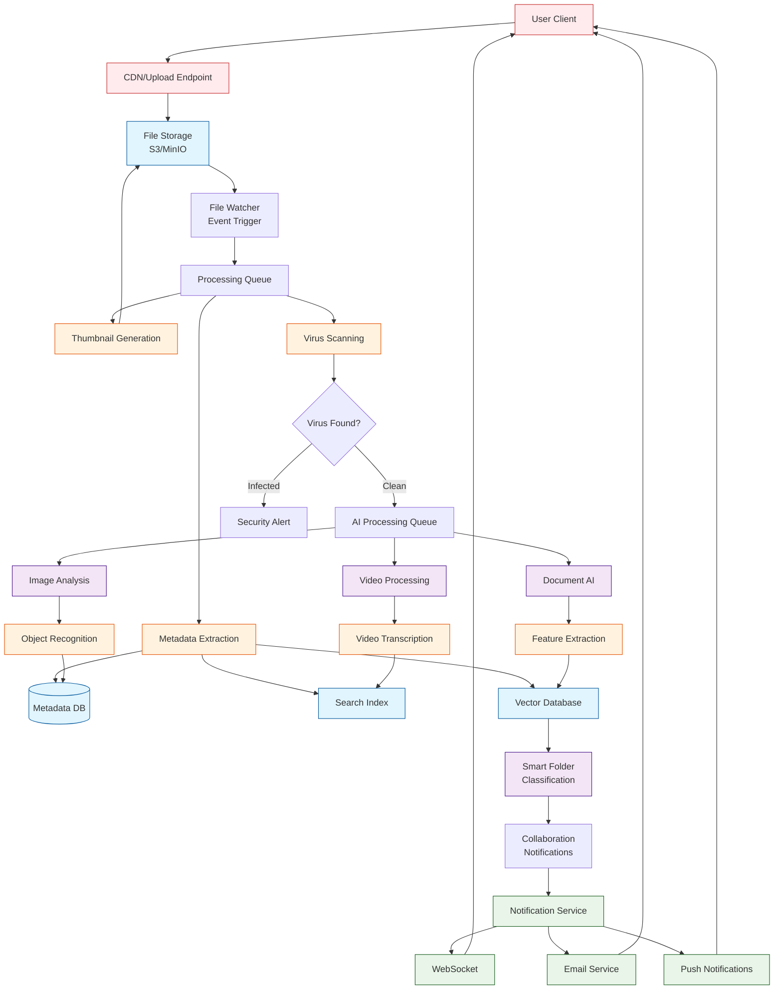

## Search and Retrieval Flow

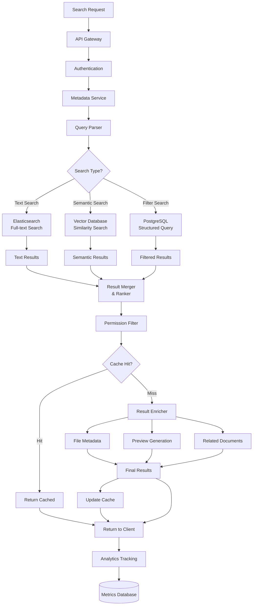

## Real-time Collaboration Flow

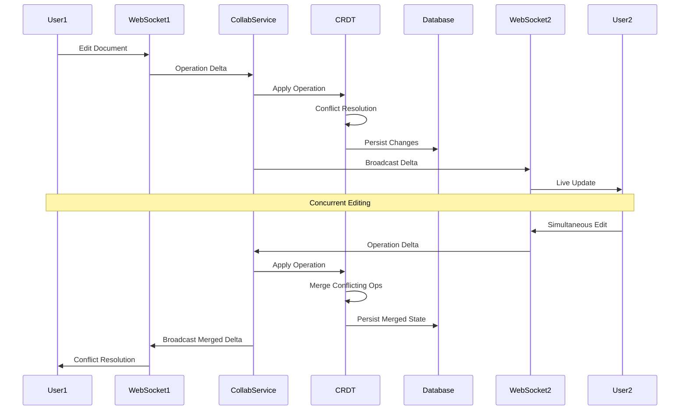

## Data Synchronization Flow

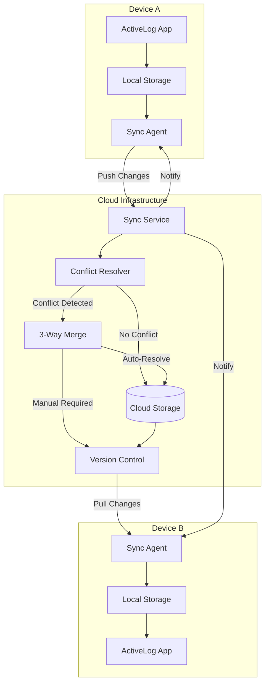

## ML Pipeline Data Flow

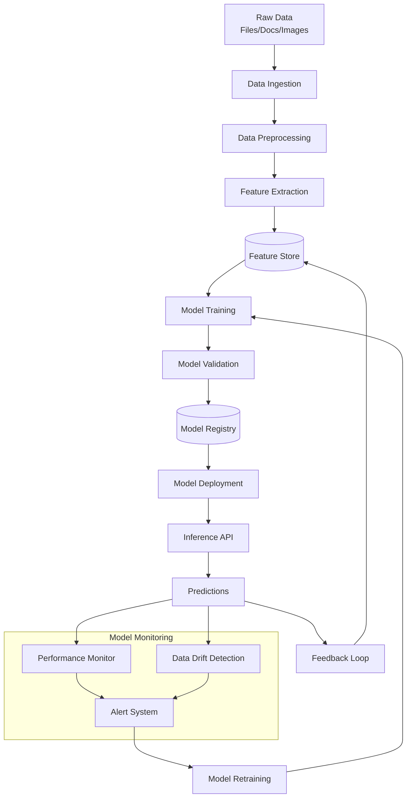

## Analytics Data Pipeline

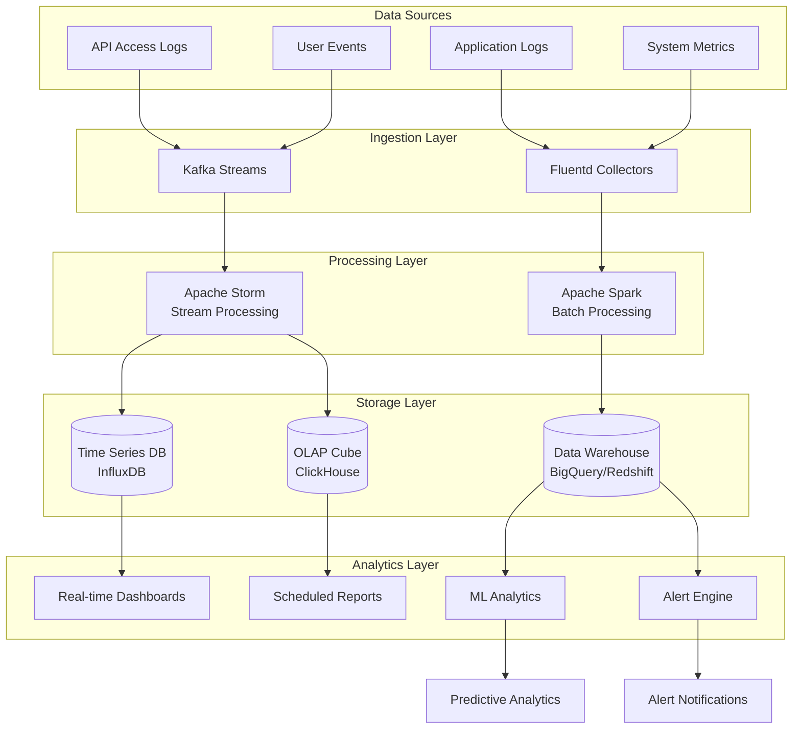

## Backup and Recovery Flow

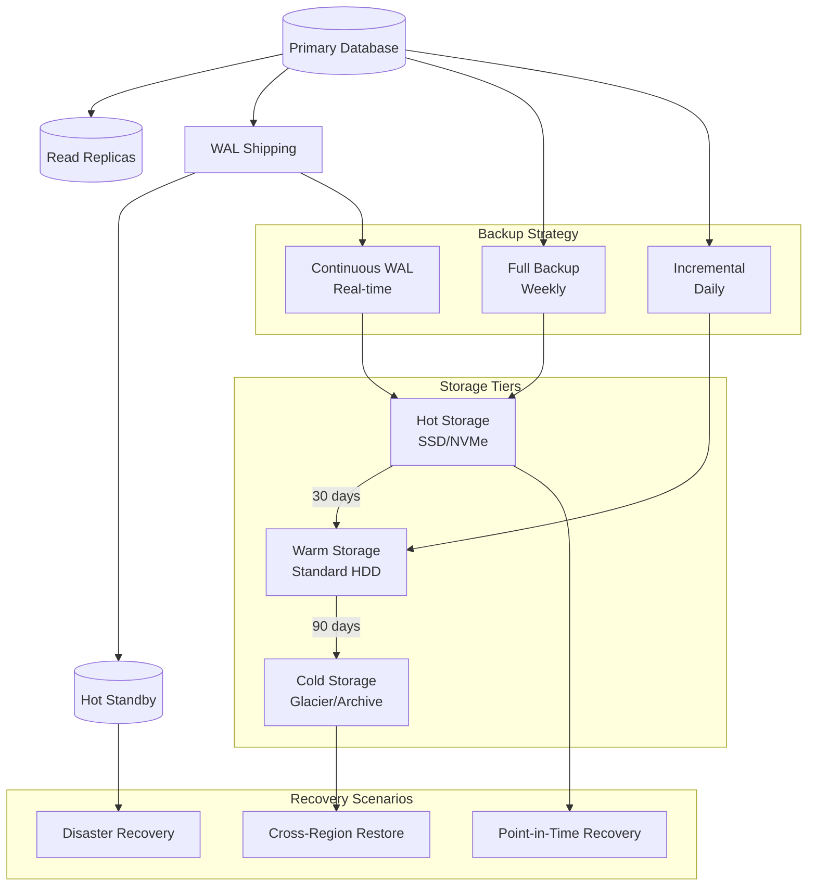

## Data Governance Flow

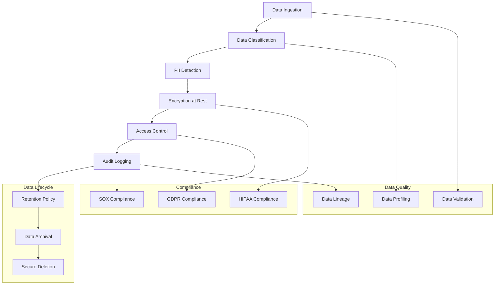

## Performance Optimization Patterns

### Caching Strategy
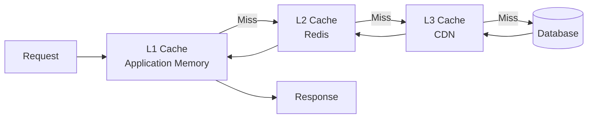

### Data Partitioning
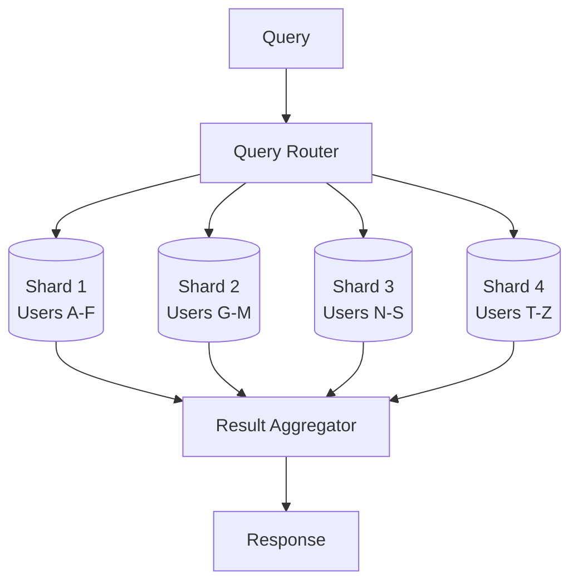

## Error Handling and Circuit Breakers

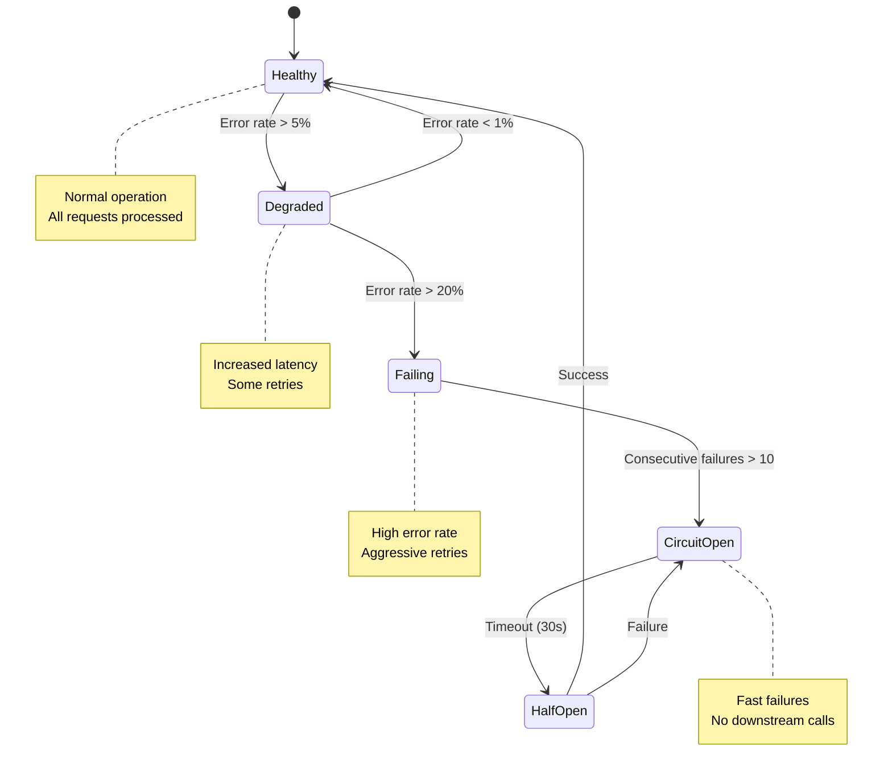