# High-Level System Architecture

This diagram shows the overall ActiveLog system architecture with major components and their relationships.

```mermaid
graph TB
    subgraph "Client Applications"
        WEB[Web Dashboard<br/>React/TypeScript]
        MOBILE[Mobile App<br/>React Native]
        API_CLIENT[API Clients<br/>SDKs]
    end

    subgraph "Edge & CDN"
        CDN[Content Delivery Network<br/>CloudFront/CloudFlare]
        LB[Load Balancer<br/>NGINX/ALB]
    end

    subgraph "API Layer"
        GATEWAY[API Gateway<br/>FastAPI]
        AUTH[Auth Service<br/>JWT/OAuth]
        RATE_LIMIT[Rate Limiting<br/>Redis]
    end

    subgraph "Core Services"
        METADATA[Metadata Service<br/>Search & Index]
        FILE_SYNC[File Sync<br/>Real-time]
        ANALYTICS[Analytics<br/>Metrics & Reports]
        NOTIFICATIONS[Notifications<br/>Push & Email]
    end

    subgraph "Processing Services"
        DOC_AI[Document AI<br/>OCR & NLP]
        VIDEO[Video Pipeline<br/>Transcoding]
        ML[ML Pipeline<br/>Training & Inference]
        AI_ORCH[AI Orchestrator<br/>Model Management]
    end

    subgraph "Workflow & Integration"
        WORKFLOWS[Workflow Engine<br/>Automation]
        COLLAB[Collaboration<br/>Real-time Editing]
        EXPORT[Data Export<br/>Bulk Operations]
        SMART[Smart Folders<br/>AI Organization]
    end

    subgraph "Storage Layer"
        PRIMARY_DB[(Primary Database<br/>PostgreSQL)]
        VECTOR_DB[(Vector Database<br/>Pinecone/Weaviate)]
        SEARCH[(Search Engine<br/>Elasticsearch)]
        CACHE[(Cache Layer<br/>Redis)]
        FILE_STORE[File Storage<br/>S3/MinIO]
        BACKUP[Backup Storage<br/>S3 Glacier]
    end

    subgraph "Message Queue"
        QUEUE[Message Broker<br/>RabbitMQ/Kafka]
        WORKER[Background Workers<br/>Celery]
    end

    subgraph "Monitoring & Observability"
        METRICS[Metrics<br/>Prometheus]
        LOGS[Logging<br/>ELK Stack]
        TRACES[Distributed Tracing<br/>Jaeger]
        ALERTS[Alerting<br/>AlertManager]
    end

    subgraph "External Services"
        CLOUD_AI[Cloud AI APIs<br/>OpenAI/Google]
        EMAIL[Email Service<br/>SendGrid/SES]
        SMS[SMS Service<br/>Twilio]
        STORAGE_EXT[External Storage<br/>Dropbox/GDrive]
    end

    %% Client connections
    WEB --> CDN
    MOBILE --> CDN
    API_CLIENT --> CDN

    %% CDN and Load Balancing
    CDN --> LB
    LB --> GATEWAY

    %% API Gateway connections
    GATEWAY --> AUTH
    GATEWAY --> RATE_LIMIT
    GATEWAY --> METADATA
    GATEWAY --> FILE_SYNC
    GATEWAY --> ANALYTICS
    GATEWAY --> NOTIFICATIONS

    %% Auth flow
    AUTH --> PRIMARY_DB
    AUTH --> CACHE

    %% Core service connections
    METADATA --> SEARCH
    METADATA --> VECTOR_DB
    METADATA --> PRIMARY_DB
    FILE_SYNC --> FILE_STORE
    FILE_SYNC --> CACHE
    ANALYTICS --> PRIMARY_DB
    NOTIFICATIONS --> QUEUE

    %% Processing services
    DOC_AI --> QUEUE
    DOC_AI --> FILE_STORE
    VIDEO --> QUEUE
    VIDEO --> FILE_STORE
    ML --> VECTOR_DB
    AI_ORCH --> CLOUD_AI

    %% Workflow services
    WORKFLOWS --> QUEUE
    COLLAB --> CACHE
    EXPORT --> FILE_STORE
    SMART --> ML

    %% Background processing
    QUEUE --> WORKER
    WORKER --> PRIMARY_DB
    WORKER --> FILE_STORE

    %% External integrations
    NOTIFICATIONS --> EMAIL
    NOTIFICATIONS --> SMS
    FILE_SYNC --> STORAGE_EXT
    AI_ORCH --> CLOUD_AI

    %% Monitoring
    GATEWAY --> METRICS
    GATEWAY --> LOGS
    GATEWAY --> TRACES
    METRICS --> ALERTS

    %% Backup
    PRIMARY_DB --> BACKUP
    FILE_STORE --> BACKUP

    %% Styling
    classDef clientApp fill:#E3F2FD,stroke:#1976D2
    classDef coreService fill:#E8F5E8,stroke:#388E3C
    classDef processing fill:#FFF3E0,stroke:#F57C00
    classDef storage fill:#F3E5F5,stroke:#7B1FA2
    classDef external fill:#FFEBEE,stroke:#D32F2F
    classDef monitoring fill:#E0F2F1,stroke:#00796B

    class WEB,MOBILE,API_CLIENT clientApp
    class METADATA,FILE_SYNC,ANALYTICS,NOTIFICATIONS coreService
    class DOC_AI,VIDEO,ML,AI_ORCH processing
    class PRIMARY_DB,VECTOR_DB,SEARCH,CACHE,FILE_STORE,BACKUP storage
    class CLOUD_AI,EMAIL,SMS,STORAGE_EXT external
    class METRICS,LOGS,TRACES,ALERTS monitoring
```

## Key Components

### Client Layer
- **Web Dashboard**: React/TypeScript SPA with real-time updates
- **Mobile App**: React Native app with offline sync capabilities
- **API Clients**: SDKs for Python, JavaScript, and other languages

### Edge & CDN
- **CDN**: Global content delivery for static assets and file downloads
- **Load Balancer**: High-availability request distribution

### API Layer
- **API Gateway**: Central entry point with routing, authentication, and rate limiting
- **Auth Service**: JWT-based authentication with OAuth integration
- **Rate Limiting**: Redis-based rate limiting to prevent abuse

### Core Services
- **Metadata Service**: File metadata, search indexing, and vector embeddings
- **File Sync**: Real-time file synchronization across devices
- **Analytics**: Usage metrics, reporting, and business intelligence
- **Notifications**: Push notifications, email, and SMS alerts

### Processing Services
- **Document AI**: OCR, text extraction, and document classification
- **Video Pipeline**: Video transcoding, thumbnail generation, and analysis
- **ML Pipeline**: Model training, inference, and experiment tracking
- **AI Orchestrator**: Manages AI model lifecycle and routing

### Storage Layer
- **Primary Database**: PostgreSQL for transactional data
- **Vector Database**: Stores embeddings for semantic search
- **Search Engine**: Elasticsearch for full-text search
- **Cache**: Redis for session storage and caching
- **File Storage**: S3-compatible object storage for files
- **Backup**: Automated backup to cold storage

### Message Queue
- **Message Broker**: Handles asynchronous processing
- **Background Workers**: Process long-running tasks

## Data Flow Patterns

### Synchronous Flow
1. Client → CDN → Load Balancer → API Gateway
2. API Gateway → Auth Service (token validation)
3. API Gateway → Core Service
4. Core Service → Database/Storage
5. Response back through the chain

### Asynchronous Flow
1. Service → Message Queue → Background Worker
2. Worker processes task and updates database
3. Notification sent to client via WebSocket/Push

### File Upload Flow
1. Client uploads to CDN/Storage directly
2. Metadata extracted and indexed
3. Processing services analyze content
4. Results stored and user notified

## Scalability Features

- **Horizontal Scaling**: All services can scale independently
- **Caching**: Multi-level caching reduces database load
- **CDN**: Global content delivery for performance
- **Load Balancing**: Distributes traffic across instances
- **Message Queues**: Decouples services and enables async processing

## Security Layers

- **Authentication**: JWT tokens with short expiration
- **Authorization**: Role-based access control (RBAC)
- **Encryption**: TLS in transit, AES at rest
- **Rate Limiting**: Prevents abuse and DoS attacks
- **Input Validation**: All inputs validated and sanitized

## High Availability

- **Multi-AZ Deployment**: Services deployed across availability zones
- **Health Checks**: Automated health monitoring and recovery
- **Circuit Breakers**: Prevent cascade failures
- **Graceful Degradation**: Core functionality maintained during partial outages
- **Backup & Recovery**: Automated backups with point-in-time recovery

## Performance Characteristics

- **Response Time**: < 200ms for cached responses
- **Throughput**: 10K+ requests/second with auto-scaling
- **Availability**: 99.9% uptime SLA
- **Storage**: Petabyte-scale file storage capacity
- **Search**: Sub-second full-text search across millions of documents