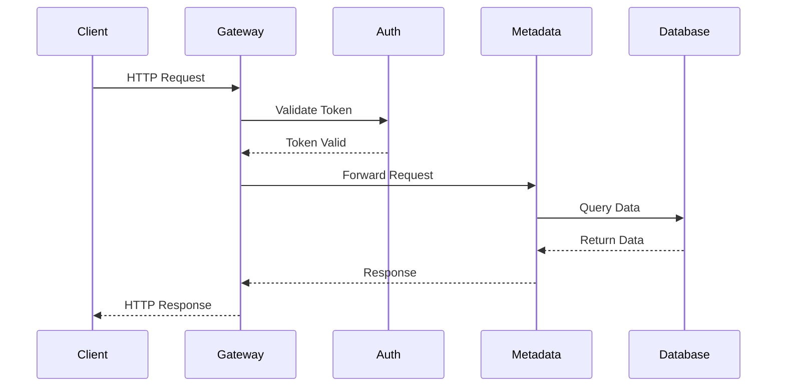
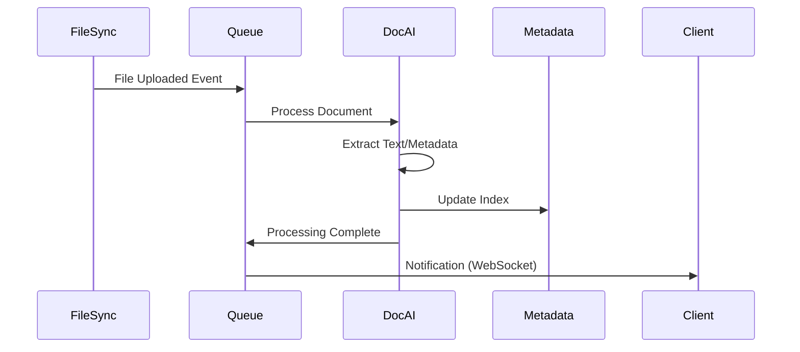
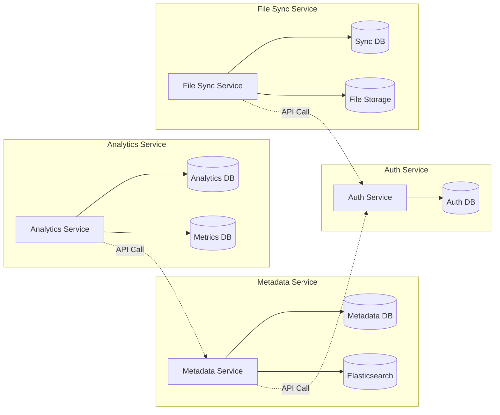
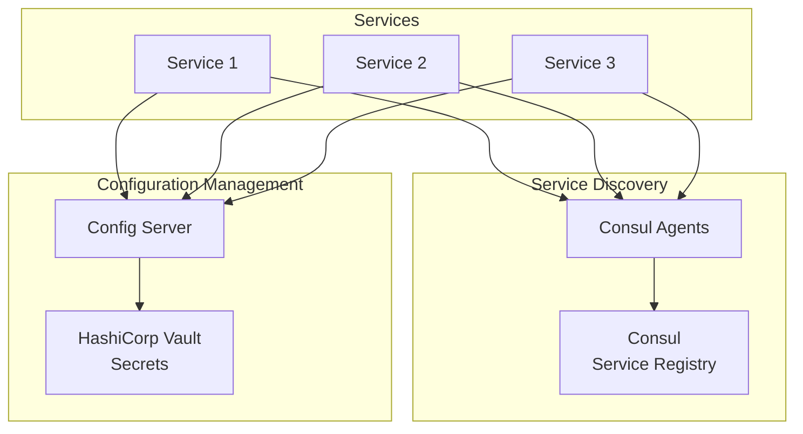
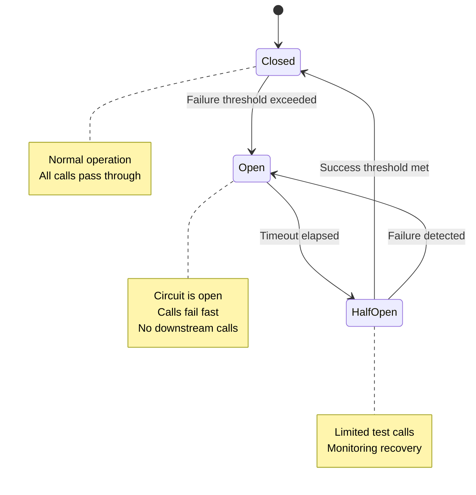
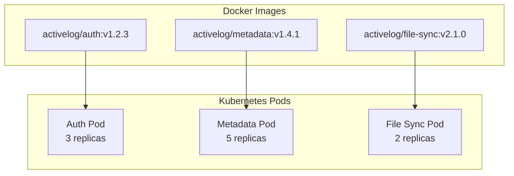
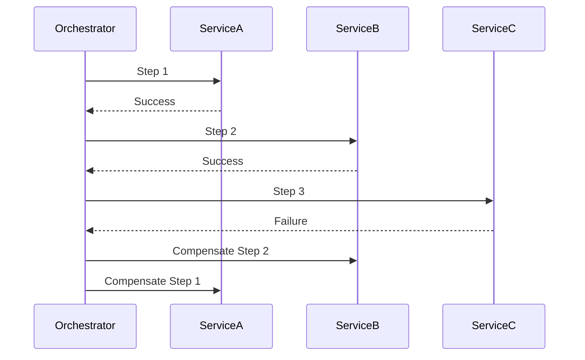

# Microservices Architecture

This diagram shows the detailed microservices architecture with service boundaries, communication patterns, and data ownership.

```mermaid
graph TB
    subgraph "API Gateway Cluster"
        GATEWAY[API Gateway<br/>Port: 8000]
        GATEWAY_LB[Gateway Load Balancer]
        GATEWAY_LB --> GATEWAY
    end

    subgraph "Authentication & Authorization"
        AUTH[Auth Service<br/>Port: 8001]
        AUTH_DB[(Auth Database)]
        CACHE_AUTH[(Auth Cache)]
        AUTH --> AUTH_DB
        AUTH --> CACHE_AUTH
    end

    subgraph "Core Data Services"
        METADATA[Metadata Service<br/>Port: 8002]
        META_DB[(Metadata DB)]
        SEARCH_ENGINE[(Elasticsearch)]
        VECTOR_DB[(Vector Database)]
        
        METADATA --> META_DB
        METADATA --> SEARCH_ENGINE
        METADATA --> VECTOR_DB
    end

    subgraph "File Management"
        FILE_SYNC[File Sync Service<br/>Port: 8015]
        FILE_WATCHER[File Watcher<br/>Port: 8016]
        SYNC_ENGINE[Sync Engine<br/>Port: 8017]
        
        FILE_STORE[File Storage<br/>S3/MinIO]
        SYNC_DB[(Sync Database)]
        
        FILE_SYNC --> FILE_STORE
        FILE_SYNC --> SYNC_DB
        FILE_WATCHER --> FILE_SYNC
        SYNC_ENGINE --> FILE_SYNC
    end

    subgraph "Analytics & Reporting"
        ANALYTICS[Analytics Service<br/>Port: 8003]
        ANALYTICS_DB[(Analytics DB)]
        METRICS_STORE[(Metrics Store)]
        
        ANALYTICS --> ANALYTICS_DB
        ANALYTICS --> METRICS_STORE
    end

    subgraph "Notification System"
        NOTIFICATIONS[Notification Service<br/>Port: 8004]
        NOTIF_DB[(Notification DB)]
        EMAIL_QUEUE[Email Queue]
        PUSH_QUEUE[Push Queue]
        
        NOTIFICATIONS --> NOTIF_DB
        NOTIFICATIONS --> EMAIL_QUEUE
        NOTIFICATIONS --> PUSH_QUEUE
    end

    subgraph "AI & ML Services"
        AI_ORCHESTRATOR[AI Orchestrator<br/>Port: 8018]
        ML_PIPELINE[ML Pipeline<br/>Port: 8007]
        DOC_AI[Document AI<br/>Port: 8005]
        
        ML_DB[(ML Database)]
        MODEL_STORE[Model Storage]
        
        AI_ORCHESTRATOR --> ML_PIPELINE
        ML_PIPELINE --> ML_DB
        ML_PIPELINE --> MODEL_STORE
        DOC_AI --> AI_ORCHESTRATOR
    end

    subgraph "Video Processing"
        VIDEO_PIPELINE[Video Pipeline<br/>Port: 8006]
        VIDEO_PROCESSOR[Video Processor<br/>Port: 8019]
        
        VIDEO_DB[(Video Database)]
        VIDEO_STORE[Video Storage]
        
        VIDEO_PIPELINE --> VIDEO_DB
        VIDEO_PIPELINE --> VIDEO_STORE
        VIDEO_PROCESSOR --> VIDEO_PIPELINE
    end

    subgraph "Business Logic Services"
        WORKFLOWS[Workflow Service<br/>Port: 8012]
        COLLABORATION[Collaboration<br/>Port: 8010]
        SMART_FOLDERS[Smart Folders<br/>Port: 8011]
        
        WORKFLOW_DB[(Workflow DB)]
        COLLAB_DB[(Collaboration DB)]
        SMART_DB[(Smart Folders DB)]
        
        WORKFLOWS --> WORKFLOW_DB
        COLLABORATION --> COLLAB_DB
        SMART_FOLDERS --> SMART_DB
    end

    subgraph "Data Management"
        BACKUP[Backup Service<br/>Port: 8008]
        BATCH_IMPORT[Batch Import<br/>Port: 8009]
        DATA_EXPORT[Data Export<br/>Port: 8014]
        
        BACKUP_STORE[Backup Storage]
        IMPORT_QUEUE[Import Queue]
        EXPORT_QUEUE[Export Queue]
        
        BACKUP --> BACKUP_STORE
        BATCH_IMPORT --> IMPORT_QUEUE
        DATA_EXPORT --> EXPORT_QUEUE
    end

    subgraph "Mobile & Integration"
        MOBILE_API[Mobile API<br/>Port: 8013]
        MOBILE_DB[(Mobile Sync DB)]
        
        MOBILE_API --> MOBILE_DB
    end

    subgraph "Message Queue System"
        MESSAGE_BROKER[RabbitMQ/Kafka<br/>Port: 5672/9092]
        WORKER_POOL[Worker Pool]
        
        MESSAGE_BROKER --> WORKER_POOL
    end

    subgraph "Caching Layer"
        REDIS_CLUSTER[(Redis Cluster)]
        CACHE_MANAGER[Cache Manager]
        
        CACHE_MANAGER --> REDIS_CLUSTER
    end

    %% Gateway routing
    GATEWAY --> AUTH
    GATEWAY --> METADATA
    GATEWAY --> FILE_SYNC
    GATEWAY --> ANALYTICS
    GATEWAY --> NOTIFICATIONS
    GATEWAY --> ML_PIPELINE
    GATEWAY --> VIDEO_PIPELINE
    GATEWAY --> WORKFLOWS
    GATEWAY --> COLLABORATION
    GATEWAY --> SMART_FOLDERS
    GATEWAY --> BACKUP
    GATEWAY --> BATCH_IMPORT
    GATEWAY --> DATA_EXPORT
    GATEWAY --> MOBILE_API

    %% Service-to-service communication
    METADATA --> FILE_SYNC
    ANALYTICS --> METADATA
    NOTIFICATIONS --> AUTH
    AI_ORCHESTRATOR --> METADATA
    VIDEO_PIPELINE --> METADATA
    WORKFLOWS --> NOTIFICATIONS
    COLLABORATION --> AUTH
    SMART_FOLDERS --> ML_PIPELINE
    BACKUP --> FILE_SYNC
    BATCH_IMPORT --> METADATA
    DATA_EXPORT --> FILE_SYNC
    MOBILE_API --> FILE_SYNC

    %% Message queue connections
    DOC_AI -.-> MESSAGE_BROKER
    VIDEO_PROCESSOR -.-> MESSAGE_BROKER
    ML_PIPELINE -.-> MESSAGE_BROKER
    NOTIFICATIONS -.-> MESSAGE_BROKER
    BACKUP -.-> MESSAGE_BROKER
    BATCH_IMPORT -.-> MESSAGE_BROKER

    %% Cache connections
    AUTH --> CACHE_MANAGER
    METADATA --> CACHE_MANAGER
    FILE_SYNC --> CACHE_MANAGER
    COLLABORATION --> CACHE_MANAGER

    %% External dependencies (dotted lines for clarity)
    EMAIL_QUEUE -.-> EXTERNAL_EMAIL[Email Provider<br/>SendGrid/SES]
    PUSH_QUEUE -.-> EXTERNAL_PUSH[Push Service<br/>FCM/APNS]
    AI_ORCHESTRATOR -.-> EXTERNAL_AI[External AI APIs<br/>OpenAI/Google]

    %% Styling
    classDef gateway fill:#1976D2,stroke:#0D47A1,color:#fff
    classDef auth fill:#388E3C,stroke:#1B5E20,color:#fff
    classDef core fill:#F57C00,stroke:#E65100,color:#fff
    classDef storage fill:#7B1FA2,stroke:#4A148C,color:#fff
    classDef processing fill:#D32F2F,stroke:#B71C1C,color:#fff
    classDef integration fill:#00796B,stroke:#004D40,color:#fff
    classDef queue fill:#5D4037,stroke:#3E2723,color:#fff
    classDef external fill:#616161,stroke:#212121,color:#fff

    class GATEWAY,GATEWAY_LB gateway
    class AUTH,AUTH_DB,CACHE_AUTH auth
    class METADATA,FILE_SYNC,ANALYTICS,META_DB,SYNC_DB,ANALYTICS_DB core
    class FILE_STORE,SEARCH_ENGINE,VECTOR_DB,METRICS_STORE storage
    class AI_ORCHESTRATOR,ML_PIPELINE,DOC_AI,VIDEO_PIPELINE,VIDEO_PROCESSOR processing
    class WORKFLOWS,COLLABORATION,SMART_FOLDERS,MOBILE_API integration
    class MESSAGE_BROKER,WORKER_POOL,REDIS_CLUSTER queue
    class EXTERNAL_EMAIL,EXTERNAL_PUSH,EXTERNAL_AI external
```

## Service Communication Patterns

### Synchronous Communication

### Asynchronous Processing

## Service Responsibilities

### API Gateway
- **Primary**: Request routing, load balancing, rate limiting
- **Secondary**: Request/response transformation, authentication orchestration
- **Data**: Request logs, rate limiting counters

### Auth Service
- **Primary**: User authentication, JWT token management
- **Secondary**: User profiles, role-based access control
- **Data**: User credentials, sessions, permissions

### Metadata Service
- **Primary**: File metadata management, search indexing
- **Secondary**: Tag management, content classification
- **Data**: File metadata, tags, search indices, embeddings

### File Sync Service
- **Primary**: File synchronization, version control
- **Secondary**: Conflict resolution, delta sync
- **Data**: File versions, sync state, conflict logs

### Analytics Service
- **Primary**: Usage metrics, reporting, dashboards
- **Secondary**: User behavior analysis, performance monitoring
- **Data**: Events, metrics, aggregated reports

### Notification Service
- **Primary**: Push notifications, email alerts
- **Secondary**: Notification preferences, delivery tracking
- **Data**: Notification templates, delivery logs, preferences

## Database Per Service Pattern

Each service owns its data and database:

## Service Discovery and Configuration

## Circuit Breaker Pattern

## Service Health Monitoring

Each service implements standard health check endpoints:

- `GET /health` - Basic health status
- `GET /health/ready` - Readiness probe
- `GET /health/live` - Liveness probe
- `GET /metrics` - Prometheus metrics

## Deployment Units

Services are deployed as independent units:

## Data Consistency Patterns

### Eventual Consistency
- File metadata updates propagate asynchronously
- Analytics data aggregated in batch jobs
- Cache invalidation handled by events

### Strong Consistency
- User authentication and authorization
- Financial/billing data
- Critical system configurations

### Saga Pattern
For distributed transactions across services:

