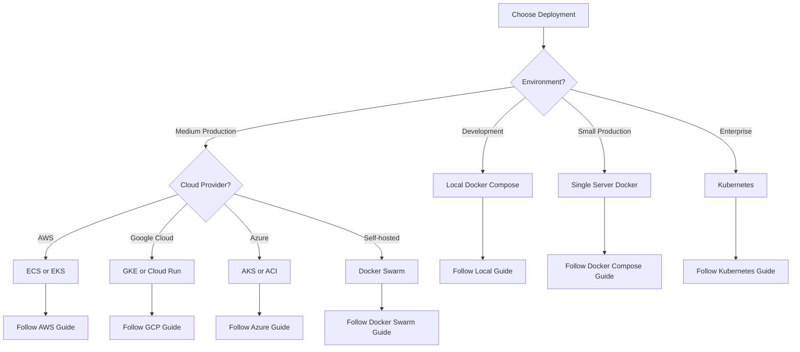
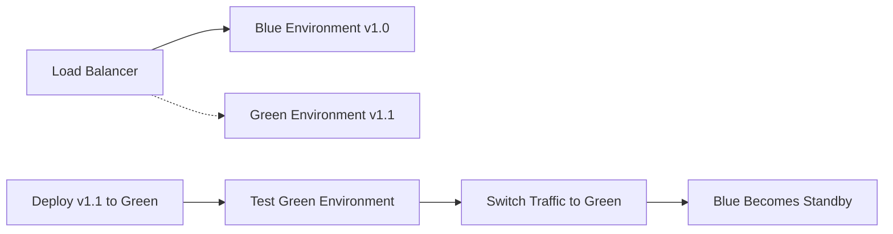
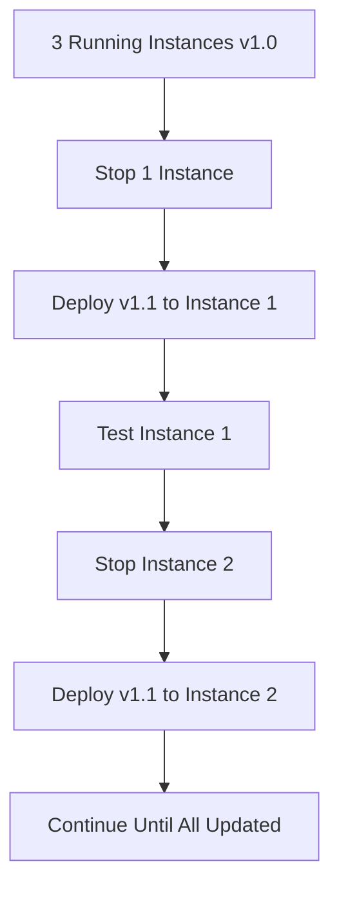
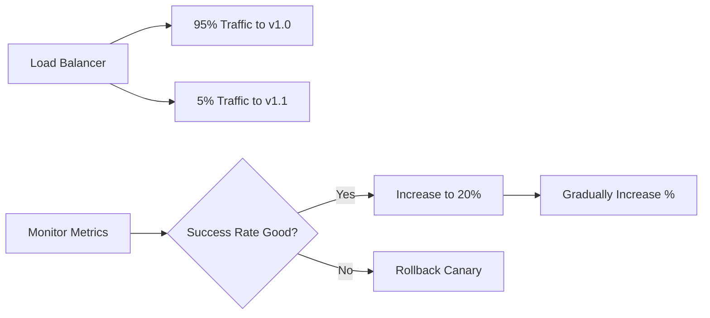
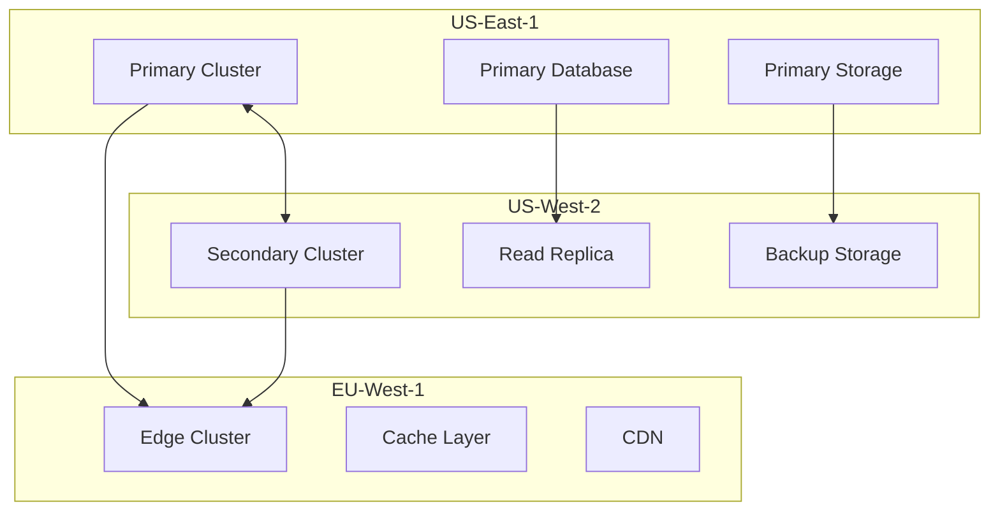

# Deployment Guide

This comprehensive deployment guide covers all deployment scenarios for ActiveLog, from local development to enterprise production environments.

## Deployment Options Overview

ActiveLog supports multiple deployment strategies to fit different needs and scales:

| Deployment Type | Use Case | Complexity | Scalability | Cost |
|----------------|----------|------------|-------------|------|
| [Local Development](./local.md) | Development & testing | Low | Single machine | Free |
| [Docker Compose](./docker-compose.md) | Small teams, prototyping | Low | Single server | Low |
| [Docker Swarm](./docker-swarm.md) | Multi-server clusters | Medium | Multi-server | Medium |
| [Kubernetes](./kubernetes.md) | Production at scale | High | Auto-scaling | Medium |
| [AWS ECS](./aws-ecs.md) | AWS-native deployment | Medium | Managed scaling | Medium |
| [AWS EKS](./aws-eks.md) | Kubernetes on AWS | High | Full auto-scaling | High |
| [Google Cloud Run](./gcp-cloudrun.md) | Serverless deployment | Low | Auto-scaling | Variable |
| [Azure Container Instances](./azure-aci.md) | Simple Azure deployment | Low | Manual scaling | Low |

## Quick Deployment Decision Tree



## Prerequisites for All Deployments

### Required Software

**For Container-based Deployments:**
- Docker 20.10+ and Docker Compose 2.0+
- Git for cloning the repository
- Make (for using Makefile commands)

**For Kubernetes Deployments:**
- kubectl configured for your cluster
- Helm 3+ (recommended)
- Docker for building custom images

**For Cloud Deployments:**
- Cloud provider CLI tools (aws-cli, gcloud, az-cli)
- Terraform (for infrastructure as code)

### Required Resources

**Minimum System Requirements:**
- **CPU**: 4 cores (2 cores minimum)
- **Memory**: 8GB RAM (4GB minimum)
- **Storage**: 100GB free space (20GB minimum)
- **Network**: Stable internet connection

**Production Requirements:**
- **CPU**: 8+ cores per node
- **Memory**: 16GB+ RAM per node
- **Storage**: 500GB+ SSD storage
- **Network**: High-bandwidth, low-latency connection

## Pre-Deployment Checklist

Before starting any deployment:

### 1. Environment Preparation
- [ ] Clone ActiveLog repository
- [ ] Review and customize configuration files
- [ ] Generate secure secrets and certificates
- [ ] Prepare external dependencies (databases, storage)
- [ ] Set up monitoring and logging infrastructure

### 2. Security Setup
- [ ] Generate SSL/TLS certificates
- [ ] Configure authentication providers
- [ ] Set up firewall rules and security groups
- [ ] Review and harden default configurations
- [ ] Implement backup and disaster recovery

### 3. Resource Planning
- [ ] Estimate resource requirements
- [ ] Plan for data storage and backup
- [ ] Design network architecture
- [ ] Plan for monitoring and alerting
- [ ] Consider compliance requirements

## Configuration Overview

### Essential Configuration Files

```
activelog/
├── .env.example                 # Environment variable template
├── docker-compose.yml           # Development setup
├── docker-compose.prod.yml      # Production overrides
├── config/
│   ├── nginx/                   # Reverse proxy configuration
│   ├── postgres/                # Database initialization
│   └── monitoring/              # Prometheus/Grafana config
├── deploy/                      # Deployment manifests
│   ├── kubernetes/              # K8s manifests
│   ├── terraform/               # Infrastructure as code
│   └── scripts/                 # Deployment scripts
└── infrastructure/              # Advanced infrastructure
    ├── mesh/                    # Service mesh configuration
    └── terraform/               # Cloud infrastructure
```

### Configuration Customization

1. **Copy environment template:**
   ```bash
   cp .env.example .env
   ```

2. **Generate secure secrets:**
   ```bash
   ./scripts/generate-secrets.sh
   ```

3. **Customize for your environment:**
   ```bash
   nano .env  # Edit configuration
   ./scripts/validate-config.sh  # Validate settings
   ```

## Deployment Strategies

### Blue-Green Deployment

Deploy new version alongside existing version, then switch traffic:



**Advantages:**
- Zero-downtime deployments
- Easy rollback if issues arise
- Full environment testing before switch

**Use Cases:**
- Production environments
- Critical applications
- When rollback speed is important

### Rolling Update

Gradually replace instances with new version:



**Advantages:**
- Resource efficient
- Gradual rollout reduces risk
- Automatic rollback on failure

**Use Cases:**
- Kubernetes deployments
- Resource-constrained environments
- When gradual rollout is preferred

### Canary Deployment

Route small percentage of traffic to new version:



**Advantages:**
- Low-risk testing with real traffic
- Data-driven deployment decisions
- Easy rollback with minimal impact

**Use Cases:**
- A/B testing new features
- High-risk deployments
- When user feedback is critical

## Common Deployment Patterns

### Environment Progression

```
Developer Laptop → CI/CD Pipeline → Staging → Production
     ↓                    ↓             ↓           ↓
Local Docker     →    Unit Tests   →  Integration → Load Testing
Development      →    Build Images →  E2E Tests   → Monitoring
```

### Multi-Region Deployment



**Benefits:**
- High availability across regions
- Improved performance for global users
- Disaster recovery capabilities
- Compliance with data residency requirements

## Environment-Specific Configurations

### Development Environment

```yaml
# docker-compose.override.yml
version: '3.8'
services:
  api-gateway:
    build:
      target: development
    volumes:
      - ./services:/app
    environment:
      - DEBUG=true
      - LOG_LEVEL=DEBUG
      - HOT_RELOAD=true
```

### Staging Environment

```yaml
# docker-compose.staging.yml
version: '3.8'
services:
  api-gateway:
    image: activelog/api-gateway:staging
    environment:
      - DEBUG=false
      - LOG_LEVEL=INFO
      - ENVIRONMENT=staging
    deploy:
      resources:
        limits:
          memory: 512M
        reservations:
          memory: 256M
```

### Production Environment

```yaml
# docker-compose.prod.yml
version: '3.8'
services:
  api-gateway:
    image: activelog/api-gateway:latest
    environment:
      - DEBUG=false
      - LOG_LEVEL=WARNING
      - ENVIRONMENT=production
    deploy:
      replicas: 3
      resources:
        limits:
          memory: 1G
        reservations:
          memory: 512M
      restart_policy:
        condition: on-failure
        max_attempts: 3
```

## Security Considerations

### SSL/TLS Configuration

**Development:**
```bash
# Generate self-signed certificates
./scripts/generate-dev-certs.sh
```

**Production:**
```bash
# Use Let's Encrypt or commercial certificates
certbot --nginx -d yourdomain.com
```

### Network Security

```yaml
# docker-compose.yml network configuration
networks:
  frontend:
    driver: bridge
    ipam:
      config:
        - subnet: 172.20.0.0/16
  backend:
    driver: bridge
    internal: true
    ipam:
      config:
        - subnet: 172.21.0.0/16
```

### Secrets Management

**Development:**
```bash
# Use .env files (not committed to git)
echo "JWT_SECRET=$(openssl rand -hex 32)" >> .env
```

**Production (Docker Swarm):**
```yaml
secrets:
  jwt_secret:
    external: true
  database_password:
    external: true

services:
  auth-service:
    secrets:
      - jwt_secret
      - database_password
```

**Production (Kubernetes):**
```yaml
apiVersion: v1
kind: Secret
metadata:
  name: activelog-secrets
type: Opaque
data:
  jwt-secret: <base64-encoded-value>
  database-password: <base64-encoded-value>
```

## Monitoring and Observability

### Health Checks

All deployment methods should include health checks:

```yaml
# Docker Compose health check
healthcheck:
  test: ["CMD", "curl", "-f", "http://localhost:8000/health"]
  interval: 30s
  timeout: 10s
  retries: 3
  start_period: 60s
```

```yaml
# Kubernetes health check
livenessProbe:
  httpGet:
    path: /health
    port: 8000
  initialDelaySeconds: 60
  periodSeconds: 30

readinessProbe:
  httpGet:
    path: /ready
    port: 8000
  initialDelaySeconds: 10
  periodSeconds: 5
```

### Logging Configuration

**Centralized Logging:**
```yaml
# docker-compose.yml
logging:
  driver: "json-file"
  options:
    max-size: "100m"
    max-file: "3"
    tag: "{{.Name}}"
```

**ELK Stack Integration:**
```yaml
# docker-compose.yml
logging:
  driver: "fluentd"
  options:
    fluentd-address: "fluentd:24224"
    tag: "activelog.{{.Name}}"
```

### Metrics Collection

**Prometheus Integration:**
```yaml
# prometheus.yml
scrape_configs:
  - job_name: 'activelog'
    static_configs:
      - targets: ['api-gateway:8000', 'auth-service:8001']
    metrics_path: '/metrics'
    scrape_interval: 15s
```

## Backup and Disaster Recovery

### Database Backup

```bash
# Automated PostgreSQL backup
#!/bin/bash
BACKUP_DIR="/backups/postgresql"
DATE=$(date +%Y%m%d_%H%M%S)

pg_dump -h postgres -U activelog_user activelog_db > \
  "$BACKUP_DIR/activelog_backup_$DATE.sql"

# Encrypt backup
gpg --symmetric --cipher-algo AES256 \
  "$BACKUP_DIR/activelog_backup_$DATE.sql"

# Upload to cloud storage
aws s3 cp "$BACKUP_DIR/activelog_backup_$DATE.sql.gpg" \
  s3://activelog-backups/
```

### Application Data Backup

```bash
# Backup file storage
#!/bin/bash
STORAGE_DIR="/data/activelog/files"
BACKUP_DIR="/backups/files"
DATE=$(date +%Y%m%d_%H%M%S)

tar czf "$BACKUP_DIR/files_backup_$DATE.tar.gz" "$STORAGE_DIR"

# Sync to remote storage
rsync -av --delete "$STORAGE_DIR/" \
  backup-server:/backups/activelog/files/
```

### Disaster Recovery Plan

1. **Recovery Time Objective (RTO):** 4 hours
2. **Recovery Point Objective (RPO):** 1 hour
3. **Backup Frequency:** Every 6 hours
4. **Backup Retention:** 30 days local, 1 year cloud

**Recovery Procedures:**
```bash
# 1. Restore database
psql -h postgres -U activelog_user -d activelog_db < \
  /backups/activelog_backup_latest.sql

# 2. Restore file storage
tar xzf /backups/files_backup_latest.tar.gz -C /data/activelog/

# 3. Restart services
docker-compose down
docker-compose up -d

# 4. Verify health
./scripts/health-check.sh
```

## Performance Optimization

### Resource Allocation

**CPU-Optimized Services:**
- AI/ML processing services
- Document processing
- Video transcoding

**Memory-Optimized Services:**
- Database services
- Cache services
- Search services

**Network-Optimized Services:**
- API Gateway
- File sync services
- Real-time collaboration

### Scaling Strategies

**Horizontal Scaling:**
```yaml
# Docker Compose scaling
docker-compose up --scale api-gateway=3 --scale auth-service=2

# Kubernetes scaling
kubectl scale deployment api-gateway --replicas=5
```

**Vertical Scaling:**
```yaml
# Increase resource limits
resources:
  limits:
    memory: "2Gi"
    cpu: "2000m"
  requests:
    memory: "1Gi"
    cpu: "1000m"
```

### Load Testing

Before production deployment:

```bash
# Install load testing tools
pip install locust

# Run load tests
locust -f tests/load/locustfile.py \
  --host=http://localhost:8000 \
  --users=100 \
  --spawn-rate=10 \
  --run-time=5m
```

## Troubleshooting Deployments

### Common Issues

1. **Services won't start:**
   ```bash
   docker-compose logs [service-name]
   kubectl logs deployment/[service-name]
   ```

2. **Database connection issues:**
   ```bash
   # Test database connectivity
   docker exec -it postgres psql -U activelog_user -d activelog_db -c "SELECT 1;"
   ```

3. **Network connectivity:**
   ```bash
   # Test service-to-service communication
   docker exec api-gateway ping auth-service
   kubectl exec -it api-gateway -- nc -zv auth-service 8001
   ```

4. **Resource constraints:**
   ```bash
   # Monitor resource usage
   docker stats
   kubectl top nodes
   kubectl top pods
   ```

### Debugging Tools

```bash
# Enable debug logging
export DEBUG=true
export LOG_LEVEL=DEBUG

# Access service containers
docker exec -it activelog_api-gateway_1 bash
kubectl exec -it api-gateway-pod -- bash

# View configuration
docker exec activelog_api-gateway_1 env | grep ACTIVELOG
kubectl exec api-gateway-pod -- env | grep ACTIVELOG
```

## Getting Help

### Documentation Resources

Each deployment guide includes:
- Step-by-step instructions
- Configuration examples
- Troubleshooting sections
- Best practices
- Security considerations

### Support Channels

- **Documentation:** Complete guides for each deployment type
- **Community:** Discord server for real-time help
- **Issues:** GitHub for bug reports and feature requests
- **Professional:** Enterprise support for production deployments

### Next Steps

1. Choose your deployment method from the options above
2. Follow the specific deployment guide for your chosen method
3. Configure monitoring and alerting
4. Set up backup and disaster recovery
5. Perform load testing before going live

---

**Ready to deploy?** Choose your deployment method from the menu and follow the detailed guide. Each guide includes all the specific commands, configurations, and best practices for that deployment type.

*For production deployments, we strongly recommend following the security checklist and implementing proper monitoring before going live.*