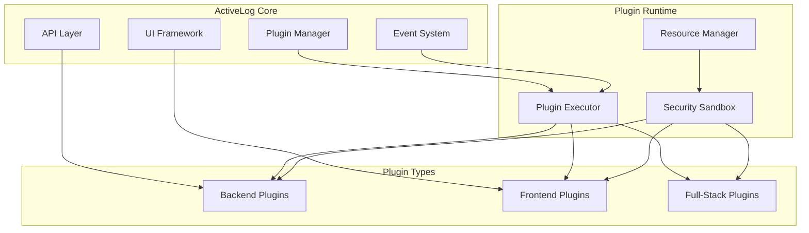

# Plugin Development Guide

ActiveLog's plugin system allows you to extend functionality with custom features, integrations, and workflows. This guide covers everything from basic plugin development to publishing in the ActiveLog marketplace.

## Plugin System Overview

### What are ActiveLog Plugins?

ActiveLog plugins are self-contained modules that extend the platform's capabilities:

- **File Processors** - Custom file analysis and transformation
- **AI Integrations** - Connect custom AI/ML models
- **External Integrations** - Third-party service connections
- **Workflow Automations** - Custom business logic
- **UI Extensions** - Frontend components and views
- **Data Exporters** - Custom export formats
- **Authentication Providers** - Custom auth systems

### Plugin Architecture



## Quick Start

### Create Your First Plugin

```bash
# Install the plugin CLI
npm install -g @activelog/plugin-cli

# Create a new plugin
activelog-plugin create my-first-plugin --template basic

# Navigate to plugin directory
cd my-first-plugin

# Install dependencies
npm install

# Start development server
npm run dev
```

### Plugin Structure

```
my-first-plugin/
├── manifest.json          # Plugin metadata and configuration
├── package.json           # Node.js dependencies (if applicable)
├── requirements.txt       # Python dependencies (if applicable)
├── src/
│   ├── main.py            # Main plugin entry point (Python)
│   ├── index.ts           # Main plugin entry point (TypeScript)
│   ├── handlers/          # Event handlers
│   ├── components/        # UI components (React)
│   └── utils/             # Utility functions
├── assets/
│   ├── icon.svg           # Plugin icon
│   └── screenshots/       # Screenshots for marketplace
├── docs/
│   ├── README.md          # Plugin documentation
│   └── examples/          # Usage examples
└── tests/
    ├── unit/              # Unit tests
    └── integration/       # Integration tests
```

### Basic Plugin Example

**manifest.json:**
```json
{
  "id": "com.example.my-first-plugin",
  "name": "My First Plugin",
  "version": "1.0.0",
  "description": "A simple example plugin for ActiveLog",
  "author": "Your Name <your.email@example.com>",
  "license": "MIT",
  "homepage": "https://github.com/yourusername/my-first-plugin",
  "activelog": {
    "minVersion": "2.0.0",
    "maxVersion": "3.0.0"
  },
  "runtime": {
    "language": "python",
    "version": "3.9+"
  },
  "permissions": [
    "files:read",
    "files:write",
    "api:metadata"
  ],
  "hooks": [
    {
      "event": "file.uploaded",
      "handler": "src/handlers/file_uploaded.py"
    }
  ],
  "ui": {
    "components": [
      {
        "name": "MyComponent",
        "path": "src/components/MyComponent.tsx",
        "mountPoint": "file-viewer"
      }
    ]
  },
  "configuration": [
    {
      "key": "apiKey",
      "name": "API Key",
      "description": "Your service API key",
      "type": "password",
      "required": true
    },
    {
      "key": "enableFeature",
      "name": "Enable Advanced Feature",
      "description": "Enable advanced processing",
      "type": "boolean",
      "default": false
    }
  ]
}
```

**Python Handler Example:**
```python
# src/handlers/file_uploaded.py
from activelog_plugin_sdk import Plugin, FileEvent

class MyFirstPlugin(Plugin):
    def __init__(self, config):
        super().__init__(config)
        self.api_key = config.get('apiKey')
        self.enabled = config.get('enableFeature', False)
    
    async def handle_file_uploaded(self, event: FileEvent):
        """Handle file upload events"""
        file_info = event.file
        
        # Log the event
        self.logger.info(f"Processing file: {file_info.name}")
        
        # Process the file
        if file_info.type.startswith('image/'):
            await self.process_image(file_info)
        elif file_info.type.startswith('text/'):
            await self.process_text(file_info)
        
        # Update metadata
        await self.api.metadata.update(file_info.id, {
            'processed_by': 'my-first-plugin',
            'processed_at': self.now(),
            'custom_field': 'custom_value'
        })
    
    async def process_image(self, file_info):
        """Process image files"""
        # Your image processing logic here
        pass
    
    async def process_text(self, file_info):
        """Process text files"""
        # Your text processing logic here
        pass
```

**React Component Example:**
```tsx
// src/components/MyComponent.tsx
import React, { useState, useEffect } from 'react';
import { useActiveLogAPI } from '@activelog/ui-sdk';

interface MyComponentProps {
  fileId: string;
}

const MyComponent: React.FC<MyComponentProps> = ({ fileId }) => {
  const [data, setData] = useState<any>(null);
  const [loading, setLoading] = useState(true);
  const api = useActiveLogAPI();

  useEffect(() => {
    const loadData = async () => {
      try {
        const response = await api.get(`/plugins/my-first-plugin/data/${fileId}`);
        setData(response.data);
      } catch (error) {
        console.error('Failed to load plugin data:', error);
      } finally {
        setLoading(false);
      }
    };

    loadData();
  }, [fileId, api]);

  if (loading) {
    return <div>Loading plugin data...</div>;
  }

  return (
    <div className="my-plugin-component">
      <h3>My First Plugin</h3>
      {data ? (
        <div>
          <p>Processed: {data.processed_at}</p>
          <p>Custom field: {data.custom_field}</p>
        </div>
      ) : (
        <p>No plugin data available</p>
      )}
    </div>
  );
};

export default MyComponent;
```

## Plugin Development SDK

### Python SDK

**Installation:**
```bash
pip install activelog-plugin-sdk
```

**Core Classes:**
```python
from activelog_plugin_sdk import (
    Plugin,           # Base plugin class
    FileEvent,        # File-related events
    UserEvent,        # User-related events
    APIClient,        # ActiveLog API client
    Logger,           # Plugin logger
    Config,           # Configuration management
    Storage,          # Plugin storage
    Cache,            # Caching utilities
    Scheduler,        # Task scheduling
    Webhooks,         # Webhook utilities
)

class MyPlugin(Plugin):
    def __init__(self, config: Config):
        super().__init__(config)
        
        # Access configuration
        self.api_key = config.get('apiKey')
        self.debug = config.get('debug', False)
        
        # Initialize services
        self.api = APIClient(self.auth_token)
        self.storage = Storage(self.plugin_id)
        self.cache = Cache(self.plugin_id)
        self.scheduler = Scheduler()
        
    async def on_activate(self):
        """Called when plugin is activated"""
        self.logger.info("Plugin activated")
        
        # Schedule recurring tasks
        self.scheduler.every(1).hours.do(self.cleanup_task)
        
    async def on_deactivate(self):
        """Called when plugin is deactivated"""
        self.logger.info("Plugin deactivated")
        
        # Cleanup resources
        self.scheduler.clear()
        await self.storage.close()
        
    # Event handlers
    async def handle_file_uploaded(self, event: FileEvent):
        pass
        
    async def handle_user_login(self, event: UserEvent):
        pass
```

### TypeScript SDK

**Installation:**
```bash
npm install @activelog/plugin-sdk
```

**Core Types:**
```typescript
import {
  Plugin,
  PluginConfig,
  FileEvent,
  UserEvent,
  APIClient,
  Logger,
  Storage,
  Cache,
  EventHandler,
} from '@activelog/plugin-sdk';

export class MyPlugin extends Plugin {
  private apiKey: string;
  private api: APIClient;
  
  constructor(config: PluginConfig) {
    super(config);
    this.apiKey = config.get('apiKey');
    this.api = new APIClient(this.authToken);
  }
  
  async onActivate(): Promise<void> {
    this.logger.info('Plugin activated');
    
    // Register event handlers
    this.on('file.uploaded', this.handleFileUploaded.bind(this));
    this.on('user.login', this.handleUserLogin.bind(this));
  }
  
  async onDeactivate(): Promise<void> {
    this.logger.info('Plugin deactivated');
    
    // Cleanup
    this.removeAllListeners();
    await this.api.close();
  }
  
  @EventHandler('file.uploaded')
  async handleFileUploaded(event: FileEvent): Promise<void> {
    // Handle file upload
  }
  
  @EventHandler('user.login')
  async handleUserLogin(event: UserEvent): Promise<void> {
    // Handle user login
  }
}
```

## Plugin Types and Examples

### File Processing Plugin

Process files with custom logic:

```python
from activelog_plugin_sdk import Plugin, FileEvent
import cv2
import numpy as np

class ImageEnhancerPlugin(Plugin):
    """Enhance images with AI-powered processing"""
    
    async def handle_file_uploaded(self, event: FileEvent):
        if not event.file.type.startswith('image/'):
            return
            
        # Download original image
        image_data = await self.api.files.download(event.file.id)
        
        # Process image
        enhanced_image = self.enhance_image(image_data)
        
        # Upload enhanced version
        enhanced_file = await self.api.files.upload(
            enhanced_image,
            filename=f"enhanced_{event.file.name}",
            folder=event.file.folder
        )
        
        # Link files
        await self.api.metadata.add_relation(
            event.file.id,
            enhanced_file.id,
            relation_type='enhanced_version'
        )
    
    def enhance_image(self, image_data: bytes) -> bytes:
        """Apply AI enhancement to image"""
        # Convert bytes to OpenCV image
        nparr = np.frombuffer(image_data, np.uint8)
        img = cv2.imdecode(nparr, cv2.IMREAD_COLOR)
        
        # Apply enhancement (example: contrast adjustment)
        enhanced = cv2.convertScaleAbs(img, alpha=1.2, beta=30)
        
        # Convert back to bytes
        _, buffer = cv2.imencode('.jpg', enhanced)
        return buffer.tobytes()
```

### AI Integration Plugin

Connect external AI services:

```python
from activelog_plugin_sdk import Plugin, FileEvent
import openai

class OpenAISummarizerPlugin(Plugin):
    """Summarize documents using OpenAI GPT"""
    
    def __init__(self, config):
        super().__init__(config)
        openai.api_key = config.get('openai_api_key')
    
    async def handle_file_uploaded(self, event: FileEvent):
        if event.file.type != 'application/pdf':
            return
            
        # Extract text from PDF
        text = await self.api.ai.extract_text(event.file.id)
        
        if len(text) < 100:  # Skip short documents
            return
            
        # Generate summary
        summary = await self.generate_summary(text)
        
        # Update metadata with summary
        await self.api.metadata.update(event.file.id, {
            'ai_summary': summary,
            'summary_model': 'gpt-3.5-turbo',
            'summary_generated_at': self.now()
        })
        
        # Add tags based on content
        tags = await self.generate_tags(text)
        await self.api.metadata.add_tags(event.file.id, tags)
    
    async def generate_summary(self, text: str) -> str:
        """Generate summary using OpenAI"""
        response = await openai.ChatCompletion.acreate(
            model="gpt-3.5-turbo",
            messages=[
                {"role": "system", "content": "Summarize the following document in 2-3 sentences."},
                {"role": "user", "content": text[:4000]}  # Limit token usage
            ],
            max_tokens=150
        )
        return response.choices[0].message.content
    
    async def generate_tags(self, text: str) -> list:
        """Generate tags based on content"""
        response = await openai.ChatCompletion.acreate(
            model="gpt-3.5-turbo",
            messages=[
                {"role": "system", "content": "Generate 3-5 relevant tags for this document. Return only comma-separated tags."},
                {"role": "user", "content": text[:2000]}
            ],
            max_tokens=50
        )
        tags_text = response.choices[0].message.content
        return [tag.strip() for tag in tags_text.split(',')]
```

### External Integration Plugin

Connect third-party services:

```python
from activelog_plugin_sdk import Plugin, FileEvent
import requests
import json

class SlackNotificationPlugin(Plugin):
    """Send notifications to Slack when files are uploaded"""
    
    def __init__(self, config):
        super().__init__(config)
        self.webhook_url = config.get('slack_webhook_url')
        self.channel = config.get('slack_channel', '#general')
        self.notify_types = config.get('notify_file_types', ['pdf', 'docx'])
    
    async def handle_file_uploaded(self, event: FileEvent):
        # Check if we should notify for this file type
        file_ext = event.file.name.split('.')[-1].lower()
        if file_ext not in self.notify_types:
            return
            
        # Get file metadata
        metadata = await self.api.metadata.get(event.file.id)
        
        # Create Slack message
        message = {
            "channel": self.channel,
            "username": "ActiveLog",
            "icon_emoji": ":file_folder:",
            "text": f"New file uploaded: *{event.file.name}*",
            "attachments": [
                {
                    "color": "good",
                    "fields": [
                        {
                            "title": "File Type",
                            "value": event.file.type,
                            "short": True
                        },
                        {
                            "title": "Size",
                            "value": self.format_file_size(event.file.size),
                            "short": True
                        },
                        {
                            "title": "Uploaded By",
                            "value": event.user.name,
                            "short": True
                        },
                        {
                            "title": "Folder",
                            "value": event.file.folder or "Root",
                            "short": True
                        }
                    ],
                    "actions": [
                        {
                            "type": "button",
                            "text": "View File",
                            "url": f"{self.config.base_url}/files/{event.file.id}"
                        }
                    ]
                }
            ]
        }
        
        # Send to Slack
        response = requests.post(
            self.webhook_url,
            headers={'Content-Type': 'application/json'},
            data=json.dumps(message)
        )
        
        if response.status_code != 200:
            self.logger.error(f"Failed to send Slack notification: {response.text}")
    
    def format_file_size(self, size_bytes: int) -> str:
        """Format file size in human readable format"""
        for unit in ['B', 'KB', 'MB', 'GB']:
            if size_bytes < 1024:
                return f"{size_bytes:.1f} {unit}"
            size_bytes /= 1024
        return f"{size_bytes:.1f} TB"
```

### UI Extension Plugin

Add custom UI components:

```tsx
// src/components/FileAnalyzer.tsx
import React, { useState, useEffect } from 'react';
import { Card, Button, Progress, Alert } from '@activelog/ui-components';
import { useActiveLogAPI } from '@activelog/ui-sdk';

interface FileAnalyzerProps {
  fileId: string;
}

const FileAnalyzer: React.FC<FileAnalyzerProps> = ({ fileId }) => {
  const [analysis, setAnalysis] = useState<any>(null);
  const [loading, setLoading] = useState(false);
  const [error, setError] = useState<string | null>(null);
  const api = useActiveLogAPI();

  const runAnalysis = async () => {
    setLoading(true);
    setError(null);

    try {
      // Trigger analysis via plugin API
      const response = await api.post(`/plugins/file-analyzer/analyze/${fileId}`);
      
      // Poll for results
      const jobId = response.data.jobId;
      const result = await pollForResult(jobId);
      
      setAnalysis(result);
    } catch (err: any) {
      setError(err.message || 'Analysis failed');
    } finally {
      setLoading(false);
    }
  };

  const pollForResult = async (jobId: string): Promise<any> => {
    const maxAttempts = 30;
    const pollInterval = 2000;

    for (let i = 0; i < maxAttempts; i++) {
      const response = await api.get(`/plugins/file-analyzer/job/${jobId}`);
      
      if (response.data.status === 'completed') {
        return response.data.result;
      } else if (response.data.status === 'failed') {
        throw new Error(response.data.error);
      }

      await new Promise(resolve => setTimeout(resolve, pollInterval));
    }

    throw new Error('Analysis timeout');
  };

  return (
    <Card title="File Analysis" className="file-analyzer-plugin">
      {!analysis && !loading && (
        <div>
          <p>Run AI-powered analysis on this file to extract insights, detect patterns, and classify content.</p>
          <Button onClick={runAnalysis} type="primary">
            Start Analysis
          </Button>
        </div>
      )}

      {loading && (
        <div>
          <Progress percent={0} status="active" />
          <p>Analyzing file... This may take a few minutes.</p>
        </div>
      )}

      {error && (
        <Alert
          type="error"
          message="Analysis Failed"
          description={error}
          closable
          onClose={() => setError(null)}
        />
      )}

      {analysis && (
        <div>
          <h4>Analysis Results</h4>
          
          <div className="analysis-section">
            <h5>Content Type</h5>
            <p>{analysis.contentType} (Confidence: {analysis.confidence}%)</p>
          </div>

          <div className="analysis-section">
            <h5>Key Topics</h5>
            <div className="tags">
              {analysis.topics.map((topic: string, index: number) => (
                <span key={index} className="tag">{topic}</span>
              ))}
            </div>
          </div>

          <div className="analysis-section">
            <h5>Sentiment</h5>
            <p>{analysis.sentiment.label} ({analysis.sentiment.score.toFixed(2)})</p>
          </div>

          <div className="analysis-section">
            <h5>Language</h5>
            <p>{analysis.language.name} (Confidence: {analysis.language.confidence}%)</p>
          </div>

          {analysis.entities.length > 0 && (
            <div className="analysis-section">
              <h5>Entities</h5>
              <ul>
                {analysis.entities.map((entity: any, index: number) => (
                  <li key={index}>
                    <strong>{entity.text}</strong> ({entity.type})
                  </li>
                ))}
              </ul>
            </div>
          )}
        </div>
      )}
    </Card>
  );
};

export default FileAnalyzer;
```

### Workflow Automation Plugin

Automate business processes:

```python
from activelog_plugin_sdk import Plugin, FileEvent, WorkflowEngine
from datetime import datetime, timedelta

class DocumentApprovalPlugin(Plugin):
    """Automated document approval workflow"""
    
    def __init__(self, config):
        super().__init__(config)
        self.workflow = WorkflowEngine(self)
        
        # Configure approval rules
        self.approval_rules = {
            'contracts': {
                'folder_pattern': '**/contracts/**',
                'approvers': ['legal@company.com', 'ceo@company.com'],
                'required_approvals': 2,
                'timeout_days': 7
            },
            'policies': {
                'folder_pattern': '**/policies/**',
                'approvers': ['hr@company.com', 'compliance@company.com'],
                'required_approvals': 1,
                'timeout_days': 3
            }
        }
    
    async def handle_file_uploaded(self, event: FileEvent):
        """Start approval workflow for certain documents"""
        
        # Check if file matches approval rules
        rule = self.get_matching_rule(event.file)
        if not rule:
            return
            
        # Create approval workflow
        workflow_id = await self.create_approval_workflow(event.file, rule)
        
        # Update file metadata
        await self.api.metadata.update(event.file.id, {
            'approval_status': 'pending',
            'approval_workflow_id': workflow_id,
            'approval_started_at': self.now()
        })
    
    def get_matching_rule(self, file_info):
        """Check if file matches any approval rules"""
        for rule_name, rule_config in self.approval_rules.items():
            if self.matches_pattern(file_info.path, rule_config['folder_pattern']):
                return rule_config
        return None
    
    async def create_approval_workflow(self, file_info, rule):
        """Create approval workflow"""
        
        workflow = self.workflow.create_workflow(
            name=f"approval_{file_info.id}",
            timeout=timedelta(days=rule['timeout_days'])
        )
        
        # Add approval tasks
        for i, approver in enumerate(rule['approvers']):
            workflow.add_task(
                name=f"approval_{i}",
                type="human_approval",
                assignee=approver,
                data={
                    'file_id': file_info.id,
                    'file_name': file_info.name,
                    'description': f'Please review and approve: {file_info.name}',
                    'approval_url': f"{self.config.base_url}/approval/{workflow.id}",
                }
            )
        
        # Add final task
        workflow.add_task(
            name="finalize_approval",
            type="plugin_callback",
            callback=self.finalize_approval,
            depends_on=rule['approvers'][:rule['required_approvals']]
        )
        
        # Start workflow
        await workflow.start()
        
        # Send notifications
        for approver in rule['approvers']:
            await self.send_approval_notification(approver, file_info, workflow.id)
        
        return workflow.id
    
    async def send_approval_notification(self, approver, file_info, workflow_id):
        """Send approval notification email"""
        
        await self.api.notifications.send_email(
            to=approver,
            subject=f"Document Approval Required: {file_info.name}",
            template="approval_request",
            data={
                'file_name': file_info.name,
                'file_url': f"{self.config.base_url}/files/{file_info.id}",
                'approval_url': f"{self.config.base_url}/approval/{workflow_id}",
                'requester': file_info.uploaded_by,
                'uploaded_at': file_info.uploaded_at
            }
        )
    
    async def finalize_approval(self, workflow_context):
        """Finalize approval process"""
        
        file_id = workflow_context.data['file_id']
        approvals = workflow_context.get_completed_tasks()
        
        # Update file metadata
        await self.api.metadata.update(file_id, {
            'approval_status': 'approved',
            'approved_by': [task.assignee for task in approvals],
            'approved_at': self.now()
        })
        
        # Send confirmation notification
        await self.api.notifications.send_email(
            to=workflow_context.initiator,
            subject=f"Document Approved: {workflow_context.data['file_name']}",
            template="approval_completed",
            data={
                'file_name': workflow_context.data['file_name'],
                'approvers': [task.assignee for task in approvals]
            }
        )
```

## Plugin Configuration

### Manifest.json Schema

```json
{
  "$schema": "https://schemas.activelog.com/plugin/v1",
  "id": "com.company.plugin-name",
  "name": "Human Readable Plugin Name",
  "version": "1.0.0",
  "description": "Brief description of what the plugin does",
  "author": "Author Name <email@example.com>",
  "license": "MIT",
  "homepage": "https://github.com/author/plugin-name",
  "repository": "https://github.com/author/plugin-name",
  "keywords": ["tag1", "tag2", "integration"],
  "activelog": {
    "minVersion": "2.0.0",
    "maxVersion": "3.0.0"
  },
  "runtime": {
    "language": "python",
    "version": "3.9+",
    "dockerfile": "Dockerfile",
    "requirements": "requirements.txt"
  },
  "permissions": [
    "files:read",
    "files:write",
    "metadata:read",
    "metadata:write",
    "api:search",
    "api:notifications",
    "network:external"
  ],
  "resources": {
    "memory": "512MB",
    "cpu": "0.5",
    "disk": "1GB",
    "timeout": 300
  },
  "hooks": [
    {
      "event": "file.uploaded",
      "handler": "src/handlers/file_uploaded.py",
      "async": true,
      "filters": {
        "file_type": ["image/*", "application/pdf"]
      }
    }
  ],
  "api": {
    "endpoints": [
      {
        "method": "POST",
        "path": "/analyze/{file_id}",
        "handler": "src/api/analyze.py",
        "auth_required": true
      }
    ]
  },
  "ui": {
    "components": [
      {
        "name": "FileAnalyzer",
        "path": "src/components/FileAnalyzer.tsx",
        "mountPoint": "file-detail",
        "props": ["fileId"]
      }
    ],
    "pages": [
      {
        "name": "PluginSettings",
        "path": "src/pages/Settings.tsx",
        "route": "/plugins/my-plugin/settings",
        "permissions": ["admin"]
      }
    ]
  },
  "configuration": [
    {
      "key": "apiKey",
      "name": "API Key",
      "description": "Your external service API key",
      "type": "password",
      "required": true,
      "validation": {
        "pattern": "^[a-zA-Z0-9]{32}$",
        "message": "API key must be 32 alphanumeric characters"
      }
    }
  ],
  "dependencies": [
    "com.activelog.core-utils@^1.0.0",
    "com.third-party.another-plugin@^2.1.0"
  ],
  "health_check": {
    "endpoint": "/health",
    "interval": 30,
    "timeout": 10
  }
}
```

### Configuration Types

**Available configuration types:**
```json
{
  "configuration": [
    {
      "key": "textField",
      "type": "text",
      "placeholder": "Enter text here"
    },
    {
      "key": "passwordField", 
      "type": "password",
      "description": "This will be encrypted"
    },
    {
      "key": "numberField",
      "type": "number",
      "min": 1,
      "max": 100,
      "default": 10
    },
    {
      "key": "booleanField",
      "type": "boolean",
      "default": false
    },
    {
      "key": "selectField",
      "type": "select",
      "options": [
        {"value": "option1", "label": "Option 1"},
        {"value": "option2", "label": "Option 2"}
      ]
    },
    {
      "key": "multiSelectField",
      "type": "multiselect",
      "options": [
        {"value": "tag1", "label": "Tag 1"},
        {"value": "tag2", "label": "Tag 2"}
      ]
    },
    {
      "key": "fileField",
      "type": "file",
      "accept": ".json,.csv",
      "maxSize": "10MB"
    },
    {
      "key": "colorField",
      "type": "color",
      "default": "#ff0000"
    },
    {
      "key": "dateField",
      "type": "date"
    },
    {
      "key": "urlField",
      "type": "url",
      "validation": {
        "pattern": "^https://.*",
        "message": "Must be HTTPS URL"
      }
    }
  ]
}
```

## Plugin Security

### Permission System

Plugins must declare required permissions:

```json
{
  "permissions": [
    "files:read",              // Read file metadata and content
    "files:write",             // Create, update, delete files
    "files:download",          // Download file content
    "metadata:read",           // Read file metadata
    "metadata:write",          // Update file metadata
    "search:query",            // Perform searches
    "users:read",              // Read user information
    "api:notifications",       // Send notifications
    "api:webhooks",           // Register webhooks
    "network:external",       // Make external HTTP requests
    "storage:read",           // Read from plugin storage
    "storage:write",          // Write to plugin storage
    "admin:settings",         // Access admin settings
    "system:logs"             // Access system logs
  ]
}
```

### Security Sandbox

All plugins run in isolated containers with:

- **Resource Limits** - CPU, memory, disk, network
- **Filesystem Isolation** - Access only to plugin directory
- **Network Restrictions** - Limited external access
- **API Rate Limiting** - Prevent abuse of ActiveLog APIs
- **Input Validation** - All inputs sanitized

### Security Best Practices

```python
# ✅ Good: Use the SDK's API client
response = await self.api.files.get(file_id)

# ❌ Bad: Direct database access
import psycopg2
conn = psycopg2.connect("postgresql://...")

# ✅ Good: Validate all inputs
def process_file(self, file_id: str):
    if not file_id or not file_id.isalnum():
        raise ValueError("Invalid file ID")

# ❌ Bad: Use user input directly
def process_file(self, file_id):
    query = f"SELECT * FROM files WHERE id = '{file_id}'"

# ✅ Good: Use plugin storage for secrets
api_key = await self.storage.get_secret('api_key')

# ❌ Bad: Hardcode secrets
api_key = "sk-1234567890abcdef"
```

## Testing Plugins

### Unit Testing

```python
# tests/test_my_plugin.py
import pytest
from unittest.mock import AsyncMock, Mock
from activelog_plugin_sdk import FileEvent
from src.my_plugin import MyFirstPlugin

@pytest.fixture
def plugin_config():
    return {
        'apiKey': 'test-api-key',
        'enableFeature': True
    }

@pytest.fixture
def plugin(plugin_config):
    return MyFirstPlugin(plugin_config)

@pytest.mark.asyncio
async def test_handle_file_uploaded(plugin):
    # Mock the API client
    plugin.api = AsyncMock()
    
    # Create test event
    event = FileEvent(
        file=Mock(id='file-123', name='test.jpg', type='image/jpeg'),
        user=Mock(id='user-456', name='Test User')
    )
    
    # Test the handler
    await plugin.handle_file_uploaded(event)
    
    # Verify API calls
    plugin.api.metadata.update.assert_called_once_with(
        'file-123',
        {
            'processed_by': 'my-first-plugin',
            'processed_at': plugin.now(),
            'custom_field': 'custom_value'
        }
    )

@pytest.mark.asyncio
async def test_process_image(plugin):
    # Mock file info
    file_info = Mock(id='file-123', name='test.jpg', type='image/jpeg')
    
    # Test image processing
    await plugin.process_image(file_info)
    
    # Add your specific assertions here
```

### Integration Testing

```python
# tests/test_integration.py
import pytest
from activelog_test_client import TestClient

@pytest.fixture
def test_client():
    return TestClient()

@pytest.fixture
async def uploaded_file(test_client):
    # Upload a test file
    with open('tests/fixtures/test.jpg', 'rb') as f:
        response = await test_client.post('/files/upload', files={'file': f})
    return response.json()

@pytest.mark.asyncio
async def test_plugin_processes_file(test_client, uploaded_file):
    file_id = uploaded_file['id']
    
    # Wait for plugin processing
    await test_client.wait_for_processing(file_id)
    
    # Check that plugin processed the file
    metadata = await test_client.get(f'/metadata/{file_id}')
    
    assert metadata['processed_by'] == 'my-first-plugin'
    assert 'custom_field' in metadata
```

### End-to-End Testing

```bash
# Run E2E tests
npm run test:e2e

# Run specific test suite
npm run test:e2e -- --grep "file upload workflow"

# Run tests with coverage
npm run test:e2e -- --coverage
```

## Plugin Development Workflow

### Development Environment

```bash
# Clone plugin template
activelog-plugin create my-plugin --template advanced

# Set up development environment
cd my-plugin
npm install
pip install -r requirements.txt

# Start ActiveLog in development mode
activelog dev start

# Install plugin in development mode
activelog plugin install . --dev

# Watch for changes and hot reload
npm run dev
```

### Debugging

```python
# Enable debug logging
import logging
logging.basicConfig(level=logging.DEBUG)

# Use the plugin logger
self.logger.debug("Processing file: %s", file_info.name)
self.logger.info("Plugin activated successfully")
self.logger.error("Failed to process file: %s", error)

# Add breakpoints for debugging
import pdb; pdb.set_trace()

# Use async debugging
import aiotools
await aiotools.debug_sleep(0)
```

### Plugin CLI Commands

```bash
# Create new plugin
activelog-plugin create <name> [--template <template>]

# Validate plugin manifest
activelog-plugin validate

# Build plugin package
activelog-plugin build

# Test plugin locally
activelog-plugin test

# Install plugin locally
activelog-plugin install [--dev]

# Uninstall plugin
activelog-plugin uninstall <plugin-id>

# List installed plugins
activelog-plugin list

# Update plugin
activelog-plugin update <plugin-id>

# Publish to marketplace
activelog-plugin publish [--dry-run]

# Generate documentation
activelog-plugin docs generate
```

## Publishing to Marketplace

### Preparation Checklist

Before publishing your plugin:

- [ ] **Complete manifest.json** with all required fields
- [ ] **Add comprehensive documentation** (README.md)
- [ ] **Include screenshots** and examples
- [ ] **Write unit and integration tests** (>80% coverage)
- [ ] **Security review** - no hardcoded secrets, proper validation
- [ ] **Performance testing** - ensure reasonable resource usage
- [ ] **Compatibility testing** - test with supported ActiveLog versions
- [ ] **Legal compliance** - appropriate license, no copyright violations

### Publishing Process

1. **Create marketplace account:**
   ```bash
   activelog-plugin auth login
   ```

2. **Validate plugin:**
   ```bash
   activelog-plugin validate --strict
   activelog-plugin test --coverage
   ```

3. **Build release package:**
   ```bash
   activelog-plugin build --production
   ```

4. **Submit for review:**
   ```bash
   activelog-plugin publish
   ```

5. **Review process:**
   - Automated security scan
   - Code quality analysis
   - Manual review by ActiveLog team
   - Approval (typically 3-5 business days)

### Marketplace Guidelines

**Quality Standards:**
- Code must be well-documented and tested
- User interface should follow ActiveLog design guidelines
- Must handle errors gracefully
- Should not impact overall system performance

**Security Requirements:**
- No hardcoded secrets or credentials
- Proper input validation and sanitization
- Use official SDK methods only
- Declare all required permissions

**Pricing Models:**
- **Free** - Open source plugins
- **Freemium** - Basic features free, premium features paid
- **Paid** - One-time purchase or subscription
- **Enterprise** - Custom pricing for enterprise features

## Plugin Marketplace

### Finding Plugins

Browse the ActiveLog Plugin Marketplace:

**Categories:**
- AI & Machine Learning
- File Processing
- External Integrations
- Workflow Automation
- Analytics & Reporting
- Security & Compliance
- Developer Tools
- UI Extensions

**Popular Plugins:**
- **Dropbox Sync** - Sync files with Dropbox
- **OCR Pro** - Advanced OCR with 99% accuracy
- **Smart Classifier** - AI-powered content classification
- **Slack Integration** - Team notifications and collaboration
- **PDF Toolkit** - Advanced PDF processing
- **Video Transcriber** - Automatic video transcription
- **Security Scanner** - Malware and vulnerability detection

### Installing Plugins

**Via Web Interface:**
1. Go to Settings → Plugins
2. Browse or search marketplace
3. Click "Install" on desired plugin
4. Configure plugin settings
5. Activate plugin

**Via CLI:**
```bash
# Install from marketplace
activelog plugin install com.example.my-plugin

# Install specific version
activelog plugin install com.example.my-plugin@1.2.0

# Install from URL
activelog plugin install https://github.com/user/plugin/archive/main.zip

# Install locally
activelog plugin install ./my-plugin-folder/
```

### Managing Plugins

```bash
# List installed plugins
activelog plugin list

# Show plugin details
activelog plugin info com.example.my-plugin

# Enable/disable plugin
activelog plugin enable com.example.my-plugin
activelog plugin disable com.example.my-plugin

# Update plugin
activelog plugin update com.example.my-plugin

# Uninstall plugin
activelog plugin uninstall com.example.my-plugin

# Configure plugin
activelog plugin config com.example.my-plugin
```

## Advanced Topics

### Plugin Communication

Plugins can communicate with each other:

```python
# Send message to another plugin
await self.api.plugins.send_message(
    'com.other.plugin',
    'process_file',
    {'file_id': 'file-123'}
)

# Listen for messages
@self.on_message('process_file')
async def handle_process_file(message):
    file_id = message.data['file_id']
    # Process file
```

### Custom Storage

Plugins get isolated storage:

```python
# Store plugin data
await self.storage.set('user_preferences', {
    'theme': 'dark',
    'notifications': True
})

# Retrieve plugin data
preferences = await self.storage.get('user_preferences', default={})

# Store secrets (encrypted)
await self.storage.set_secret('api_key', 'secret-value')
api_key = await self.storage.get_secret('api_key')

# File storage
await self.storage.store_file('temp.json', json_data)
file_data = await self.storage.read_file('temp.json')
```

### Scheduled Tasks

Run background tasks:

```python
from activelog_plugin_sdk import cron

class MyPlugin(Plugin):
    @cron('0 2 * * *')  # Daily at 2 AM
    async def daily_cleanup(self):
        """Clean up old temporary files"""
        await self.cleanup_temp_files()
    
    @cron('*/15 * * * *')  # Every 15 minutes
    async def sync_data(self):
        """Sync with external service"""
        await self.sync_external_data()
    
    async def on_activate(self):
        # One-time tasks
        self.scheduler.call_later(60, self.delayed_initialization)
        
        # Recurring tasks
        self.scheduler.call_periodically(300, self.periodic_check)
```

### WebSocket Integration

Real-time features:

```python
from activelog_plugin_sdk import WebSocketHandler

class MyPlugin(Plugin, WebSocketHandler):
    async def on_websocket_connect(self, websocket, user):
        """Handle WebSocket connections"""
        await self.join_room(websocket, f'user:{user.id}')
    
    async def handle_file_uploaded(self, event):
        """Send real-time notification"""
        await self.broadcast_to_room(
            f'user:{event.user.id}',
            {
                'type': 'file_uploaded',
                'file': event.file.to_dict(),
                'plugin_data': await self.process_file(event.file)
            }
        )
```

### Custom Endpoints

Add custom API endpoints:

```python
from fastapi import APIRouter, Depends
from activelog_plugin_sdk import auth_required

# Create router
router = APIRouter(prefix=f'/plugins/{self.plugin_id}')

@router.post('/analyze/{file_id}')
async def analyze_file(
    file_id: str,
    user = Depends(auth_required)
):
    """Custom API endpoint for file analysis"""
    
    # Verify permissions
    if not await self.api.files.can_access(file_id, user.id):
        raise HTTPException(403, "Access denied")
    
    # Perform analysis
    result = await self.analyze_file(file_id)
    
    return {
        'file_id': file_id,
        'analysis': result,
        'analyzed_at': self.now()
    }

# Register router with plugin
self.add_router(router)
```

## Resources and Support

### Documentation

- **Plugin SDK Reference** - Complete API documentation
- **Example Plugins** - GitHub repository with examples
- **Video Tutorials** - Step-by-step plugin development
- **Best Practices Guide** - Security and performance tips

### Community

- **Discord Server** - Real-time chat with other developers
- **GitHub Discussions** - Technical discussions and Q&A
- **Stack Overflow** - Tag questions with `activelog-plugin`
- **Reddit Community** - r/ActiveLogDev for tips and showcase

### Support

- **Developer Forum** - Official support forum
- **Email Support** - plugins@activelog.com for technical issues
- **Office Hours** - Weekly video calls with the ActiveLog team
- **Enterprise Support** - Priority support for enterprise customers

### Useful Links

- [Plugin Marketplace](https://marketplace.activelog.com)
- [SDK Documentation](https://docs.activelog.com/sdk)
- [Example Plugins](https://github.com/activelog/plugin-examples)
- [Plugin Templates](https://github.com/activelog/plugin-templates)
- [Developer Tools](https://github.com/activelog/plugin-cli)

---

**Ready to build your first plugin?** Start with our [Quick Start guide](#quick-start) or explore our [example plugins](https://github.com/activelog/plugin-examples) to see what's possible.

*Join thousands of developers extending ActiveLog with custom functionality. Share your plugins with the community and help build the future of intelligent file management!*