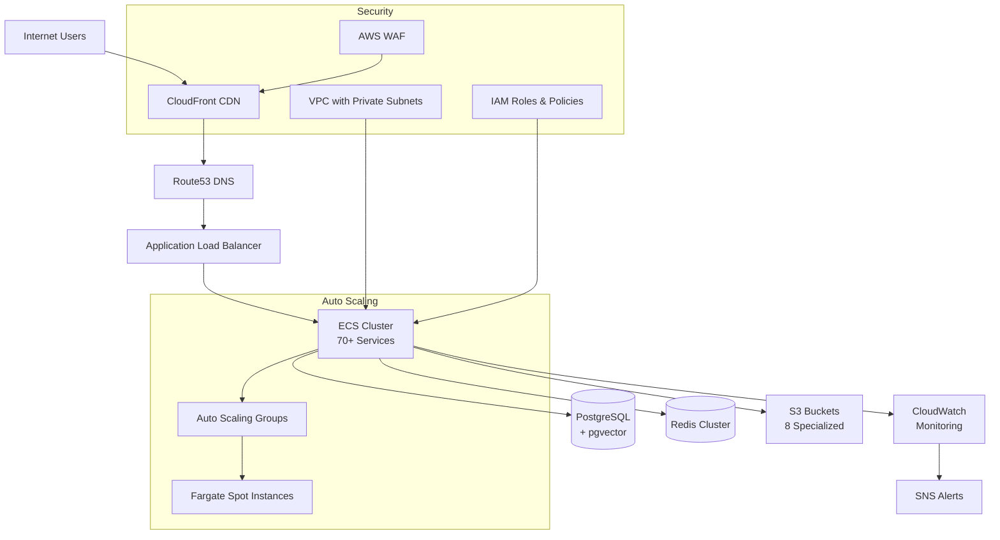

# ActiveLog AWS Infrastructure

🚀 **Complete AWS infrastructure for ActiveLog - 70+ microservices with auto-scaling, monitoring, and cost optimization**

## 📋 Quick Overview

This repository contains the complete Infrastructure as Code (IaC) for deploying ActiveLog on AWS. It provisions a production-ready, scalable, and cost-optimized infrastructure supporting 70+ microservices.

### 🏗️ What's Included

- **70+ Microservices** on ECS Fargate with auto-scaling
- **PostgreSQL with pgvector** for AI embeddings and vector search
- **Redis Cluster** for high-performance caching and sessions
- **S3 Buckets** (8 specialized buckets) for all file storage needs
- **CloudFront CDN** for global content delivery
- **API Gateway** for unified API management
- **Route53** for DNS and health checks
- **Comprehensive Monitoring** with CloudWatch dashboards and alerts
- **Cost Management** with budgets and anomaly detection
- **Security** with WAF, encryption, and VPC isolation

## 🚀 Quick Start

### 1. **One-Command Deployment**

```bash
# Deploy staging environment
cd ~/activelog/infrastructure/aws
./scripts/deploy.sh -e staging -d staging.activelog.com

# Deploy production environment  
./scripts/deploy.sh -e production -d activelog.com -y
```

### 2. **Estimated Costs**

| Environment | Monthly Cost | Use Case |
|-------------|--------------|----------|
| **Staging** | **$1,611** | Development, Testing, QA |
| **Production** | **$4,011** | Live Application, High Availability |

### 3. **Deployment Time**
- **Staging**: ~15 minutes
- **Production**: ~20 minutes

## 📁 Repository Structure

```
~/activelog/infrastructure/aws/
├── terraform/                    # Main Terraform configuration
│   ├── main.tf                  # Root configuration
│   ├── variables.tf             # Variable definitions
│   ├── outputs.tf               # Output values
│   └── modules/                 # Reusable modules
│       ├── vpc/                 # Network infrastructure
│       ├── ecs/                 # Container orchestration
│       ├── rds/                 # Database setup
│       ├── elasticache/         # Redis caching
│       ├── s3/                  # File storage
│       ├── cloudfront/          # CDN configuration
│       ├── api-gateway/         # API management
│       ├── route53/             # DNS management
│       ├── monitoring/          # CloudWatch setup
│       └── security/            # Security policies
├── environments/                # Environment-specific configs
│   ├── staging/
│   │   └── terraform.tfvars    # Staging configuration
│   └── production/
│       └── terraform.tfvars    # Production configuration
├── scripts/
│   └── deploy.sh               # One-click deployment script
└── docs/
    ├── DEPLOYMENT_GUIDE.md     # Detailed deployment guide
    └── COST_ANALYSIS.md        # Cost breakdown and optimization
```

## 🏛️ Architecture Overview



## 🎯 Key Features

### ✅ **Complete Service Coverage**
- **Authentication**: Multi-factor, OAuth, session management
- **Core Business**: Projects, workspaces, collaboration, version control
- **AI & ML**: AI assistant, code analysis, recommendations
- **Communication**: Notifications, email, chat, video calls
- **File Management**: Upload, processing, CDN delivery
- **Analytics**: User behavior, performance metrics
- **Integrations**: GitHub, Slack, Discord, Jira
- **Security**: Vulnerability scanning, audit logging
- **Billing**: Payments, subscriptions, invoicing

### 🔧 **Infrastructure Capabilities**
- **Auto Scaling**: Intelligent scaling based on CPU/memory
- **High Availability**: Multi-AZ deployment with failover
- **Security**: End-to-end encryption, VPC isolation, WAF
- **Monitoring**: 50+ CloudWatch alarms and dashboards
- **Cost Optimization**: Spot instances, reserved capacity
- **Disaster Recovery**: Automated backups and replication

## 💰 Cost Optimization

### 🎯 **Built-in Cost Savings**
- **Spot Instances**: Up to 70% savings on compute
- **Intelligent Tiering**: Automatic S3 storage optimization
- **Right-sizing**: Instance sizes matched to workload
- **Reserved Instances**: Available for predictable workloads
- **Lifecycle Policies**: Automated data archiving

### 📊 **Cost Monitoring**
- **Real-time Budgets**: Automatic alerts at 50%, 80%, 100%
- **Anomaly Detection**: ML-based cost anomaly alerts
- **Service-level Tracking**: Per-service cost breakdown
- **Optimization Recommendations**: Weekly cost review reports

## 📊 Monitoring & Alerting

### 🔍 **What's Monitored**
- **Application Performance**: Response times, error rates
- **Infrastructure Health**: CPU, memory, disk usage
- **Service Availability**: Health checks, uptime monitoring
- **Cost Management**: Budget alerts, usage tracking
- **Security Events**: Failed logins, suspicious activity

### 🚨 **Alert Types**
- **Critical**: Service down, database failure
- **Warning**: High resource usage, slow responses
- **Info**: Cost thresholds, optimization opportunities

## 🔒 Security Features

### 🛡️ **Built-in Security**
- **Network Security**: VPC with private subnets, NACLs
- **Encryption**: At-rest and in-transit encryption
- **Access Control**: IAM roles with least privilege
- **Web Security**: AWS WAF with managed rule sets
- **Monitoring**: CloudTrail, GuardDuty integration ready
- **Compliance**: GDPR, SOC 2 ready architecture

## 📚 Documentation

### 📖 **Available Guides**
- **[Deployment Guide](docs/DEPLOYMENT_GUIDE.md)**: Step-by-step deployment instructions
- **[Cost Analysis](docs/COST_ANALYSIS.md)**: Detailed cost breakdown and optimization
- **Architecture Diagrams**: Visual infrastructure overview
- **Troubleshooting Guide**: Common issues and solutions

## 🚀 Getting Started

### **Prerequisites**
- AWS CLI v2 configured
- Terraform ≥ 1.0
- Domain name (optional but recommended)

### **Step 1: Clone Repository**
```bash
cd ~/activelog/infrastructure/aws
chmod +x scripts/deploy.sh
```

### **Step 2: Configure Environment**
```bash
# Edit environment-specific settings
vi environments/staging/terraform.tfvars
vi environments/production/terraform.tfvars
```

### **Step 3: Deploy**
```bash
# Staging deployment
./scripts/deploy.sh -e staging -d staging.activelog.com

# Production deployment
./scripts/deploy.sh -e production -d activelog.com
```

### **Step 4: Verify Deployment**
```bash
# Check infrastructure status
terraform output

# Verify services are running
aws ecs list-services --cluster activelog-staging-cluster
```

## 🔧 Customization

### **Environment Configuration**
Each environment can be customized by editing the respective `.tfvars` file:

- **Instance sizes**: Scale up/down based on needs
- **Service counts**: Enable/disable specific services
- **Cost limits**: Adjust budgets and alerts
- **Security policies**: Customize access controls

### **Adding New Services**
To add a new microservice:

1. Add service definition to `main.tf` services map
2. Configure container settings (CPU, memory, replicas)
3. Deploy with `terraform apply`

## 🆘 Support & Troubleshooting

### **Common Issues**
- **Deployment Fails**: Check AWS credentials and permissions
- **Services Not Starting**: Verify container images and configurations
- **High Costs**: Review resource usage and optimization recommendations
- **Performance Issues**: Check CloudWatch dashboards and scaling policies

### **Getting Help**
- Review troubleshooting guides in the docs folder
- Check CloudWatch logs for service-specific issues
- Use AWS Support (if you have a support plan)

## 📈 Scaling & Growth

### **Built for Scale**
This infrastructure is designed to grow with your needs:

- **Small Team** (1-10 users): Use minimal service replicas
- **Medium Team** (10-100 users): Standard production configuration
- **Large Organization** (100-1000 users): Enable all services with high availability
- **Enterprise** (1000+ users): Add multi-region deployment

### **Performance Benchmarks**
- **Response Time**: <200ms average API response
- **Throughput**: 10,000+ requests/minute supported
- **Availability**: 99.9% uptime target
- **Scalability**: Auto-scale from 70 to 1,400 tasks

---

## 🎉 **Ready to Deploy?**

Your complete ActiveLog infrastructure is ready to deploy in just one command:

```bash
./scripts/deploy.sh -e production -d yourdomain.com
```

**Questions?** Check out our comprehensive [Deployment Guide](docs/DEPLOYMENT_GUIDE.md) or [Cost Analysis](docs/COST_ANALYSIS.md) for detailed information.

---

**Infrastructure Version**: v1.0.0  
**Last Updated**: 2024  
**Terraform Version**: ≥ 1.0.0  
**AWS Provider**: ~> 5.0