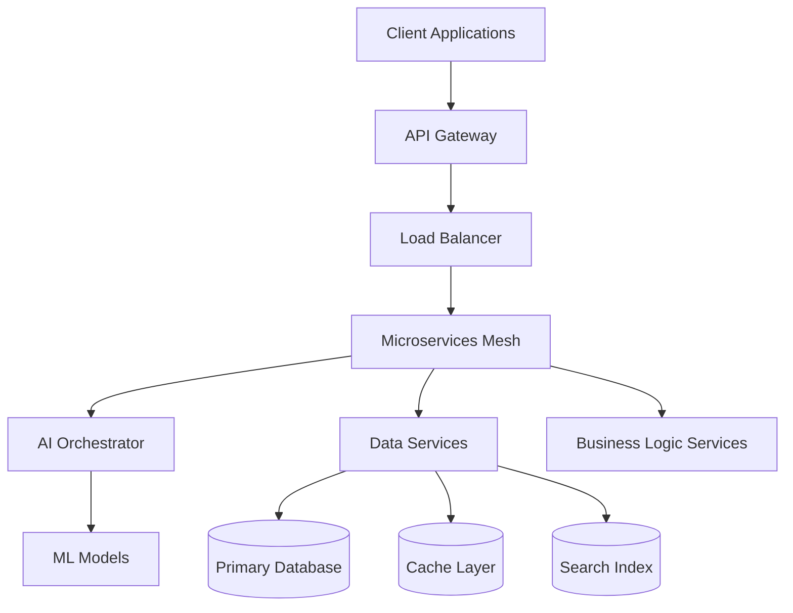

# Technical Documentation Summary
## ActiveLog Technologies Platform

**Last Updated:** September 15, 2024  
**Version:** 2.4  
**Maintained By:** Engineering Team  

---

## Platform Overview

ActiveLog Technologies operates a cloud-native, AI-powered business automation platform designed for scalable enterprise deployment. The platform processes over 1.2M requests daily across 47 microservices.

### Core Technology Stack
- **Backend:** Python (FastAPI), Node.js, Go
- **Frontend:** React, TypeScript, Next.js
- **Database:** PostgreSQL, Redis, Elasticsearch
- **Infrastructure:** AWS (EKS, RDS, ElastiCache, S3)
- **AI/ML:** TensorFlow, PyTorch, Hugging Face Transformers
- **Monitoring:** Prometheus, Grafana, Jaeger, ELK Stack

---

## Architecture Documentation

### 1. High-Level System Architecture



**Key Components:**
- **API Gateway:** Kong with rate limiting and authentication
- **Service Mesh:** Istio for service-to-service communication
- **AI Orchestrator:** Custom orchestration layer for ML workflows
- **Event Bus:** Apache Kafka for asynchronous processing

### 2. Microservices Architecture

#### Core Services (12 services)
- **Auth Service:** OAuth 2.0, JWT token management
- **User Management:** Profile, preferences, organizations
- **AI Receptionist:** Conversational AI engine
- **Phone System:** VoIP integration, call routing
- **Appointment Scheduler:** Calendar integration, booking logic
- **Document AI:** OCR, classification, extraction
- **Analytics:** Real-time metrics, reporting
- **Notification:** Email, SMS, webhook delivery
- **File Processing:** Upload, validation, storage
- **Integration Hub:** Third-party API connections
- **Billing:** Subscription management, usage tracking
- **Admin Portal:** System configuration, monitoring

#### AI/ML Services (8 services)
- **Natural Language Processing:** Intent classification, entity extraction
- **Speech Recognition:** Voice-to-text conversion
- **Text-to-Speech:** Multi-language voice generation
- **Sentiment Analysis:** Emotion detection, tone analysis
- **Document Processing:** OCR, form extraction
- **Predictive Analytics:** Customer behavior, usage forecasting
- **Recommendation Engine:** Feature suggestions, upselling
- **Model Management:** Training, deployment, versioning

#### Infrastructure Services (6 services)
- **Logging Service:** Centralized log aggregation
- **Metrics Collector:** Performance monitoring
- **Health Checker:** Service availability monitoring
- **Configuration Management:** Feature flags, settings
- **Backup Service:** Automated data backup
- **Security Scanner:** Vulnerability assessment

### 3. Data Architecture

#### Primary Database Schema
- **PostgreSQL Clusters:** 3 clusters (Prod, Staging, Dev)
- **Total Tables:** 127 tables
- **Data Size:** 2.4TB production data
- **Backup Strategy:** Point-in-time recovery, cross-region replication

#### Key Database Schemas
```sql
-- User Management
users, organizations, roles, permissions
user_preferences, user_sessions, audit_logs

-- AI/Conversation Data  
conversations, messages, voice_logs, sentiment_analysis
training_data, model_predictions, feedback_loops

-- Business Data
customers, appointments, documents, contracts
billing_events, usage_metrics, notifications

-- System Data
system_settings, feature_flags, health_checks
performance_metrics, error_logs, security_events
```

#### Caching Strategy
- **Redis Clusters:** 2 clusters (primary, replica)
- **Cache Hit Ratio:** 94.2%
- **TTL Strategy:** Dynamic based on data volatility
- **Cache Patterns:** Read-through, write-back, cache-aside

---

## API Documentation

### REST API Endpoints

#### Authentication & Authorization
```yaml
POST /auth/login          # User authentication
POST /auth/refresh        # Token refresh
POST /auth/logout         # Session termination
GET  /auth/user           # Current user info
```

#### Core Business APIs
```yaml
# Conversations
POST /conversations       # Start new conversation
GET  /conversations/{id}  # Get conversation details
POST /conversations/{id}/messages  # Send message

# AI Processing
POST /ai/analyze-text     # Text analysis
POST /ai/process-speech   # Voice processing
POST /ai/generate-response # AI response generation

# Appointments
GET  /appointments        # List appointments
POST /appointments        # Create appointment
PUT  /appointments/{id}   # Update appointment
DELETE /appointments/{id} # Cancel appointment

# Documents
POST /documents/upload    # Upload document
GET  /documents/{id}      # Download document
POST /documents/analyze   # AI document analysis
```

#### Admin & Analytics APIs
```yaml
GET  /admin/dashboard     # Admin dashboard data
GET  /analytics/metrics   # System metrics
GET  /analytics/reports   # Business reports
POST /admin/settings      # Update system settings
```

### GraphQL Schema
```graphql
type User {
  id: ID!
  email: String!
  profile: UserProfile
  conversations: [Conversation!]!
  appointments: [Appointment!]!
}

type Conversation {
  id: ID!
  title: String
  messages: [Message!]!
  sentimentAnalysis: SentimentData
  status: ConversationStatus!
}

type AIResponse {
  text: String!
  confidence: Float!
  intent: String
  entities: [Entity!]!
  suggestedActions: [String!]!
}
```

### WebSocket Events
```javascript
// Real-time conversation events
conversation:message      // New message received
conversation:status       // Status change
conversation:typing       // Typing indicator

// System events  
system:notification       // System notifications
metrics:update           // Real-time metrics
health:status           // Health check updates
```

---

## Code Quality & Standards

### Code Coverage
- **Overall Coverage:** 87.3%
- **Unit Tests:** 2,847 tests
- **Integration Tests:** 456 tests  
- **E2E Tests:** 127 test scenarios
- **Performance Tests:** Load testing up to 10K RPS

### Code Quality Metrics
- **Cyclomatic Complexity:** Average 3.2 (target: <5)
- **Technical Debt:** 2.3 days (SonarQube)
- **Security Hotspots:** 0 critical, 3 minor
- **Code Duplication:** 2.1% (target: <5%)

### Development Standards
- **Code Reviews:** Required for all changes
- **Static Analysis:** SonarQube, ESLint, Pylint
- **Security Scanning:** Snyk, OWASP ZAP
- **Dependency Management:** Automated vulnerability scanning

---

## Infrastructure Documentation

### Cloud Architecture (AWS)

#### Production Environment
```yaml
# Compute
EKS Clusters: 2 clusters (primary, DR)
EC2 Instances: t3.large to c5.4xlarge
Auto Scaling: 10-50 nodes per cluster

# Storage  
RDS: PostgreSQL 14.x Multi-AZ
ElastiCache: Redis 6.x cluster mode
S3: 847GB documents, 2.1TB backups

# Networking
VPC: Multi-AZ with private/public subnets
Load Balancers: Application LB with SSL
CDN: CloudFront for static assets
```

#### Security Configuration
- **Network Security:** VPC, Security Groups, NACLs
- **Encryption:** Data at rest (AES-256), in transit (TLS 1.3)  
- **IAM:** Least privilege access, role-based permissions
- **Monitoring:** CloudTrail, Config, GuardDuty

#### Disaster Recovery
- **RTO:** 4 hours
- **RPO:** 1 hour  
- **Backup Strategy:** Cross-region replication
- **Testing:** Monthly DR drills

---

## Deployment & Operations

### CI/CD Pipeline
```yaml
Source Control: GitHub with branch protection
Build: GitHub Actions, Docker containers
Testing: Automated test suite execution
Security: Container scanning, SAST/DAST
Deployment: Blue-green deployment strategy
```

### Monitoring & Alerting
- **Uptime:** 99.97% (target: 99.9%)
- **Response Time:** P95 < 200ms
- **Error Rate:** 0.03% (target: <0.1%)
- **Alert Channels:** Slack, PagerDuty, Email

### Performance Metrics
```yaml
# Application Performance
Average Response Time: 145ms
Throughput: 1,247 RPS peak
Database Query Time: P95 < 50ms
Cache Hit Ratio: 94.2%

# Infrastructure Metrics  
CPU Utilization: 67% average
Memory Usage: 72% average
Network I/O: 1.2 GB/hour average
Storage IOPS: 2,847 average
```

---

## Security Documentation

### Security Architecture
- **Zero Trust Model:** All services authenticated
- **API Security:** Rate limiting, input validation
- **Data Protection:** Field-level encryption for PII
- **Access Control:** RBAC with attribute-based extensions

### Compliance & Certifications
- **SOC 2 Type II:** Completed August 2024
- **GDPR Compliance:** Full compliance implemented
- **HIPAA Ready:** Healthcare module certified
- **PCI DSS:** Level 1 merchant compliance

### Security Testing
- **Penetration Testing:** Quarterly external audits
- **Vulnerability Scanning:** Daily automated scans
- **Security Reviews:** All code changes reviewed
- **Incident Response:** 24/7 security monitoring

---

## Integration Documentation

### Third-Party Integrations

#### CRM Systems
- **Salesforce:** Bidirectional sync, custom objects
- **HubSpot:** Lead capture, contact management
- **Pipedrive:** Deal tracking, activity logging

#### Communication Platforms
- **Twilio:** Voice calls, SMS messaging
- **Slack:** Notifications, bot integration
- **Microsoft Teams:** Chat integration, calendar sync

#### Business Tools
- **Google Workspace:** Calendar, email, drive
- **Microsoft 365:** Outlook, OneDrive, Teams
- **Zoom:** Meeting scheduling, recording

#### Payment Systems
- **Stripe:** Subscription billing, payment processing
- **PayPal:** Alternative payment method
- **Chargebee:** Subscription management

---

## Development Roadmap

### Q4 2024 Priorities
- **AI Enhancement:** GPT-4 integration, improved NLP
- **Performance:** Database optimization, caching improvements
- **Security:** Enhanced authentication, audit logging

### 2025 Roadmap
- **Mobile Apps:** iOS/Android native applications
- **Advanced Analytics:** Predictive insights, custom dashboards
- **International:** Multi-language, regional compliance

### Technical Debt Management
- **Legacy Code Refactoring:** 15% completion
- **Database Migration:** PostgreSQL 15 upgrade planned
- **Container Optimization:** Resource usage improvements

---

## Documentation Maintenance

### Documentation Standards
- **Update Frequency:** Weekly for API docs, monthly for architecture
- **Review Process:** Engineering lead approval required
- **Version Control:** All docs in Git repository
- **Access Control:** Internal team access, NDA for contractors

### Knowledge Management
- **Internal Wiki:** Confluence with 234 pages
- **Code Comments:** 78% of functions documented
- **API Documentation:** Auto-generated from code annotations
- **Runbooks:** 67 operational procedures documented

**Prepared by:** Engineering Team  
**Technical Review:** CTO Office  
**Next Update:** October 15, 2024