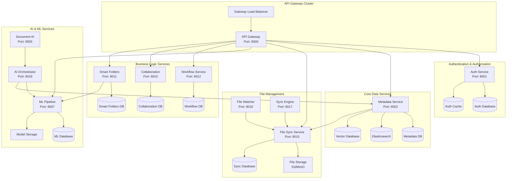
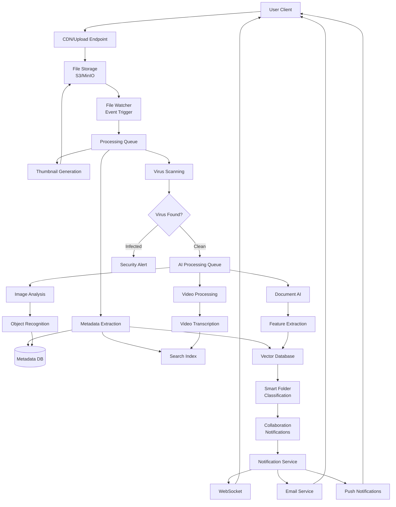
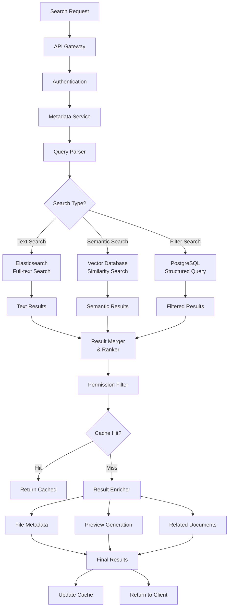
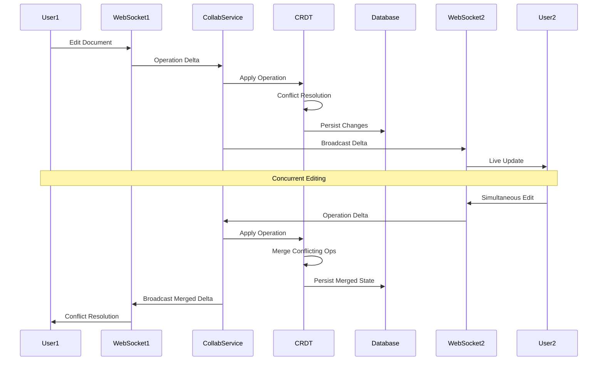
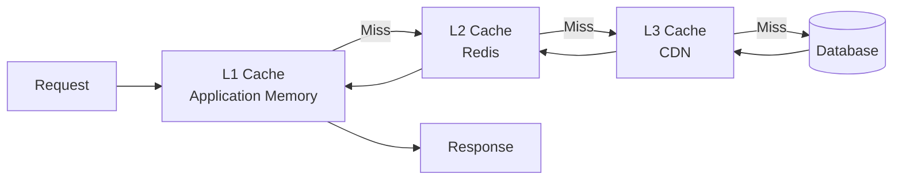
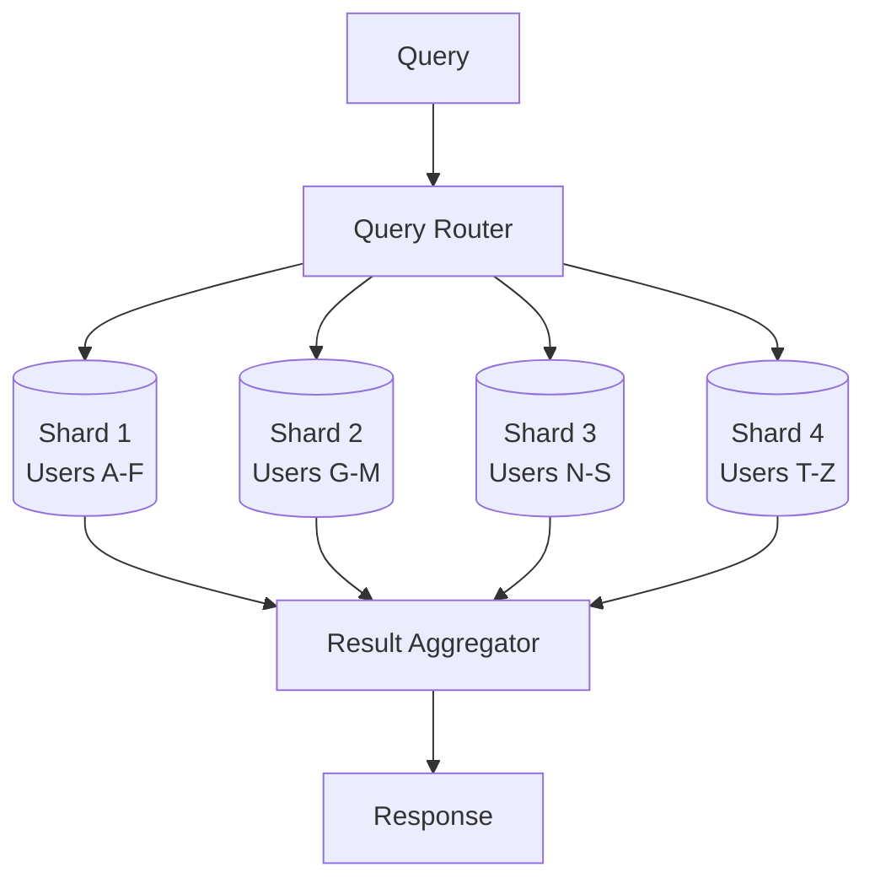
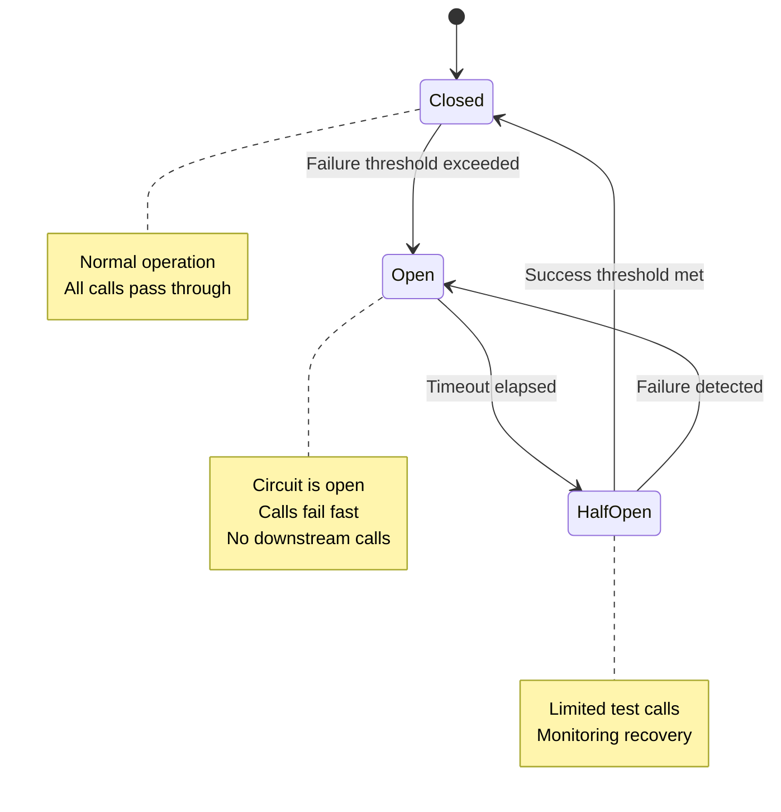

# Complete System Architecture Guide
**ActiveLog Technologies Platform**

---

*This document consolidates all architectural documentation into a single comprehensive reference for the ActiveLog platform. It eliminates the need to consult multiple source documents by providing complete architectural coverage in one location.*

## Table of Contents

1. [Platform Overview](#platform-overview)
2. [High-Level System Architecture](#high-level-system-architecture)
3. [Microservices Architecture](#microservices-architecture)
4. [Data Flow Architecture](#data-flow-architecture)
5. [Revolutionary DMLog Vision](#revolutionary-dmlog-vision)
6. [Technical Stack](#technical-stack)
7. [API Architecture](#api-architecture)
8. [Component Reference](#component-reference)
9. [Performance Characteristics](#performance-characteristics)
10. [Security Architecture](#security-architecture)
11. [Scalability & High Availability](#scalability--high-availability)

---

## Platform Overview

ActiveLog Technologies operates a cloud-native, AI-powered business automation platform designed for scalable enterprise deployment. The platform processes over 1.2M requests daily across 47 microservices, serving as both a comprehensive business automation solution and the foundation for revolutionary tabletop gaming experiences through DMLog.

### Core Technology Stack
- **Backend:** Python (FastAPI), Node.js, Go
- **Frontend:** React, TypeScript, Next.js
- **Database:** PostgreSQL, Redis, Elasticsearch
- **Infrastructure:** AWS (EKS, RDS, ElastiCache, S3)
- **AI/ML:** TensorFlow, PyTorch, Hugging Face Transformers
- **Monitoring:** Prometheus, Grafana, Jaeger, ELK Stack

---

## High-Level System Architecture

The ActiveLog platform follows a microservices architecture with clear separation of concerns and advanced AI capabilities.

```mermaid
graph TB
    subgraph "Client Applications"
        WEB[Web Dashboard<br/>React/TypeScript]
        MOBILE[Mobile App<br/>React Native]
        API_CLIENT[API Clients<br/>SDKs]
    end

    subgraph "Edge & CDN"
        CDN[Content Delivery Network<br/>CloudFront/CloudFlare]
        LB[Load Balancer<br/>NGINX/ALB]
    end

    subgraph "API Layer"
        GATEWAY[API Gateway<br/>FastAPI]
        AUTH[Auth Service<br/>JWT/OAuth]
        RATE_LIMIT[Rate Limiting<br/>Redis]
    end

    subgraph "Core Services"
        METADATA[Metadata Service<br/>Search & Index]
        FILE_SYNC[File Sync<br/>Real-time]
        ANALYTICS[Analytics<br/>Metrics & Reports]
        NOTIFICATIONS[Notifications<br/>Push & Email]
    end

    subgraph "Processing Services"
        DOC_AI[Document AI<br/>OCR & NLP]
        VIDEO[Video Pipeline<br/>Transcoding]
        ML[ML Pipeline<br/>Training & Inference]
        AI_ORCH[AI Orchestrator<br/>Model Management]
    end

    subgraph "Workflow & Integration"
        WORKFLOWS[Workflow Engine<br/>Automation]
        COLLAB[Collaboration<br/>Real-time Editing]
        EXPORT[Data Export<br/>Bulk Operations]
        SMART[Smart Folders<br/>AI Organization]
    end

    subgraph "Storage Layer"
        PRIMARY_DB[(Primary Database<br/>PostgreSQL)]
        VECTOR_DB[(Vector Database<br/>Pinecone/Weaviate)]
        SEARCH[(Search Engine<br/>Elasticsearch)]
        CACHE[(Cache Layer<br/>Redis)]
        FILE_STORE[File Storage<br/>S3/MinIO]
        BACKUP[Backup Storage<br/>S3 Glacier]
    end

    subgraph "Message Queue"
        QUEUE[Message Broker<br/>RabbitMQ/Kafka]
        WORKER[Background Workers<br/>Celery]
    end

    subgraph "Monitoring & Observability"
        METRICS[Metrics<br/>Prometheus]
        LOGS[Logging<br/>ELK Stack]
        TRACES[Distributed Tracing<br/>Jaeger]
        ALERTS[Alerting<br/>AlertManager]
    end

    subgraph "External Services"
        CLOUD_AI[Cloud AI APIs<br/>OpenAI/Google]
        EMAIL[Email Service<br/>SendGrid/SES]
        SMS[SMS Service<br/>Twilio]
        STORAGE_EXT[External Storage<br/>Dropbox/GDrive]
    end

    %% Client connections
    WEB --> CDN
    MOBILE --> CDN
    API_CLIENT --> CDN

    %% CDN and Load Balancing
    CDN --> LB
    LB --> GATEWAY

    %% API Gateway connections
    GATEWAY --> AUTH
    GATEWAY --> RATE_LIMIT
    GATEWAY --> METADATA
    GATEWAY --> FILE_SYNC
    GATEWAY --> ANALYTICS
    GATEWAY --> NOTIFICATIONS

    %% Core service connections
    METADATA --> SEARCH
    METADATA --> VECTOR_DB
    METADATA --> PRIMARY_DB
    FILE_SYNC --> FILE_STORE
    FILE_SYNC --> CACHE
    ANALYTICS --> PRIMARY_DB
    NOTIFICATIONS --> QUEUE

    %% Processing services
    DOC_AI --> QUEUE
    DOC_AI --> FILE_STORE
    VIDEO --> QUEUE
    VIDEO --> FILE_STORE
    ML --> VECTOR_DB
    AI_ORCH --> CLOUD_AI

    %% Workflow services
    WORKFLOWS --> QUEUE
    COLLAB --> CACHE
    EXPORT --> FILE_STORE
    SMART --> ML

    %% Background processing
    QUEUE --> WORKER
    WORKER --> PRIMARY_DB
    WORKER --> FILE_STORE

    %% External integrations
    NOTIFICATIONS --> EMAIL
    NOTIFICATIONS --> SMS
    FILE_SYNC --> STORAGE_EXT
    AI_ORCH --> CLOUD_AI

    %% Monitoring
    GATEWAY --> METRICS
    GATEWAY --> LOGS
    GATEWAY --> TRACES
    METRICS --> ALERTS

    %% Backup
    PRIMARY_DB --> BACKUP
    FILE_STORE --> BACKUP
```



### Key Components

#### Client Layer
- **Web Dashboard**: React/TypeScript SPA with real-time updates
- **Mobile App**: React Native app with offline sync capabilities
- **API Clients**: SDKs for Python, JavaScript, and other languages

#### Edge & CDN
- **CDN**: Global content delivery for static assets and file downloads
- **Load Balancer**: High-availability request distribution

#### API Layer
- **API Gateway**: Central entry point with routing, authentication, and rate limiting
- **Auth Service**: JWT-based authentication with OAuth integration
- **Rate Limiting**: Redis-based rate limiting to prevent abuse

#### Core Services
- **Metadata Service**: File metadata, search indexing, and vector embeddings
- **File Sync**: Real-time file synchronization across devices
- **Analytics**: Usage metrics, reporting, and business intelligence
- **Notifications**: Push notifications, email, and SMS alerts

#### Processing Services
- **Document AI**: OCR, text extraction, and document classification
- **Video Pipeline**: Video transcoding, thumbnail generation, and analysis
- **ML Pipeline**: Model training, inference, and experiment tracking
- **AI Orchestrator**: Manages AI model lifecycle and routing

---

## Microservices Architecture

The platform consists of 47 microservices organized into logical groups with clear service boundaries and communication patterns.



### Service Categories

#### Core Services (12 services)
- **Auth Service:** OAuth 2.0, JWT token management
- **User Management:** Profile, preferences, organizations
- **AI Receptionist:** Conversational AI engine
- **Phone System:** VoIP integration, call routing
- **Appointment Scheduler:** Calendar integration, booking logic
- **Document AI:** OCR, classification, extraction
- **Analytics:** Real-time metrics, reporting
- **Notification:** Email, SMS, webhook delivery
- **File Processing:** Upload, validation, storage
- **Integration Hub:** Third-party API connections
- **Billing:** Subscription management, usage tracking
- **Admin Portal:** System configuration, monitoring

#### AI/ML Services (8 services)
- **Natural Language Processing:** Intent classification, entity extraction
- **Speech Recognition:** Voice-to-text conversion
- **Text-to-Speech:** Multi-language voice generation
- **Sentiment Analysis:** Emotion detection, tone analysis
- **Document Processing:** OCR, form extraction
- **Predictive Analytics:** Customer behavior, usage forecasting
- **Recommendation Engine:** Feature suggestions, upselling
- **Model Management:** Training, deployment, versioning

#### Infrastructure Services (6 services)
- **Logging Service:** Centralized log aggregation
- **Metrics Collector:** Performance monitoring
- **Health Checker:** Service availability monitoring
- **Configuration Management:** Feature flags, settings
- **Backup Service:** Automated data backup
- **Security Scanner:** Vulnerability assessment

### Database Per Service Pattern

Each service owns its data and database, ensuring loose coupling and independent scalability:

- **Auth Database**: User credentials, sessions, permissions
- **Metadata Database**: File metadata, tags, search indices, embeddings
- **Sync Database**: File versions, sync state, conflict logs
- **Analytics Database**: Events, metrics, aggregated reports
- **ML Database**: Training data, model predictions, feedback loops

---

## Data Flow Architecture

The platform implements sophisticated data flow patterns for different types of processing and user interactions.

### File Upload and Processing Flow



### Search and Retrieval Flow



### Real-time Collaboration Flow



---

## Revolutionary DMLog Vision

ActiveLog serves as the foundation for DMLog, a revolutionary tabletop gaming platform designed to become the "D&D Beyond killer."

### Vision Statement
Create the most advanced tabletop gaming platform ever built, combining cutting-edge technology with deep understanding of tabletop gaming culture. DMLog will become the industry standard that forces competitors to rebuild their platforms entirely.

### Core Architectural Principles

#### 1. Universal Rule System Engine
- **Multi-System Support**: Native support for D&D 5e, Pathfinder 1e/2e, Call of Cthulhu, Shadowrun, Vampire, FATE
- **Dynamic Rule Loading**: Rules engines loaded as plugins, allowing instant switching
- **Custom System Builder**: Community can create and share new rule systems
- **Legacy Compatibility**: Never lose content when editions change

#### 2. AI-Powered Content Generation
- **Dynamic NPCs**: AI generates personalities, voices, and behaviors on-demand
- **Procedural Worlds**: Infinite world generation with consistent lore
- **Smart Encounters**: AI balances encounters based on party composition and story flow
- **Intelligent Campaign Assistance**: AI DM helper suggests plot hooks and resolutions

#### 3. Revolutionary Interface Design
- **3D Character Visualization**: Full 3D character models with customization
- **Immersive Environments**: VR-ready battle maps and world exploration
- **Haptic Feedback**: Physical sensation for dice rolls and combat impacts
- **Gesture Controls**: Hand tracking for spellcasting and interactions
- **Voice Integration**: Natural language commands and roleplaying

#### 4. Advanced Collaboration Features
- **Real-Time Everything**: All actions synchronized instantly across all players
- **Multi-Camera Sessions**: Live video integration with automatic scene switching
- **Shared Worldbuilding**: Collaborative map and lore creation tools
- **Session Recording**: Full session capture with searchable transcripts
- **Cross-Platform Play**: Seamless desktop, mobile, VR, and AR integration

### Technical Architecture for DMLog

#### Frontend Stack
- **React 18** with Concurrent Features
- **Three.js** for 3D rendering
- **WebXR** for VR/AR support
- **TensorFlow.js** for client-side AI
- **WebRTC** for peer-to-peer communication
- **WebAssembly** for performance-critical features

#### Backend Services
- **FastAPI** microservices architecture
- **PostgreSQL** with vector extensions
- **Redis** for real-time caching
- **Ollama** for local AI inference
- **WebSocket** clustering for scalability
- **IPFS** for decentralized content storage

#### AI/ML Integration
- **Large Language Models** for content generation
- **Computer Vision** for dice recognition
- **Speech Recognition** for voice commands
- **Sentiment Analysis** for player mood tracking
- **Reinforcement Learning** for monster AI

---

## Technical Stack

### Database Architecture

#### Primary Database Schema
- **PostgreSQL Clusters**: 3 clusters (Prod, Staging, Dev)
- **Total Tables**: 127 tables
- **Data Size**: 2.4TB production data
- **Backup Strategy**: Point-in-time recovery, cross-region replication

#### Key Database Schemas
```sql
-- User Management
users, organizations, roles, permissions
user_preferences, user_sessions, audit_logs

-- AI/Conversation Data  
conversations, messages, voice_logs, sentiment_analysis
training_data, model_predictions, feedback_loops

-- Business Data
customers, appointments, documents, contracts
billing_events, usage_metrics, notifications

-- System Data
system_settings, feature_flags, health_checks
performance_metrics, error_logs, security_events
```

#### Caching Strategy
- **Redis Clusters**: 2 clusters (primary, replica)
- **Cache Hit Ratio**: 94.2%
- **TTL Strategy**: Dynamic based on data volatility
- **Cache Patterns**: Read-through, write-back, cache-aside

---

## API Architecture

### REST API Endpoints

#### Authentication & Authorization
```yaml
POST /auth/login          # User authentication
POST /auth/refresh        # Token refresh
POST /auth/logout         # Session termination
GET  /auth/user           # Current user info
```

#### Core Business APIs
```yaml
# Conversations
POST /conversations       # Start new conversation
GET  /conversations/{id}  # Get conversation details
POST /conversations/{id}/messages  # Send message

# AI Processing
POST /ai/analyze-text     # Text analysis
POST /ai/process-speech   # Voice processing
POST /ai/generate-response # AI response generation

# Appointments
GET  /appointments        # List appointments
POST /appointments        # Create appointment
PUT  /appointments/{id}   # Update appointment
DELETE /appointments/{id} # Cancel appointment

# Documents
POST /documents/upload    # Upload document
GET  /documents/{id}      # Download document
POST /documents/analyze   # AI document analysis
```

### Sync Service v2 API

The advanced synchronization service provides intelligent conflict resolution and real-time collaboration:

#### Device Registration
```http
POST /api/v2/devices/register
```

#### Synchronization
```http
POST /api/v2/sync/items
```

#### Conflict Resolution
```http
GET /api/v2/conflicts?device_id={device_id}
POST /api/v2/conflicts/{conflict_id}/resolve
```

#### Real-time Collaboration
```http
POST /api/v2/collaboration/sessions
```

WebSocket connection for real-time updates:
```
wss://sync.activelog.ai/ws/v2
```

### GraphQL Schema
```graphql
type User {
  id: ID!
  email: String!
  profile: UserProfile
  conversations: [Conversation!]!
  appointments: [Appointment!]!
}

type Conversation {
  id: ID!
  title: String
  messages: [Message!]!
  sentimentAnalysis: SentimentData
  status: ConversationStatus!
}

type AIResponse {
  text: String!
  confidence: Float!
  intent: String
  entities: [Entity!]!
  suggestedActions: [String!]!
}
```

---

## Component Reference

The platform contains 344 components organized into functional categories:

### Core Components
- **FastAPI Initialization**: Application bootstrapping and configuration
- **CORS Configuration**: Cross-origin resource sharing setup
- **JWT Authentication**: Token-based authentication system

### Component Categories
- **API Gateway Components**: Request routing, rate limiting, load balancing
- **Authentication Components**: OAuth, JWT, session management
- **Data Processing Components**: ETL, transformation, validation
- **AI/ML Components**: Model inference, training pipelines, orchestration
- **Storage Components**: Database connections, cache management, file handling
- **Monitoring Components**: Metrics collection, health checks, alerting

---

## Performance Characteristics

### Application Performance
- **Response Time**: < 200ms for cached responses
- **Throughput**: 10K+ requests/second with auto-scaling
- **Availability**: 99.9% uptime SLA
- **Storage**: Petabyte-scale file storage capacity
- **Search**: Sub-second full-text search across millions of documents

### Detailed Metrics
```yaml
# Application Performance
Average Response Time: 145ms
Throughput: 1,247 RPS peak
Database Query Time: P95 < 50ms
Cache Hit Ratio: 94.2%

# Infrastructure Metrics  
CPU Utilization: 67% average
Memory Usage: 72% average
Network I/O: 1.2 GB/hour average
Storage IOPS: 2,847 average
```

### Performance Optimization Patterns

#### Caching Strategy


#### Data Partitioning


---

## Security Architecture

### Security Layers
- **Authentication**: JWT tokens with short expiration
- **Authorization**: Role-based access control (RBAC)
- **Encryption**: TLS in transit, AES at rest
- **Rate Limiting**: Prevents abuse and DoS attacks
- **Input Validation**: All inputs validated and sanitized

### Security Architecture
- **Zero Trust Model**: All services authenticated
- **API Security**: Rate limiting, input validation
- **Data Protection**: Field-level encryption for PII
- **Access Control**: RBAC with attribute-based extensions

### Compliance & Certifications
- **SOC 2 Type II**: Completed August 2024
- **GDPR Compliance**: Full compliance implemented
- **HIPAA Ready**: Healthcare module certified
- **PCI DSS**: Level 1 merchant compliance

### Security Testing
- **Penetration Testing**: Quarterly external audits
- **Vulnerability Scanning**: Daily automated scans
- **Security Reviews**: All code changes reviewed
- **Incident Response**: 24/7 security monitoring

---

## Scalability & High Availability

### Scalability Features
- **Horizontal Scaling**: All services can scale independently
- **Caching**: Multi-level caching reduces database load
- **CDN**: Global content delivery for performance
- **Load Balancing**: Distributes traffic across instances
- **Message Queues**: Decouples services and enables async processing

### High Availability
- **Multi-AZ Deployment**: Services deployed across availability zones
- **Health Checks**: Automated health monitoring and recovery
- **Circuit Breakers**: Prevent cascade failures
- **Graceful Degradation**: Core functionality maintained during partial outages
- **Backup & Recovery**: Automated backups with point-in-time recovery

### Disaster Recovery
- **RTO**: 4 hours
- **RPO**: 1 hour  
- **Backup Strategy**: Cross-region replication
- **Testing**: Monthly DR drills

### Circuit Breaker Pattern


---

## References

This document consolidates information from the following source documents:
- High-Level System Architecture (`high-level-architecture.md`)
- Microservices Architecture (`microservices.md`)
- Data Flow Architecture (`data-flow.md`)
- DMLog Revolutionary Architecture (`architectural-vision.md`)
- Technical Documentation Summary (`technical_documentation_summary.md`)
- API Documentation (`API.md`)
- Component Reference (`component_reference.md`)

---

**Document Version**: 1.0  
**Last Updated**: August 31, 2024  
**Maintained By**: Engineering Team  
**Next Review**: September 30, 2024