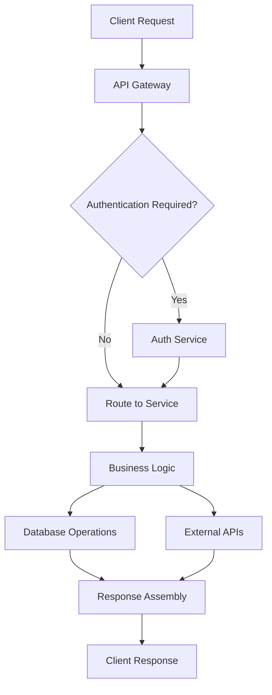

# Development Platform User Guide
## ActiveLog Technologies, Inc.

**Document Version:** 1.0  
**Effective Date:** [DATE]  
**Last Updated:** [DATE]  
**Next Review:** [DATE + 6 months]  
**Owner:** VP of Engineering and Product Management  

---

## Table of Contents

1. [Platform Overview](#platform-overview)
2. [Getting Started Guide](#getting-started-guide)
3. [Web Application User Guide](#web-application-user-guide)
4. [Mobile Companion Guide](#mobile-companion-guide)
5. [Developer Onboarding](#developer-onboarding)
6. [CLI Tools and Automation](#cli-tools-and-automation)
7. [DMLog Gaming Platform](#dmlog-gaming-platform)
8. [Advanced Features and Customization](#advanced-features-and-customization)
9. [Integration and APIs](#integration-and-apis)
10. [Best Practices and Workflows](#best-practices-and-workflows)
11. [Troubleshooting and Support](#troubleshooting-and-support)
12. [Community and Resources](#community-and-resources)

---

## Platform Overview

### 1.1 What is ActiveLog?

ActiveLog is a comprehensive AI-powered development and productivity platform that provides:

**Core Platform Components:**
- 🤖 **Intelligent File Management** - AI-powered organization and search
- 🔄 **Real-time Collaboration** - Multi-user synchronization and sharing
- 📱 **Cross-platform Sync** - Desktop, mobile, and web applications
- 🛠️ **Developer Tools** - CLI interfaces and automation frameworks
- 🎲 **DMLog Gaming Platform** - Complete D&D campaign management
- 📊 **Analytics and Insights** - Data-driven productivity analysis

**Target Users:**
- **End Users** - Individuals and teams managing files and projects
- **Developers** - Building applications and automating workflows
- **Content Creators** - Managing digital assets and collaboration
- **Gaming Groups** - Running tabletop RPG campaigns
- **Beta Testers** - Early access to experimental features

### 1.2 Platform Architecture

**Multi-Service Architecture:**
```
Frontend Applications
├── Web Application (React/TypeScript)
├── Desktop Apps (Windows/macOS/Linux)
├── Mobile Apps (iOS/Android PWA)
└── CLI Tools (Node.js/Python)

Backend Services
├── API Gateway (FastAPI)
├── Authentication Service
├── Metadata Service
├── Analytics Service
├── Notification Service
├── File Management Service
└── AI/ML Processing Service

Data Layer
├── PostgreSQL (Primary Database)
├── Redis (Caching and Sessions)
├── Elasticsearch (Search Engine)
├── MinIO/S3 (File Storage)
└── MongoDB (Analytics Data)
```

### 1.3 Key Features

**AI-Powered Intelligence:**
- Automatic content classification and tagging
- Intelligent search with natural language queries
- Smart folder organization and recommendations
- Document text extraction and analysis
- Image and video content recognition

**Collaboration Features:**
- Real-time multi-user editing and commenting
- Granular permission controls and sharing
- Activity feeds and notification systems
- Version history and change tracking
- Team workspaces and project management

**Developer Experience:**
- Comprehensive REST APIs with OpenAPI documentation
- CLI tools for automation and scripting
- SDK support for multiple programming languages
- Webhook integrations and event streaming
- Local development environment setup

**Platform Integrations:**
- Google Drive, Dropbox, OneDrive sync
- GitHub, GitLab repository connections
- Slack, Microsoft Teams notifications
- Zapier, IFTTT workflow automation
- Custom API integrations and webhooks

---

## Getting Started Guide

### 2.1 Account Creation and Setup

#### First-Time User Setup

**Step 1: Account Registration**
1. Visit [https://app.activelog.com](https://app.activelog.com)
2. Choose your signup method:
   - 📧 **Email Registration** - Standard email and password
   - 🔗 **Social Login** - Google, Microsoft, or GitHub SSO
   - 🏢 **Enterprise SSO** - SAML/OIDC for business accounts

3. Complete email verification
4. Accept terms of service and privacy policy

**Step 2: Profile Configuration**
```yaml
Required Settings:
  - Display name and profile picture
  - Primary timezone and language
  - Notification preferences
  - Security settings (2FA recommended)

Optional Settings:
  - Professional information and bio
  - Integration preferences
  - Default privacy settings
  - Custom themes and appearance
```

**Step 3: Initial Setup Wizard**
The platform guides you through:
- 🎯 **Use Case Selection** - Personal, Business, Development, Gaming
- 📁 **Workspace Creation** - Initial project and folder structure
- 🔌 **Integration Setup** - Connect existing services (optional)
- 🎓 **Tutorial Mode** - Interactive feature walkthrough

#### Beta Program Participation

**Beta Access Requirements:**
- ✅ Signed NDA agreement
- ✅ Valid beta invitation code
- ✅ Completed feedback commitment form
- ✅ Modern browser (Chrome 90+, Firefox 88+, Safari 14+)

**Beta-Specific Setup:**
1. Use beta URL: `https://beta.activelog.dev`
2. Accept beta terms and data collection consent
3. Enable experimental features in settings
4. Configure feedback and bug reporting preferences

### 2.2 Essential First Actions

#### Quick Start Checklist (15 minutes)

**File Management Basics:**
- [ ] **Upload First File** - Drag and drop or use upload button
- [ ] **Create Folder Structure** - Organize your content
- [ ] **Try AI Search** - Search with natural language
- [ ] **Share a File** - Test collaboration features
- [ ] **Set Up Mobile** - Install companion app

**Productivity Features:**
- [ ] **Smart Folders** - Create rule-based organization
- [ ] **Tagging System** - Use # symbols for quick tags
- [ ] **Quick Actions** - Learn keyboard shortcuts
- [ ] **Version History** - Test file versioning
- [ ] **Activity Feed** - Monitor team activity

**Collaboration Setup:**
- [ ] **Invite Team Members** - Add colleagues or friends
- [ ] **Create Shared Workspace** - Set up team collaboration
- [ ] **Configure Permissions** - Set access controls
- [ ] **Enable Notifications** - Stay updated on changes
- [ ] **Test Real-time Sync** - Verify cross-device functionality

### 2.3 Interface Overview

#### Main Dashboard Components

**Navigation Structure:**
```
Top Navigation Bar
├── ActiveLog Logo (Home)
├── Global Search Bar
├── Quick Upload Button
├── Notifications Center
├── User Profile Menu
└── Settings and Help

Left Sidebar
├── Dashboard (Overview)
├── Recent Files
├── My Files & Folders
├── Shared with Me
├── Projects & Workspaces
├── Analytics & Insights
├── Trash & Archive
└── Beta Features (if applicable)

Main Content Area
├── Welcome Dashboard (for new users)
├── File Grid/List Views
├── Preview Panel
├── Activity Timeline
└── AI Suggestions Panel

Status Bar
├── Connection Status
├── Sync Status
├── Storage Usage
└── Feature Updates
```

**View Modes and Customization:**
- **Grid View** 📱 - Visual thumbnail previews
- **List View** 📋 - Detailed file information and metadata
- **Timeline View** 📅 - Chronological organization by date
- **Map View** 🗺️ - Geographic organization (for location-tagged files)
- **Custom Views** 🎨 - User-defined layouts and filters

---

## Web Application User Guide

### 3.1 Web App Features and Navigation

#### Core Interface Elements

**Search and Discovery:**
```javascript
Search Capabilities:
- Natural Language: "Show me PDFs from last month"
- File Type Filters: @images, @documents, @videos
- Date Ranges: @today, @this-week, @last-month
- Tag Searches: #work, #important, #project
- Content Search: Full-text within documents
- AI-Powered: Semantic meaning and context search
```

**File Operations:**
- **Upload Methods** - Drag-and-drop, button click, or clipboard paste
- **Bulk Operations** - Multi-select for batch actions
- **Quick Preview** - Space bar for instant file preview
- **Share Controls** - Granular permission settings
- **Download Options** - Individual files or bulk zip archives

#### Advanced Web Features

**Smart Folder System:**
```yaml
Smart Folder Rules:
  Date-based:
    - Files from last 30 days
    - Modified this week
    - Created today
  
  Content-based:
    - All PDFs over 10MB
    - Images with faces detected
    - Documents mentioning "ActiveLog"
  
  Collaboration-based:
    - Shared with specific team
    - Recently commented files
    - Pending approval items
  
  Custom Combinations:
    - Work documents from Q4 with high priority
    - Personal photos from vacation locations
    - Development files modified by team members
```

**Real-time Collaboration:**
- **Live Cursors** - See where team members are working
- **Comment System** - Thread-based discussions on files
- **Activity Stream** - Real-time updates and notifications
- **Conflict Resolution** - Automatic merging of simultaneous edits
- **Presence Indicators** - Show who's currently online

### 3.2 Mobile Optimization and PWA

#### Progressive Web App Features

**Installation and Setup:**
1. **Browser Installation** - Add to home screen prompt
2. **Offline Functionality** - Service worker caching for core features
3. **Native Integration** - Camera access, file system integration
4. **Push Notifications** - Real-time alerts and updates

**Mobile-Optimized Interface:**
- **Touch Gestures** - Swipe navigation and pinch-to-zoom
- **Responsive Design** - Adapts to all screen sizes and orientations
- **Mobile Upload** - Camera integration and photo capture
- **Offline Access** - Limited functionality without internet
- **Performance Optimization** - Optimized for mobile networks

#### Mobile-Specific Features

**Camera Integration:**
```typescript
Mobile Camera Features:
- Document scanning with auto-crop
- QR code scanning for quick sharing
- Photo capture with location tagging
- Video recording with compression
- Batch upload with progress tracking
```

**Offline Capabilities:**
- **Read Access** - View recently accessed files offline
- **Basic Editing** - Simple text edits with sync on reconnection
- **Upload Queue** - Queue uploads for when connection returns
- **Conflict Resolution** - Handle offline/online conflicts automatically

### 3.3 Beta Testing Interface

#### Beta-Specific Elements

**Feature Flags and Experimental Features:**
- 🧪 **Beta Badge** - Identifies experimental functionality
- 🎛️ **Feature Toggles** - Enable/disable specific features
- 📊 **A/B Testing** - Participate in feature comparisons
- 💬 **Feedback Integration** - Quick feedback on new features

**Beta User Privileges:**
- **Early Access** - New features before general availability
- **Direct Feedback Channel** - Direct line to product team
- **Feature Influence** - Vote on development priorities
- **Community Access** - Beta user forums and discussions

**Data Collection and Privacy:**
```yaml
Beta Data Collection:
  Usage Analytics:
    - Feature usage patterns and frequency
    - Performance metrics and error rates
    - User flow analysis and optimization
  
  Feedback Data:
    - Explicit user feedback and ratings
    - Bug reports and issue descriptions
    - Feature requests and suggestions
  
  Privacy Controls:
    - Opt-out options for data collection
    - Anonymization and aggregation
    - Data retention and deletion policies
```

---

## Mobile Companion Guide

### 4.1 DMLog Mobile Features

#### RPG Companion App Capabilities

**Core Gaming Features:**
```yaml
Dice Rolling System:
  Standard Dice: d4, d6, d8, d10, d12, d20, d100
  Custom Combinations: 3d6+2, 4d6 drop lowest
  Roll History: Timestamped results with context
  Advantage/Disadvantage: Automatic calculation
  Critical Hit Detection: Natural 20/1 highlighting

Character Management:
  Basic Information: Name, class, level, stats
  Ability Scores: Automatic modifier calculation
  Skill Tracking: Proficiency bonus application
  Spell Management: Slot tracking and descriptions
  Inventory System: Drag-and-drop item management

Combat Tools:
  Initiative Tracker: Automatic sorting by initiative
  Turn Management: Round counter and current player
  Health Tracking: Visual HP bars and damage logging
  Condition Tracking: Status effects and durations
  Combat History: Action log and damage totals
```

**Sync and Integration:**
- **Character Sync** - Real-time updates with DMLog Core service
- **Campaign Data** - Session notes and shared information
- **Battle System** - Combat state synchronization
- **Cross-Platform** - Works on phones, tablets, and desktop

#### PWA Installation and Setup

**Installation Process:**
1. **Open in Browser** - Navigate to mobile interface
2. **Add to Home Screen** - Browser prompt or menu option
3. **Native App Experience** - Full-screen mode with app icons
4. **Automatic Updates** - Background updates without app store

**Offline Gaming Support:**
- **Local Storage** - Character data and recent session info
- **Offline Dice** - Full dice rolling functionality without connection
- **Sync on Reconnect** - Automatic synchronization when online
- **Conflict Resolution** - Handle simultaneous changes gracefully

### 4.2 Cross-Platform Synchronization

#### Multi-Device Workflow

**Device Management:**
```typescript
Supported Platforms:
- Web Browsers: Chrome, Firefox, Safari, Edge
- Desktop Apps: Windows, macOS, Linux native apps
- Mobile Web: iOS Safari, Android Chrome
- Tablet Mode: iPad, Android tablets optimized interface

Sync Capabilities:
- Real-time: Changes appear instantly across devices
- Offline Queue: Actions sync when connection restored
- Conflict Resolution: Automatic merging of simultaneous edits
- Version History: Track changes across all devices
```

**Universal Features:**
- **Consistent Interface** - Same functionality across all platforms
- **Seamless Handoff** - Start on one device, continue on another
- **Cross-Device Notifications** - Alerts and updates everywhere
- **Unified Search** - Same search results on all devices

---

## Developer Onboarding

### 5.1 Development Environment Setup

#### System Requirements and Prerequisites

**Minimum System Requirements:**
```yaml
Operating Systems:
  - macOS 10.15+ (Catalina or later)
  - Ubuntu 20.04+ LTS or compatible Linux distribution
  - Windows 10+ with WSL2 enabled

Hardware Requirements:
  - RAM: 16GB recommended (8GB minimum)
  - Storage: 50GB free space for full development setup
  - CPU: Multi-core processor (Intel i5/AMD Ryzen 5 or better)
  - Network: Stable broadband internet connection

Required Software:
  - Docker Desktop: Container orchestration
  - Git: Version control system
  - Node.js 18+: JavaScript runtime for frontend and CLI
  - Python 3.9+: Backend services and automation
  - Code Editor: VS Code recommended with extensions
```

#### Quick Setup Script

**Automated Environment Setup:**
```bash
#!/bin/bash
# ActiveLog Development Environment Setup Script

echo "🚀 Setting up ActiveLog development environment..."

# System checks
./scripts/check-requirements.sh

# Clone repository
git clone git@github.com:activelog/activelog.git
cd activelog

# Environment configuration
cp .env.example .env
echo "Edit .env file with your configuration..."

# Docker setup
docker-compose pull
docker-compose up -d postgres redis minio elasticsearch

# Backend setup
cd services/
python3 -m venv venv
source venv/bin/activate
pip install -r requirements-dev.txt

# Frontend setup
cd ../frontend/
npm install
npm install --save-dev @types/react @types/node

# Database initialization
cd ../
python services/manage.py migrate
python services/manage.py seed_dev_data

# Start development services
docker-compose -f docker-compose.yml -f docker-compose.dev.yml up

echo "✅ Development environment ready!"
echo "🌐 Web App: http://localhost:3000"
echo "📡 API Gateway: http://localhost:8000"
echo "📚 API Docs: http://localhost:8000/docs"
```

#### Development Workflow Integration

**Git Workflow:**
```yaml
Branch Strategy:
  - main: Production-ready code
  - develop: Integration branch for features
  - feature/*: Individual feature development
  - hotfix/*: Critical production fixes
  - release/*: Release preparation branches

Code Quality:
  - Pre-commit hooks: Black, ESLint, type checking
  - Automated testing: pytest, Jest test suites
  - Code coverage: Minimum 80% coverage requirement
  - Security scanning: Bandit for Python, npm audit for Node.js

Review Process:
  - Pull request required for all changes
  - Two-reviewer minimum for core changes
  - Automated checks must pass before merge
  - Documentation updates required for feature changes
```

### 5.2 First Development Task

#### Hello World Tutorial

**Creating Your First API Endpoint:**
```python
# File: services/metadata/routes.py
from datetime import datetime
from fastapi import APIRouter

router = APIRouter()

@router.get("/hello")
async def hello_world():
    """
    Simple hello world endpoint for new developers
    """
    return {
        "message": "Hello from ActiveLog!",
        "timestamp": datetime.utcnow().isoformat(),
        "service": "metadata-service",
        "version": "1.0.0",
        "developer": "Your Name Here"
    }

@router.get("/hello/{name}")
async def hello_user(name: str):
    """
    Personalized greeting endpoint
    """
    return {
        "message": f"Hello, {name}! Welcome to ActiveLog development.",
        "timestamp": datetime.utcnow().isoformat(),
        "tips": [
            "Use the CLI tools for automation",
            "Check out /docs for API documentation",
            "Join our Slack for developer discussions"
        ]
    }
```

**Testing Your Endpoint:**
```bash
# Test the basic endpoint
curl http://localhost:8002/metadata/hello

# Test the personalized endpoint
curl http://localhost:8002/metadata/hello/developer

# Run the test suite
cd services/metadata/
pytest tests/test_routes.py::test_hello_endpoint -v
```

**Writing Tests:**
```python
# File: services/metadata/tests/test_routes.py
import pytest
from fastapi.testclient import TestClient
from datetime import datetime

def test_hello_endpoint():
    """Test the hello world endpoint"""
    response = client.get("/metadata/hello")
    
    assert response.status_code == 200
    data = response.json()
    assert "message" in data
    assert "timestamp" in data
    assert data["service"] == "metadata-service"

def test_hello_user_endpoint():
    """Test the personalized greeting endpoint"""
    name = "TestUser"
    response = client.get(f"/metadata/hello/{name}")
    
    assert response.status_code == 200
    data = response.json()
    assert name in data["message"]
    assert "tips" in data
    assert len(data["tips"]) > 0
```

### 5.3 Architecture Understanding

#### Service Architecture Overview

**Microservices Structure:**
```yaml
Core Services:
  api-gateway:
    port: 8000
    purpose: Request routing, authentication, rate limiting
    technologies: FastAPI, Redis, JWT
    
  auth-service:
    port: 8001
    purpose: User authentication, authorization, session management
    technologies: FastAPI, PostgreSQL, JWT, OAuth2
    
  metadata-service:
    port: 8002
    purpose: File metadata, search indexing, AI processing
    technologies: FastAPI, PostgreSQL, Elasticsearch
    
  analytics-service:
    port: 8003
    purpose: Usage analytics, reporting, insights
    technologies: FastAPI, MongoDB, Redis
    
  notification-service:
    port: 8004
    purpose: Email, push, and in-app notifications
    technologies: FastAPI, Redis, Celery

Support Services:
  postgres:
    port: 5432
    purpose: Primary relational database
    
  redis:
    port: 6379
    purpose: Caching, session storage, message queuing
    
  elasticsearch:
    port: 9200
    purpose: Full-text search and analytics
    
  minio:
    port: 9000
    purpose: S3-compatible object storage
```

**Data Flow Architecture:**


---

## CLI Tools and Automation

### 6.1 CLI Installation and Setup

#### Installation Methods

**Primary Installation (NPM):**
```bash
# Global installation
npm install -g @activelog/cli

# Verify installation
activelog --version
activelog --help
```

**Alternative Installation Methods:**
```bash
# Python pip installation
pip install activelog-cli

# Direct binary download
curl -L https://releases.activelog.dev/cli/latest/activelog-linux -o activelog
chmod +x activelog
sudo mv activelog /usr/local/bin/

# Docker-based usage
docker run --rm activelog/cli --version
alias activelog='docker run --rm -v $(pwd):/workspace activelog/cli'

# Platform-specific package managers
# macOS
brew install activelog/tap/activelog-cli

# Windows
choco install activelog-cli
# or
scoop install activelog-cli

# Ubuntu/Debian
curl -s https://packagecloud.io/install/repositories/activelog/cli/script.deb.sh | sudo bash
sudo apt-get install activelog-cli
```

#### Authentication and Configuration

**API Token Setup:**
```bash
# Generate API token from web interface
# Settings → API Keys → Generate New Key

# Configure CLI with token
activelog auth token YOUR_API_TOKEN_HERE

# Verify authentication
activelog auth status

# Configure environment
activelog config set environment beta
activelog config set api-url https://beta-api.activelog.dev
```

**Multi-Account Management:**
```bash
# Add multiple accounts
activelog auth add --name production
activelog auth add --name staging --endpoint https://staging-api.activelog.dev

# Switch between accounts
activelog auth use beta
activelog auth use production

# List configured accounts
activelog auth list
```

### 6.2 Essential CLI Operations

#### File and Project Management

**File Operations:**
```bash
# List files with filters
activelog files list --type pdf --modified-since "2024-01-01"
activelog files list --tag work --size ">10MB"

# Upload files and directories
activelog files upload document.pdf --folder "/Work/Projects"
activelog files upload --directory ./project --recursive --exclude "*.tmp"

# Download and sync
activelog files download file-123 ./local-copy.pdf
activelog files sync ./local-folder --bidirectional

# Share and collaborate
activelog files share file-123 --public --expires 7d
activelog files share folder-456 --team engineering --permissions read-write
```

**Project Management:**
```bash
# Create and manage projects
activelog projects create "Q4 Development Sprint" --template development
activelog projects invite project-123 user@company.com --role contributor

# Bulk operations
activelog projects archive --inactive-days 90
activelog projects export project-123 --format json --include-files
```

#### Advanced Automation Scripts

**Daily Automation Script:**
```bash
#!/bin/bash
# daily-activelog-tasks.sh

echo "🤖 Starting daily ActiveLog automation..."

# Backup important projects
activelog projects export important-project --format json \
  --output "backups/$(date +%Y%m%d)-project-backup.json"

# Update team on project status
activelog analytics generate-report --project important-project \
  --period 24h --format markdown > daily-report.md

# Upload daily report
activelog files upload daily-report.md --folder "/Reports/Daily"

# Clean up old temporary files
activelog files delete --tag temporary --older-than 7d --confirm

# Send notifications
activelog notifications send --template daily-summary \
  --recipients team-leads --data daily-report.md

echo "✅ Daily automation completed!"
```

**Project Setup Automation:**
```bash
#!/bin/bash
# setup-new-project.sh

PROJECT_NAME="$1"
PROJECT_TYPE="$2"

if [ -z "$PROJECT_NAME" ] || [ -z "$PROJECT_TYPE" ]; then
    echo "Usage: $0 <project-name> <project-type>"
    echo "Types: development, marketing, research, design"
    exit 1
fi

echo "🚀 Setting up new project: $PROJECT_NAME"

# Create project with template
PROJECT_ID=$(activelog projects create "$PROJECT_NAME" \
  --template "$PROJECT_TYPE" --output json | jq -r '.id')

# Set up folder structure
activelog folders create "Documents" --project "$PROJECT_ID"
activelog folders create "Assets" --project "$PROJECT_ID"
activelog folders create "Archive" --project "$PROJECT_ID"

# Configure integrations
case "$PROJECT_TYPE" in
  development)
    activelog integrations enable github --project "$PROJECT_ID"
    activelog integrations enable slack --project "$PROJECT_ID" --channel "#dev-team"
    ;;
  marketing)
    activelog integrations enable google-drive --project "$PROJECT_ID"
    activelog integrations enable mailchimp --project "$PROJECT_ID"
    ;;
esac

# Invite team members based on project type
activelog projects invite "$PROJECT_ID" \
  --users-file "team-configs/${PROJECT_TYPE}-team.txt"

echo "✅ Project $PROJECT_NAME created with ID: $PROJECT_ID"
echo "🔗 Access at: https://app.activelog.com/projects/$PROJECT_ID"
```

### 6.3 Integration and Webhooks

#### Webhook Configuration

**Setting Up Webhooks:**
```bash
# Create webhook for project updates
activelog webhooks create \
  --name "Project Updates" \
  --url "https://your-app.com/webhooks/activelog" \
  --events "file.created,file.updated,project.shared" \
  --secret "your-webhook-secret"

# List and manage webhooks
activelog webhooks list
activelog webhooks test webhook-123
activelog webhooks logs webhook-123 --recent 10
```

**Webhook Handler Example:**
```python
from flask import Flask, request, jsonify
import hmac
import hashlib

app = Flask(__name__)
WEBHOOK_SECRET = "your-webhook-secret"

@app.route('/webhooks/activelog', methods=['POST'])
def handle_activelog_webhook():
    # Verify webhook signature
    signature = request.headers.get('X-ActiveLog-Signature')
    payload = request.get_data()
    
    expected_signature = hmac.new(
        WEBHOOK_SECRET.encode(),
        payload,
        hashlib.sha256
    ).hexdigest()
    
    if not hmac.compare_digest(f"sha256={expected_signature}", signature):
        return jsonify({"error": "Invalid signature"}), 401
    
    # Process webhook data
    data = request.json
    event_type = data.get('event')
    
    if event_type == 'file.created':
        handle_file_created(data['file'])
    elif event_type == 'project.shared':
        handle_project_shared(data['project'], data['user'])
    
    return jsonify({"status": "processed"}), 200

def handle_file_created(file_data):
    print(f"New file created: {file_data['name']}")
    # Send notification to team
    # Update external systems
    # Trigger automated workflows

def handle_project_shared(project_data, user_data):
    print(f"Project {project_data['name']} shared with {user_data['email']}")
    # Send welcome email
    # Grant access to related systems
```

#### CI/CD Integration

**GitHub Actions Integration:**
```yaml
# .github/workflows/activelog-backup.yml
name: ActiveLog Backup

on:
  schedule:
    - cron: '0 2 * * *'  # Daily at 2 AM
  workflow_dispatch:

jobs:
  backup:
    runs-on: ubuntu-latest
    
    steps:
    - name: Setup ActiveLog CLI
      run: |
        npm install -g @activelog/cli
        activelog auth token ${{ secrets.ACTIVELOG_API_TOKEN }}
    
    - name: Export project data
      run: |
        activelog projects export main-project \
          --format json \
          --output "backup-$(date +%Y%m%d).json"
    
    - name: Upload to cloud storage
      env:
        AWS_ACCESS_KEY_ID: ${{ secrets.AWS_ACCESS_KEY_ID }}
        AWS_SECRET_ACCESS_KEY: ${{ secrets.AWS_SECRET_ACCESS_KEY }}
      run: |
        aws s3 cp backup-*.json s3://company-backups/activelog/
    
    - name: Notify team
      run: |
        activelog notifications send \
          --template backup-complete \
          --recipients devops-team
```

---

## DMLog Gaming Platform

### 7.1 Campaign Management System

#### Complete D&D Campaign Tools

**Campaign Creation and Setup:**
```yaml
Campaign Templates:
  Beginner Campaigns:
    - The Goblin Caves (Levels 1-3): Classic dungeon crawl
    - Village Mysteries (Levels 1-2): Investigation and roleplay
    - Forest Adventures (Levels 2-4): Exploration and survival
  
  Intermediate Campaigns:
    - The Haunted Mansion (Levels 3-5): Horror mystery
    - Pirates of Stormhaven (Levels 4-6): Maritime adventure
    - Underground Politics (Levels 5-7): Intrigue and diplomacy
  
  Advanced Campaigns:
    - The Dragon's Gambit (Levels 8-10): High-level politics
    - Planar Adventures (Levels 10-15): Multiverse exploration
    - Epic Confrontations (Levels 15-20): World-shaking events

Campaign Features:
  - Pre-built NPCs with personalities and motivations
  - Interactive battle maps with dynamic lighting
  - Automated treasure and XP distribution
  - Session recap generation and note-taking
  - Player scheduling and availability tracking
```

**Real-Time Multiplayer Features:**
- **Synchronized Dice Rolling** - All players see results instantly
- **Shared Battle Maps** - Interactive token movement for all users
- **Live Character Updates** - Real-time HP, spells, and inventory changes
- **Group Initiative Tracking** - Automatic turn order and round management
- **Collaborative Note-Taking** - Shared campaign journal and session logs

#### Character Management System

**Character Creation and Progression:**
```typescript
Character Templates:
  Beginner-Friendly:
    - Human Fighter: Straightforward combat mechanics
    - Dwarf Cleric: Balanced offense and healing
    - Halfling Rogue: Skill-focused with stealth options
    - Elf Wizard: Magic user with utility spells
  
  Advanced Options:
    - Full D&D 5e race and class combinations
    - Custom backgrounds and personality traits
    - Multiclassing and advanced rule options
    - Import from D&D Beyond, Roll20, Hero Lab

Character Sheet Features:
  - Interactive Elements: Click abilities to roll checks
  - Automatic Calculations: Modifiers, saves, and skill bonuses
  - Resource Tracking: Spell slots, hit dice, class features
  - Equipment Management: Drag-and-drop inventory system
  - Level-Up Automation: Automatic feature unlocks and improvements
```

### 7.2 Digital Dice and Combat Tools

#### Advanced Dice Rolling System

**3D Physics Dice Engine:**
```javascript
Dice Types and Features:
  Standard Dice: d4, d6, d8, d10, d12, d20, d100
  Custom Combinations: 
    - 4d6 drop lowest (ability scores)
    - 8d6 fireball damage
    - 1d20+5 with advantage
  
  Visual Features:
    - Realistic physics simulation
    - Multiple material textures and colors
    - Sound effects and haptic feedback
    - Slow-motion for critical moments
  
  Advanced Options:
    - Exploding dice (roll again on max)
    - Reroll mechanics (Lucky feat, etc.)
    - Dice probability analysis
    - Roll history and statistics
```

**Combat Management Tools:**
```yaml
Initiative System:
  - Automatic sorting by initiative score
  - Round and turn tracking with visual indicators
  - Delayed actions and readied action support
  - Flexible turn order modifications

Battle Maps:
  - Grid-based tactical combat
  - Hex grid support for alternative systems
  - Dynamic lighting and fog of war
  - Area effect spell templates
  - Distance and range measurement tools
  - Elevation and 3D terrain support

Status Effect Tracking:
  - Visual condition indicators on tokens
  - Automatic duration countdown
  - Effect description tooltips
  - Concentration spell tracking
  - Death save automation
```

### 7.3 AI-Powered Game Master Tools

#### NPC Generation and Management

**Intelligent NPC Creator:**
```python
NPC Generation Features:
  Personality Generation:
    - Unique personality traits and quirks
    - Motivations and goals
    - Voice and speech patterns
    - Relationships and connections
  
  Stat Block Creation:
    - Appropriate challenge ratings
    - Balanced ability scores and skills
    - Relevant equipment and spells
    - Custom abilities and features
  
  Roleplay Assistance:
    - Dialogue suggestions and responses
    - Reaction predictions based on party actions
    - Plot hook integration
    - Character arc development
```

**Dynamic Story Adaptation:**
- **Player Choice Analysis** - AI adapts storylines based on party decisions
- **Pacing Optimization** - Adjusts encounter difficulty and story beats
- **Content Generation** - Creates new locations, NPCs, and plot elements
- **Continuity Tracking** - Maintains story consistency across sessions

#### Session Management and Analytics

**Comprehensive Session Tools:**
```yaml
Pre-Session Preparation:
  - Adventure summary and key points
  - NPC preparation with voice notes
  - Battle map loading and token setup
  - Ambient music and sound effect queues

During Session:
  - Automatic session logging and transcription
  - Player action tracking and analysis
  - Real-time rule lookups and clarifications
  - Encounter balancing and difficulty adjustment

Post-Session Analysis:
  - Automated session recap generation
  - Player engagement and participation metrics
  - Story progression tracking
  - XP and treasure distribution summaries
```

---

## Advanced Features and Customization

### 8.1 AI-Powered Content Analysis

#### Intelligent Document Processing

**Automatic Content Classification:**
```yaml
Content Types Detected:
  Documents:
    - Contracts and legal documents
    - Research papers and articles
    - Meeting notes and minutes
    - Financial reports and statements
    - Marketing materials and presentations
  
  Media Files:
    - Photos with facial recognition
    - Videos with scene detection
    - Audio with speech-to-text transcription
    - Graphics with object recognition
  
  Code Files:
    - Programming language detection
    - Function and class extraction
    - Documentation parsing
    - Dependency analysis
```

**Smart Tagging and Organization:**
- **Automatic Tagging** - AI suggests relevant tags based on content
- **Semantic Search** - Understand meaning and context, not just keywords
- **Content Relationships** - Discover connections between related files
- **Duplicate Detection** - Identify similar or identical content

#### Natural Language Search

**Advanced Search Capabilities:**
```typescript
Search Examples:
  - "Show me contracts signed last month"
  - "Find presentations about AI from the marketing team"
  - "Photos of the team from the company retreat"
  - "Code files modified by John containing authentication logic"
  - "Documents mentioning budget that need approval"

Search Features:
  - Contextual Understanding: Interprets intent and meaning
  - Multi-Modal Search: Text, image, and audio content
  - Temporal Queries: Time-based search with natural language
  - Collaborative Context: Find files shared with specific people
  - Project Scoping: Search within specific workspaces or projects
```

### 8.2 Workflow Automation

#### Custom Automation Rules

**Rule-Based Automation Engine:**
```yaml
Automation Triggers:
  File Events:
    - New file uploaded
    - File modified or updated
    - File shared with team
    - File tagged with specific label
  
  Time-Based Events:
    - Daily, weekly, monthly schedules
    - Specific dates and deadlines
    - Recurring project milestones
  
  User Actions:
    - User joins workspace
    - Project status changes
    - Approval workflow completed

Automation Actions:
  Notifications:
    - Send email alerts
    - Push notifications
    - Slack/Teams messages
    - In-app notifications
  
  File Operations:
    - Auto-organize into folders
    - Apply tags and metadata
    - Create copies or backups
    - Convert file formats
  
  Integration Tasks:
    - Update external systems
    - Create calendar events
    - Generate reports
    - Trigger webhooks
```

**Visual Workflow Builder:**
```typescript
Workflow Example:
  Trigger: New PDF uploaded to "Contracts" folder
  Conditions: 
    - File size > 1MB
    - Contains text "signature required"
  Actions:
    1. Extract text and metadata
    2. Send to legal team for review
    3. Create calendar reminder for follow-up
    4. Log in contract management system
    5. Notify account manager
```

### 8.3 Custom Integrations and APIs

#### Integration Ecosystem

**Pre-Built Integrations:**
```yaml
Cloud Storage:
  - Google Drive: Bi-directional sync
  - Dropbox: File sync and sharing
  - OneDrive: Microsoft ecosystem integration
  - Box: Enterprise file management

Productivity Tools:
  - Microsoft 365: Calendar, email, documents
  - Google Workspace: Gmail, Calendar, Docs
  - Slack: Notifications and file sharing
  - Microsoft Teams: Collaboration and chat

Development Tools:
  - GitHub: Repository integration and webhooks
  - GitLab: Code collaboration and CI/CD
  - Jira: Issue tracking and project management
  - Jenkins: Build automation and deployment

Marketing and Analytics:
  - HubSpot: CRM and marketing automation
  - Mailchimp: Email marketing campaigns
  - Google Analytics: Website and app analytics
  - Salesforce: Sales and customer management
```

**Custom Integration Development:**
```python
# Example: Custom Notion Integration
import requests
from activelog.integrations import BaseIntegration

class NotionIntegration(BaseIntegration):
    name = "notion"
    display_name = "Notion Workspace"
    description = "Sync pages and databases with Notion"
    
    def __init__(self, api_token, database_id):
        self.api_token = api_token
        self.database_id = database_id
        self.headers = {
            "Authorization": f"Bearer {api_token}",
            "Notion-Version": "2022-06-28",
            "Content-Type": "application/json"
        }
    
    def sync_pages(self):
        """Sync Notion pages to ActiveLog"""
        url = f"https://api.notion.com/v1/databases/{self.database_id}/query"
        response = requests.post(url, headers=self.headers)
        
        for page in response.json()["results"]:
            self.create_or_update_file(
                external_id=page["id"],
                title=self.extract_title(page),
                content=self.extract_content(page),
                metadata={
                    "source": "notion",
                    "last_edited_time": page["last_edited_time"],
                    "url": page["url"]
                }
            )
    
    def webhook_handler(self, webhook_data):
        """Handle webhooks from Notion"""
        if webhook_data["event_type"] == "page.updated":
            page_id = webhook_data["page"]["id"]
            self.sync_single_page(page_id)
```

---

## Integration and APIs

### 9.1 REST API Documentation

#### API Architecture and Authentication

**API Gateway Structure:**
```yaml
Base URL: https://api.activelog.com/v1
Beta URL: https://beta-api.activelog.dev/v1

Authentication Methods:
  JWT Tokens:
    - Short-lived access tokens (15 minutes)
    - Long-lived refresh tokens (30 days)
    - Automatic token renewal
  
  API Keys:
    - Long-lived keys for automation
    - Scoped permissions and rate limits
    - Easy revocation and rotation
  
  OAuth 2.0:
    - Third-party application integration
    - User consent and permission scopes
    - PKCE for enhanced security

Rate Limiting:
  - Standard Users: 1000 requests/hour
  - Premium Users: 5000 requests/hour
  - Enterprise: Custom limits
  - WebSocket connections: Separate limits
```

**Core API Endpoints:**
```typescript
// File Management API
GET    /files                    // List files with filtering
POST   /files                    // Upload new file
GET    /files/{id}               // Get file details
PUT    /files/{id}               // Update file metadata
DELETE /files/{id}               // Delete file
POST   /files/{id}/share         // Share file with permissions

// Project Management API
GET    /projects                 // List projects
POST   /projects                 // Create new project
GET    /projects/{id}            // Get project details
PUT    /projects/{id}            // Update project
DELETE /projects/{id}            // Delete project
POST   /projects/{id}/members    // Add team members

// Search API
GET    /search                   // Global search
POST   /search/advanced          // Advanced search with filters
GET    /search/suggestions       // Search suggestions and autocomplete
POST   /search/saved             // Save search queries

// Analytics API
GET    /analytics/usage          // Usage statistics
GET    /analytics/projects/{id}  // Project-specific analytics
GET    /analytics/users/{id}     // User activity analytics
POST   /analytics/custom         // Custom analytics queries
```

#### SDK and Client Libraries

**Official SDKs:**
```python
# Python SDK Example
from activelog import ActiveLogClient

client = ActiveLogClient(
    api_token="your-api-token",
    base_url="https://api.activelog.com/v1"
)

# Upload a file
file = client.files.upload(
    file_path="/path/to/document.pdf",
    folder="/Work/Projects",
    tags=["important", "Q4"],
    metadata={"department": "engineering"}
)

# Search for files
results = client.search.query(
    query="presentations about AI",
    filters={
        "file_type": ["pdf", "pptx"],
        "modified_since": "2024-01-01",
        "tags": ["work"]
    },
    limit=10
)

# Create a project
project = client.projects.create(
    name="AI Research Project",
    description="Exploring machine learning applications",
    template="research",
    members=["researcher@company.com", "data-scientist@company.com"]
)
```

```javascript
// Node.js SDK Example
const { ActiveLogClient } = require('@activelog/sdk');

const client = new ActiveLogClient({
    apiToken: 'your-api-token',
    baseUrl: 'https://api.activelog.com/v1'
});

// Upload multiple files
const uploadResults = await client.files.uploadBatch([
    { path: './document1.pdf', folder: '/Work' },
    { path: './document2.docx', folder: '/Work' },
    { path: './presentation.pptx', folder: '/Work' }
]);

// Real-time file updates
client.on('file.created', (file) => {
    console.log(`New file uploaded: ${file.name}`);
    // Trigger custom workflows
});

// Advanced search with facets
const searchResults = await client.search.advanced({
    query: 'machine learning',
    facets: ['file_type', 'tags', 'modified_date'],
    filters: {
        project_id: 'proj-123',
        size: { min: '1MB', max: '100MB' }
    }
});
```

### 9.2 Webhook System

#### Event-Driven Architecture

**Webhook Configuration:**
```yaml
Available Events:
  File Events:
    - file.created: New file uploaded
    - file.updated: File content or metadata changed
    - file.deleted: File moved to trash
    - file.shared: File shared with users or made public
    - file.downloaded: File accessed or downloaded
  
  Project Events:
    - project.created: New project created
    - project.updated: Project details changed
    - project.member_added: User added to project
    - project.member_removed: User removed from project
  
  User Events:
    - user.registered: New user account created
    - user.login: User authentication event
    - user.settings_changed: User preferences updated
  
  System Events:
    - quota.warning: Approaching storage limit
    - quota.exceeded: Storage limit reached
    - security.suspicious_activity: Potential security issue
```

**Webhook Security and Reliability:**
```python
# Webhook signature verification
import hmac
import hashlib
from flask import request

def verify_webhook_signature(payload, signature, secret):
    """Verify webhook signature for security"""
    expected_signature = hmac.new(
        secret.encode(),
        payload.encode(),
        hashlib.sha256
    ).hexdigest()
    
    return hmac.compare_digest(
        signature,
        f"sha256={expected_signature}"
    )

# Webhook handler with retry logic
@app.route('/webhooks/activelog', methods=['POST'])
def handle_webhook():
    # Verify signature
    signature = request.headers.get('X-ActiveLog-Signature')
    payload = request.get_data(as_text=True)
    
    if not verify_webhook_signature(payload, signature, WEBHOOK_SECRET):
        return jsonify({"error": "Invalid signature"}), 401
    
    # Process webhook asynchronously for reliability
    webhook_data = request.json
    process_webhook_async.delay(webhook_data)
    
    return jsonify({"status": "accepted"}), 202

@celery.task(retry_backoff=True, max_retries=3)
def process_webhook_async(webhook_data):
    """Process webhook with automatic retry on failure"""
    try:
        event_type = webhook_data['event']
        
        if event_type == 'file.created':
            handle_file_created(webhook_data['data'])
        elif event_type == 'project.member_added':
            handle_member_added(webhook_data['data'])
        
    except Exception as exc:
        # Retry on failure
        raise process_webhook_async.retry(exc=exc)
```

### 9.3 Third-Party Platform Integration

#### Enterprise Integration Patterns

**SSO and Directory Integration:**
```yaml
SAML 2.0 Integration:
  Identity Providers:
    - Okta: Enterprise identity management
    - Azure AD: Microsoft ecosystem integration
    - Auth0: Flexible authentication platform
    - OneLogin: Cloud-based identity provider
  
  Configuration:
    - Automatic user provisioning (SCIM)
    - Group-based access control
    - Just-in-time user creation
    - Attribute mapping and customization

LDAP Integration:
  - Active Directory: Windows domain integration
  - OpenLDAP: Open-source directory service
  - User synchronization and authentication
  - Group membership and permissions mapping
```

**API Integration Examples:**
```python
# Salesforce Integration
from simple_salesforce import Salesforce

class SalesforceIntegration:
    def __init__(self, username, password, security_token):
        self.sf = Salesforce(
            username=username,
            password=password,
            security_token=security_token
        )
    
    def sync_account_files(self, account_id):
        """Sync ActiveLog files with Salesforce account"""
        # Get account details
        account = self.sf.Account.get(account_id)
        
        # Find related files in ActiveLog
        files = activelog_client.search.query(
            query=f"account:{account['Name']}",
            filters={"tags": ["customer", "contract"]}
        )
        
        # Update Salesforce with file references
        for file in files:
            self.sf.ContentVersion.create({
                'Title': file['name'],
                'PathOnClient': file['name'],
                'VersionData': file['download_url'],
                'ContentLocation': 'E'  # External
            })

# Microsoft Graph Integration
from msgraph.core import GraphClient

class MicrosoftIntegration:
    def __init__(self, tenant_id, client_id, client_secret):
        self.client = GraphClient(
            credential=ClientSecretCredential(
                tenant_id=tenant_id,
                client_id=client_id,
                client_secret=client_secret
            )
        )
    
    def sync_calendar_events(self, user_id):
        """Create calendar events for project deadlines"""
        projects = activelog_client.projects.list(
            filters={"status": "active", "has_deadline": True}
        )
        
        for project in projects:
            event = {
                "subject": f"Project Deadline: {project['name']}",
                "start": {
                    "dateTime": project['deadline'],
                    "timeZone": "UTC"
                },
                "body": {
                    "content": f"Project URL: {project['url']}"
                }
            }
            
            self.client.post(
                f"/users/{user_id}/calendar/events",
                json=event
            )
```

---

## Best Practices and Workflows

### 10.1 File Organization Strategies

#### Smart Organization Patterns

**Hierarchical Folder Structure:**
```yaml
Recommended Organization:
  Personal Use:
    /Personal
      /Documents
        /Financial
        /Health
        /Legal
      /Projects
        /2024
          /Home Renovation
          /Learning Goals
      /Archive
        /2023
        /2022
  
  Business Use:
    /Company
      /Departments
        /Engineering
        /Marketing
        /Sales
      /Projects
        /Active
        /Completed
        /Archived
      /Resources
        /Templates
        /Procedures
        /Training
  
  Development Projects:
    /Development
      /Active Projects
        /Project Name
          /Documentation
          /Code
          /Assets
      /Templates
      /Archive
```

**Smart Folder Rules:**
```typescript
Automated Organization Rules:
  Time-based:
    - Files from today → /Recent
    - Files older than 1 year → /Archive
    - Monthly financial docs → /Finance/2024/March
  
  Content-based:
    - PDFs with "contract" → /Contracts/Pending
    - Images over 5MB → /Media/High-Resolution
    - Code files → /Development/[Project]
  
  Collaboration-based:
    - Shared files → /Shared/[Team]
    - Files needing approval → /Approval Queue
    - Reviewed documents → /Approved
  
  Project-based:
    - Tagged with project name → /Projects/[Name]
    - Client files → /Clients/[Client Name]
    - Work in progress → /WIP
```

#### Tagging and Metadata Best Practices

**Consistent Tagging Strategy:**
```yaml
Tag Categories:
  Status Tags:
    - #draft, #review, #approved, #final
    - #todo, #in-progress, #completed
    - #urgent, #important, #low-priority
  
  Content Tags:
    - #contract, #invoice, #report, #presentation
    - #meeting-notes, #research, #reference
    - #template, #example, #tutorial
  
  Project Tags:
    - #project-alpha, #client-xyz, #campaign-2024
    - #frontend, #backend, #design, #testing
    - #q1-2024, #launch-week, #post-mortem
  
  Organizational Tags:
    - #confidential, #public, #internal
    - #personal, #work, #shared
    - #archive, #active, #deprecated
```

**Metadata Enhancement:**
```json
{
  "file": {
    "name": "Q4_Financial_Report.pdf",
    "tags": ["#q4-2024", "#financial", "#approved", "#board-meeting"],
    "custom_metadata": {
      "department": "Finance",
      "author": "CFO",
      "approval_date": "2024-01-15",
      "confidentiality": "internal",
      "related_projects": ["budget-planning", "investor-relations"]
    },
    "auto_generated": {
      "content_type": "financial_report",
      "key_figures": ["revenue", "expenses", "profit"],
      "entities_mentioned": ["Q4 2024", "Board of Directors"],
      "language": "en",
      "page_count": 24
    }
  }
}
```

### 10.2 Collaboration Workflows

#### Team Collaboration Patterns

**Project-Based Collaboration:**
```yaml
Workflow: New Project Setup
  1. Project Creation:
     - Create project workspace
     - Define folder structure
     - Set up templates and standards
     - Configure integrations (Slack, GitHub, etc.)
  
  2. Team Onboarding:
     - Invite team members with appropriate roles
     - Share project guidelines and standards
     - Provide access to resources and templates
     - Schedule kick-off meeting
  
  3. Active Collaboration:
     - Daily file sharing and updates
     - Real-time document collaboration
     - Comment threads and feedback loops
     - Version control and approval workflows
  
  4. Project Completion:
     - Final deliverables organization
     - Archive working files
     - Knowledge transfer documentation
     - Post-project retrospective and lessons learned
```

**Review and Approval Workflows:**
```typescript
Document Review Process:
  Phase 1: Draft Creation
    - Author creates document in /Drafts folder
    - Tags with #draft and relevant project tags
    - Notifies reviewers via mention or share
    - Sets deadline for review completion
  
  Phase 2: Review Cycle
    - Reviewers add comments and suggestions
    - Track changes and revision requests
    - Author addresses feedback and updates document
    - Version history maintains audit trail
  
  Phase 3: Approval
    - Final reviewer approves document
    - Document moved to /Approved folder
    - Tag updated from #draft to #approved
    - Stakeholders notified of completion
  
  Phase 4: Publication
    - Approved document shared publicly if needed
    - Distribution to relevant teams or clients
    - Archive previous versions
    - Update related documentation
```

### 10.3 Productivity Optimization

#### Advanced Search Techniques

**Power User Search Strategies:**
```yaml
Search Operators:
  Boolean Logic:
    - "machine learning" AND "tutorial"
    - "budget" OR "financial" OR "cost"
    - "meeting notes" NOT "draft"
  
  Field-Specific Search:
    - author:"john.smith" content type:"presentation"
    - modified:>2024-01-01 size:<10MB
    - tags:"urgent" OR tags:"important"
  
  Wildcard and Fuzzy Search:
    - "analy*" (matches analytics, analysis, analyze)
    - "machne~" (fuzzy match for "machine")
    - "proj?ct" (single character wildcard)
  
  Contextual Search:
    - shared_with:marketing-team
    - commented_by:current_user
    - related_to:project-alpha
```

**Saved Searches and Alerts:**
```javascript
// Create saved search for monitoring
const savedSearch = await client.search.save({
    name: "Urgent Project Updates",
    query: 'tags:"urgent" AND tags:"project-alpha"',
    filters: {
        modified_since: "yesterday",
        content_type: ["document", "image", "video"]
    },
    alert_frequency: "daily",
    recipients: ["project-manager@company.com"]
});

// Weekly report generation
const weeklyReports = await client.search.save({
    name: "Weekly Team Activity",
    query: 'modified_since:"7 days ago"',
    filters: {
        shared_with: "engineering-team"
    },
    schedule: "weekly",
    format: "dashboard",
    email_summary: true
});
```

#### Automation and Workflow Optimization

**Personal Productivity Automation:**
```yaml
Morning Routine Automation:
  Trigger: Daily at 8:00 AM
  Actions:
    1. Generate personal activity summary
    2. List files requiring attention (tagged #todo)
    3. Show upcoming deadlines (next 7 days)
    4. Display recently shared files
    5. Send daily digest email

Weekly Review Automation:
  Trigger: Every Friday at 5:00 PM
  Actions:
    1. Archive completed tasks (#completed files)
    2. Generate weekly productivity report
    3. Backup important files to external storage
    4. Clean up downloads and temporary folders
    5. Prepare next week's priority list

Project Milestone Automation:
  Trigger: When project status changes to "milestone reached"
  Actions:
    1. Archive milestone-related files
    2. Send completion notification to stakeholders
    3. Create celebration event in calendar
    4. Update project documentation
    5. Prepare next milestone setup
```

**Team Productivity Workflows:**
```python
# Team standup automation
def generate_team_standup():
    """Generate daily standup information"""
    team_members = get_team_members("engineering")
    
    standup_data = {}
    for member in team_members:
        # Get yesterday's activity
        yesterday_files = client.search.query(
            f"modified_by:{member.email} modified_since:yesterday",
            limit=10
        )
        
        # Get today's tasks
        today_tasks = client.search.query(
            f"assigned_to:{member.email} tags:todo tags:today",
            limit=5
        )
        
        standup_data[member.name] = {
            "yesterday": [f.name for f in yesterday_files],
            "today": [t.name for t in today_tasks],
            "blockers": get_blockers(member.email)
        }
    
    # Send standup summary
    send_team_notification("Daily Standup Summary", standup_data)
    return standup_data

# Project health monitoring
def monitor_project_health(project_id):
    """Monitor project metrics and send alerts"""
    project = client.projects.get(project_id)
    
    metrics = {
        "files_added_this_week": count_recent_files(project_id, "7d"),
        "team_activity_score": calculate_activity_score(project_id),
        "deadline_risk": assess_deadline_risk(project_id),
        "collaboration_index": measure_collaboration(project_id)
    }
    
    # Alert if metrics are concerning
    if metrics["deadline_risk"] > 0.7:
        send_alert(f"Project {project.name} at risk of missing deadline")
    
    if metrics["team_activity_score"] < 0.3:
        send_alert(f"Low team activity detected in {project.name}")
    
    return metrics
```

---

## Troubleshooting and Support

### 11.1 Common Issues and Solutions

#### Web Application Issues

**Login and Authentication Problems:**
```yaml
Issue: Cannot login with correct credentials
Symptoms: "Invalid credentials" error despite correct password
Solutions:
  1. Clear browser cache and cookies
     - Chrome: Settings > Privacy > Clear browsing data
     - Firefox: Settings > Privacy > Clear Data
     - Safari: Safari > Clear History
  
  2. Try incognito/private browsing mode
     - Bypasses cache and extension conflicts
     - Confirms if issue is browser-specific
  
  3. Check browser security settings
     - Ensure JavaScript is enabled
     - Allow cookies for activelog.com
     - Disable strict tracking protection temporarily
  
  4. Reset password if problem persists
     - Use "Forgot Password" link
     - Check spam folder for reset email
     - Contact support if no email received

Issue: Two-factor authentication not working
Symptoms: "Invalid 2FA code" despite correct authenticator app code
Solutions:
  1. Verify time synchronization
     - Ensure device clock is accurate
     - Sync authenticator app with server time
     - Check timezone settings
  
  2. Try backup codes
     - Use one-time backup codes from initial setup
     - Download new backup codes after login
  
  3. Contact support for 2FA reset
     - Provide account verification information
     - Temporary disable 2FA if needed
```

**Performance and Loading Issues:**
```yaml
Issue: Slow loading times or timeouts
Symptoms: Pages take >10 seconds to load, request timeouts
Solutions:
  1. Check internet connection speed
     - Test with speedtest.net
     - Minimum 5 Mbps recommended
     - Try different network if available
  
  2. Optimize browser performance
     - Close unnecessary tabs and applications
     - Disable resource-heavy browser extensions
     - Update browser to latest version
     - Clear browser cache
  
  3. Check server status
     - Visit status.activelog.com
     - Check social media for service announcements
     - Try alternative browsers to isolate issues

Issue: Files not uploading or upload failures
Symptoms: Upload progress stalls, error messages during upload
Solutions:
  1. Check file size and type restrictions
     - Individual file limit: 2GB
     - Daily upload limit varies by plan
     - Unsupported types: .exe, .bat, .cmd
  
  2. Network and browser troubleshooting
     - Retry upload with stable connection
     - Try different browser if persistent
     - Disable VPN if upload issues persist
  
  3. Contact support for large files
     - Request increased upload limits
     - Use CLI tools for bulk uploads
     - Consider file splitting for very large files
```

#### CLI Tool Issues

**Installation and Configuration Problems:**
```bash
# Issue: CLI installation fails
# Solution: Manual installation and verification

# Check Node.js version (must be 16+)
node --version

# Clear npm cache if installation fails
npm cache clean --force
npm install -g @activelog/cli

# Manual installation from source
git clone https://github.com/activelog/cli.git
cd activelog-cli
npm install
npm link

# Verify installation
activelog --version
activelog doctor  # System diagnostics
```

**Authentication and API Issues:**
```bash
# Issue: CLI authentication failures
# Solutions: Token refresh and configuration reset

# Clear cached credentials
activelog auth logout
activelog auth clear-cache

# Re-authenticate with fresh token
activelog auth login --force

# Check API connectivity
activelog connectivity test
activelog network diagnose

# Reset configuration if needed
activelog config reset
activelog config set environment beta

# Debug mode for detailed error information
export ACTIVELOG_DEBUG=1
activelog command-name
```

#### Mobile and PWA Issues

**Installation and App Functionality:**
```yaml
Issue: PWA not installing on mobile device
Solutions:
  1. Browser compatibility
     - Use Chrome (Android) or Safari (iOS)
     - Update browser to latest version
     - Clear browser cache and cookies
  
  2. Installation process
     - Visit activelog.com in browser
     - Look for "Add to Home Screen" prompt
     - Manually add via browser menu if no prompt
     - Allow app installation permissions

Issue: Offline functionality not working
Solutions:
  1. Enable service worker
     - Check Settings > Offline Mode
     - Allow background sync in browser settings
     - Verify sufficient storage space
  
  2. Pre-cache important files
     - Open frequently used files while online
     - Use "Make Available Offline" option
     - Check offline storage usage in settings
```

### 11.2 Error Codes and Diagnostics

#### API Error Reference

**Common HTTP Status Codes:**
```yaml
400 Bad Request:
  Causes:
    - Invalid request parameters
    - Malformed JSON in request body
    - Missing required fields
  Solutions:
    - Check API documentation for required parameters
    - Validate JSON syntax
    - Include all mandatory fields

401 Unauthorized:
  Causes:
    - Invalid or expired API token
    - Missing authentication header
    - Insufficient permissions
  Solutions:
    - Refresh or regenerate API token
    - Include Authorization header
    - Check user permissions and access levels

403 Forbidden:
  Causes:
    - Insufficient permissions for resource
    - Account suspended or restricted
    - Rate limit exceeded
  Solutions:
    - Verify user has required permissions
    - Contact support if account issues
    - Wait for rate limit reset

404 Not Found:
  Causes:
    - Resource doesn't exist or was deleted
    - Incorrect API endpoint URL
    - Typo in resource ID
  Solutions:
    - Verify resource ID is correct
    - Check if resource was deleted
    - Confirm API endpoint spelling

429 Too Many Requests:
  Causes:
    - Rate limit exceeded
    - Too many concurrent requests
    - Bulk operation limits reached
  Solutions:
    - Implement exponential backoff
    - Reduce request frequency
    - Use batch operations where available

500 Internal Server Error:
  Causes:
    - Server-side processing error
    - Database connectivity issues
    - Third-party service failures
  Solutions:
    - Retry request after brief delay
    - Check system status page
    - Contact support if persistent
```

**Application-Specific Error Codes:**
```typescript
ActiveLog Error Codes:
  AL001: File upload failed
    - Check file size and format
    - Verify network connectivity
    - Retry with exponential backoff
  
  AL002: Search index unavailable
    - Search service temporarily down
    - Use basic file listing instead
    - Check back in a few minutes
  
  AL003: Collaboration sync conflict
    - Multiple users edited simultaneously
    - Review conflicting changes
    - Merge changes or accept one version
  
  AL004: Storage quota exceeded
    - Account storage limit reached
    - Upgrade plan or delete old files
    - Contact support for temporary increase
  
  AL005: Integration authentication failed
    - Third-party service token expired
    - Re-authenticate with external service
    - Check service-specific status page
```

### 11.3 Performance Optimization

#### Client-Side Optimization

**Browser Performance Tuning:**
```yaml
Browser Optimization:
  Chrome:
    - Enable hardware acceleration
    - Disable unnecessary extensions
    - Use Chrome://flags for experimental features
    - Set adequate memory limits
  
  Firefox:
    - Enable WebGL and hardware acceleration
    - Adjust content process limits
    - Disable autoplay media to save resources
    - Use about:config for performance tweaks
  
  Safari:
    - Enable WebGL and hardware acceleration
    - Adjust security and privacy settings
    - Clear website data regularly
    - Update to latest macOS/iOS version

Network Optimization:
  Connection Settings:
    - Use wired connection when possible
    - Disable VPN during uploads if issues
    - Check firewall and proxy settings
    - Consider business internet upgrade
  
  Bandwidth Management:
    - Pause large downloads during work hours
    - Use Quality of Service (QoS) rules
    - Schedule bulk operations for off-hours
    - Monitor network usage patterns
```

**Application Performance Settings:**
```javascript
// Optimize web app performance
const performanceSettings = {
  // Reduce visual effects for better performance
  animations: false,
  transitions: "fast",
  
  // Limit concurrent operations
  maxSimultaneousUploads: 3,
  maxSearchResults: 50,
  
  // Cache management
  cacheStrategy: "aggressive",
  prefetchEnabled: true,
  
  // Image and video optimization
  thumbnailQuality: "medium",
  videoPreviewEnabled: false,
  
  // Background sync frequency
  syncInterval: 300000, // 5 minutes
  
  // Memory management
  maxCachedFiles: 100,
  memoryCleanupInterval: 600000 // 10 minutes
};

// Apply settings
activelog.configure(performanceSettings);
```

#### Server-Side Performance

**API Optimization Strategies:**
```python
# Client-side caching and optimization
import requests
import time
from functools import lru_cache
from requests.adapters import HTTPAdapter
from urllib3.util.retry import Retry

class OptimizedActiveLogClient:
    def __init__(self, api_token):
        self.api_token = api_token
        self.session = self._create_optimized_session()
        
    def _create_optimized_session(self):
        """Create HTTP session with optimization settings"""
        session = requests.Session()
        
        # Retry strategy for transient failures
        retry_strategy = Retry(
            total=3,
            backoff_factor=1,
            status_forcelist=[429, 500, 502, 503, 504],
            allowed_methods=["HEAD", "GET", "OPTIONS", "POST", "PUT", "DELETE"]
        )
        
        adapter = HTTPAdapter(max_retries=retry_strategy)
        session.mount("http://", adapter)
        session.mount("https://", adapter)
        
        # Connection pooling and keep-alive
        session.headers.update({
            'Connection': 'keep-alive',
            'Authorization': f'Bearer {self.api_token}'
        })
        
        return session
    
    @lru_cache(maxsize=128)
    def get_project(self, project_id):
        """Cached project retrieval"""
        response = self.session.get(f'/projects/{project_id}')
        return response.json()
    
    def batch_upload(self, files, chunk_size=5):
        """Optimized batch file upload"""
        for i in range(0, len(files), chunk_size):
            chunk = files[i:i + chunk_size]
            
            # Upload chunk concurrently
            futures = []
            for file_path in chunk:
                future = self.upload_file_async(file_path)
                futures.append(future)
            
            # Wait for chunk completion
            for future in futures:
                future.result()
                
            # Rate limiting between chunks
            time.sleep(1)
```

---

## Community and Resources

### 12.1 Support Channels and Resources

#### Official Support Channels

**Direct Support Options:**
```yaml
Email Support:
  General Support: support@activelog.com
    - Response time: 24-48 hours
    - Available: Business hours (9 AM - 6 PM PST)
    - Languages: English, Spanish, French
  
  Technical Support: tech-support@activelog.com
    - Response time: 4-8 hours (priority issues)
    - Available: Extended hours for critical issues
    - Expertise: API, integrations, enterprise deployments
  
  Beta Support: beta-support@activelog.dev
    - Response time: 24 hours
    - Available: Monday-Friday
    - Scope: Beta program issues, feature feedback
  
  Enterprise Support: enterprise@activelog.com
    - Response time: 2-4 hours
    - Available: 24/7 for enterprise customers
    - Dedicated account management

Live Chat and Phone:
  In-App Chat:
    - Available during business hours
    - Instant response for basic questions
    - Escalation to human agents when needed
  
  Phone Support (Enterprise):
    - +1 (555) ACTIVE-LOG
    - Available for enterprise customers
    - Emergency hotline for critical issues
```

**Self-Service Resources:**
```yaml
Documentation Hub:
  User Guides: https://docs.activelog.com/users/
    - Getting started tutorials
    - Feature-specific guides
    - Video walkthroughs and screenshots
  
  Developer Documentation: https://docs.activelog.com/developers/
    - API reference and examples
    - SDK documentation
    - Integration tutorials
    - Code samples and libraries
  
  Admin Documentation: https://docs.activelog.com/admin/
    - Account management
    - User provisioning and SSO
    - Security configuration
    - Compliance and audit features

Knowledge Base:
  FAQ Section: https://help.activelog.com/faq/
    - 200+ frequently asked questions
    - Searchable by category and keywords
    - Regular updates based on support tickets
  
  Troubleshooting Guides: https://help.activelog.com/troubleshooting/
    - Step-by-step problem resolution
    - Browser-specific instructions
    - Network and connectivity issues
    - Error code explanations

Video Resources:
  YouTube Channel: https://youtube.com/activelog
    - Weekly feature highlights
    - Tutorial series and best practices
    - Customer success stories
    - Developer deep dives
  
  Webinar Library: https://activelog.com/webinars/
    - Monthly product updates
    - Advanced feature training
    - Integration workshops
    - Q&A sessions with product team
```

#### Community Platforms

**Community Forums and Discussion:**
```yaml
Official Community: https://community.activelog.com/
  Categories:
    - General Discussion: Product feedback and suggestions
    - Feature Requests: Vote on upcoming features
    - Technical Help: Peer-to-peer troubleshooting
    - Integrations: Custom integration examples
    - Beta Testing: Beta program discussions
    - Success Stories: Customer showcases and use cases
  
  Moderation:
    - Community guidelines and code of conduct
    - Active moderation by ActiveLog team
    - Expert badges for helpful community members
    - Regular AMAs with product team

Discord Server: https://discord.gg/activelog
  Channels:
    - #general: General discussion and announcements
    - #support: Real-time community support
    - #developers: API and development discussions  
    - #integrations: Third-party integration help
    - #beta-testers: Beta program coordination
    - #showcase: Share your ActiveLog setups
  
  Features:
    - Real-time chat with other users
    - Voice channels for community calls
    - Screen sharing for troubleshooting
    - Bot integration for quick help

Social Media:
  Twitter: @ActiveLogApp
    - Product announcements and updates
    - Quick tips and productivity advice
    - Customer highlights and testimonials
    - Real-time status updates
  
  LinkedIn: ActiveLog Technologies
    - Company updates and team insights
    - Industry thought leadership
    - Customer case studies
    - Partnership announcements
  
  Reddit: r/ActiveLog
    - Community-driven discussions
    - Unofficial tips and tricks
    - User-generated content and workflows
    - Product feedback and feature requests
```

### 12.2 Training and Certification

#### Official Training Programs

**User Training Tracks:**
```yaml
Getting Started Track (Free):
  Duration: 2 hours self-paced
  Format: Interactive online modules
  Modules:
    1. Account setup and basic navigation
    2. File upload and organization strategies
    3. Search and discovery techniques
    4. Collaboration and sharing basics
    5. Mobile app usage and sync
  
  Completion: Digital certificate and profile badge
  Prerequisites: None
  Languages: English, Spanish, French

Power User Track ($99):
  Duration: 8 hours over 4 weeks
  Format: Live virtual classes + self-study
  Modules:
    1. Advanced search and automation
    2. Integration setup and management
    3. Team collaboration workflows
    4. Analytics and productivity insights
    5. Custom workflows and rules
    6. Troubleshooting and optimization
  
  Completion: Verified certificate and LinkedIn badge
  Prerequisites: 30 days of ActiveLog usage
  Next session: Monthly cohorts

Administrator Track ($299):
  Duration: 16 hours over 8 weeks
  Format: Instructor-led virtual training
  Modules:
    1. Account and user management
    2. Security and compliance setup
    3. SSO and directory integration
    4. Advanced permissions and policies
    5. Monitoring and analytics
    6. API management and automation
    7. Enterprise deployment strategies
    8. Support and troubleshooting
  
  Completion: Professional certification
  Prerequisites: Admin role in ActiveLog instance
  Corporate training available
```

**Developer Certification Program:**
```yaml
ActiveLog Developer Certification:
  Levels:
    Associate Developer:
      - API basics and authentication
      - SDK usage and simple integrations
      - Webhook setup and handling
      - Basic troubleshooting
      Cost: $199, 4-hour online exam
    
    Professional Developer:
      - Advanced API usage and optimization
      - Complex integration patterns
      - Custom application development
      - Performance tuning and scaling
      Cost: $399, 6-hour practical exam
    
    Solution Architect:
      - Enterprise architecture design
      - Multi-service integration strategy
      - Security and compliance planning
      - Team leadership and mentoring
      Cost: $799, Portfolio review + interview
  
  Benefits:
    - Official certification badge
    - Directory listing as certified developer
    - Access to partner program
    - Priority developer support
    - Beta access to new API features
    - Annual certification renewal required

Training Resources:
  Developer Portal: https://developers.activelog.com/training/
    - Interactive coding tutorials
    - Sandbox environment for testing
    - Code examples and best practices
    - API changelog and migration guides
  
  GitHub Repository: https://github.com/activelog/training
    - Sample applications and integrations
    - Workshop materials and exercises
    - Community-contributed examples
    - Certification study materials
```

### 12.3 Partner and Integration Ecosystem

#### Technology Partnership Program

**Partner Tiers and Benefits:**
```yaml
Technology Partner Tiers:
  Integration Partner (Free):
    Benefits:
      - Listing in integration marketplace
      - Technical documentation support
      - Basic API access and support
      - Community forum access
    
    Requirements:
      - Functional integration with ActiveLog
      - Support for partner's customers
      - Regular integration maintenance
  
  Certified Partner ($2,000/year):
    Benefits:
      - Featured marketplace placement
      - Co-marketing opportunities  
      - Priority technical support
      - Beta access to new APIs
      - Joint webinar opportunities
    
    Requirements:
      - Integration certification process
      - Customer success case studies
      - Dedicated integration support team
      - SLA for integration uptime
  
  Strategic Partner (Custom):
    Benefits:
      - Custom integration development
      - Revenue sharing agreements
      - Joint go-to-market strategy
      - Executive relationship program
      - Custom API development
    
    Requirements:
      - Significant customer base
      - Strategic business alignment
      - Dedicated engineering resources
      - Long-term partnership commitment

Integration Marketplace:
  Categories:
    - Productivity: Microsoft 365, Google Workspace, Notion
    - Development: GitHub, GitLab, Jira, Jenkins
    - Design: Figma, Adobe Creative Suite, Sketch
    - Communication: Slack, Microsoft Teams, Discord
    - Sales & Marketing: Salesforce, HubSpot, Mailchimp
    - Analytics: Google Analytics, Mixpanel, Tableau
    - Storage: AWS S3, Azure Blob, Google Cloud Storage
    - Automation: Zapier, IFTTT, Microsoft Power Automate
```

**Developer Resources and Support:**
```typescript
Partner Developer Resources:
  
  Technical Documentation:
    - Integration architecture guides
    - API best practices and patterns
    - Authentication and security guidelines
    - Performance optimization techniques
    - Error handling and retry logic
  
  Development Tools:
    - SDK libraries for major languages
    - Postman collections for API testing
    - Webhook testing and debugging tools
    - Integration health monitoring
    - Automated testing frameworks
  
  Business Resources:
    - Go-to-market strategy templates
    - Sales enablement materials
    - Customer case study formats
    - Marketing asset libraries
    - Partner portal and resources
  
  Support Services:
    - Dedicated partner success managers
    - Technical integration consultations
    - Integration certification process
    - Marketing campaign support
    - Customer success tracking
```

#### Community Contributions

**Open Source and Community Projects:**
```yaml
Community Initiatives:
  
  ActiveLog CLI Extensions:
    Repository: https://github.com/activelog/cli-extensions
    Description: Community-contributed CLI tools and scripts
    Examples:
      - Bulk file processing utilities
      - Custom backup and sync scripts
      - Integration helpers and shortcuts
      - Analytics and reporting tools
    
    Contribution Process:
      1. Fork repository and create feature branch
      2. Develop and test extension locally
      3. Submit pull request with documentation
      4. Code review and community feedback
      5. Merge and inclusion in official distribution
  
  Integration Templates:
    Repository: https://github.com/activelog/integration-templates
    Description: Boilerplate code for common integrations
    Templates:
      - REST API integration framework
      - Webhook handler templates
      - Authentication flow examples
      - Database sync patterns
      - File processing pipelines
  
  Documentation Contributions:
    Repository: https://github.com/activelog/docs
    Description: Community-maintained documentation
    Areas:
      - Tutorial improvements and additions
      - Language translations
      - Use case examples and guides
      - FAQ updates and expansions
      - Video content and screenshots

Recognition Programs:
  
  Community Champions:
    - Monthly recognition for helpful community members
    - Special badges and privileges in forums
    - Early access to new features and beta programs
    - Invitation to quarterly community advisory board
  
  Developer Spotlight:
    - Feature successful integrations and use cases
    - Technical blog post opportunities
    - Conference speaking opportunities
    - Networking with ActiveLog engineering team
  
  Contribution Rewards:
    - Swag and merchandise for contributions
    - Free training and certification credits
    - Conference attendance sponsorship
    - Partnership program priority consideration
```

---

## Conclusion

### Platform Evolution and Roadmap

ActiveLog's Development Platform continues to evolve rapidly, with new features and improvements released regularly. The platform's commitment to user experience, developer productivity, and intelligent automation makes it a comprehensive solution for modern file management and collaboration needs.

**Key Platform Strengths:**
- ✅ **Comprehensive Feature Set** - From basic file management to advanced AI analysis
- ✅ **Multi-Platform Support** - Seamless experience across web, mobile, and desktop
- ✅ **Developer-Friendly** - Extensive APIs, CLI tools, and integration options
- ✅ **AI-Powered Intelligence** - Smart organization, search, and workflow automation  
- ✅ **Strong Community** - Active user base and comprehensive support resources
- ✅ **Enterprise-Ready** - Security, compliance, and scalability features

**Future Development Focus:**
- 🔮 **Enhanced AI Capabilities** - Advanced content analysis and predictive features
- 🔮 **Expanded Integration Ecosystem** - More third-party service connections
- 🔮 **Advanced Collaboration Tools** - Real-time editing and improved team features
- 🔮 **Mobile Platform Expansion** - Native apps and enhanced offline functionality
- 🔮 **Enterprise Features** - Advanced security, analytics, and management tools

### Getting Started Today

Whether you're an individual user looking to organize your digital life, a developer building integrations, or an enterprise team managing complex projects, ActiveLog provides the tools and resources to enhance your productivity and collaboration.

**Next Steps:**
1. **Start Your Journey** - Create an account and explore the platform features
2. **Join the Community** - Connect with other users and share experiences
3. **Develop Solutions** - Build custom integrations and automations  
4. **Share Knowledge** - Contribute to documentation and help others succeed
5. **Stay Updated** - Follow product updates and participate in beta programs

---

**Support Contacts:**
- **General Support:** support@activelog.com
- **Developer Support:** developers@activelog.com  
- **Enterprise Sales:** enterprise@activelog.com
- **Community:** community@activelog.com

**Resources:**
- **Documentation:** https://docs.activelog.com
- **API Reference:** https://api.activelog.com/docs
- **Community Forum:** https://community.activelog.com
- **Status Page:** https://status.activelog.com

---

*This Development Platform User Guide represents the comprehensive documentation for ActiveLog's entire ecosystem. For the most current information, please visit our online documentation and community resources.*

**Document Classification:** Public  
**Last Updated:** [DATE]  
**Next Review:** [DATE + 6 months]